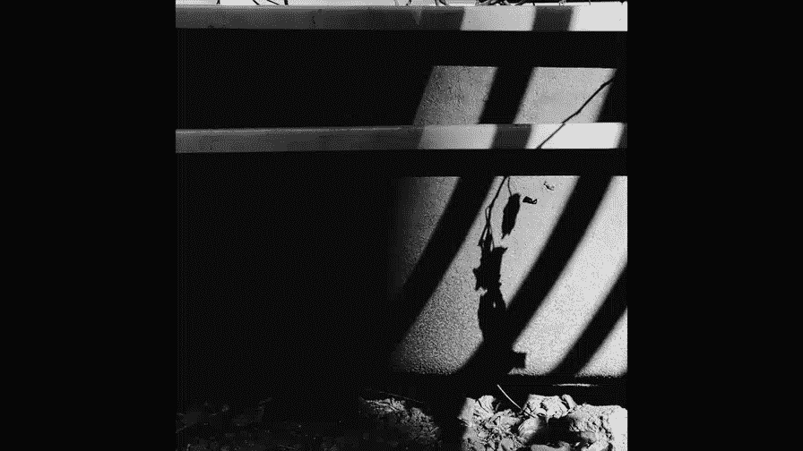
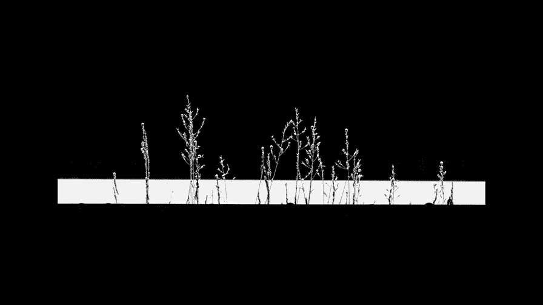
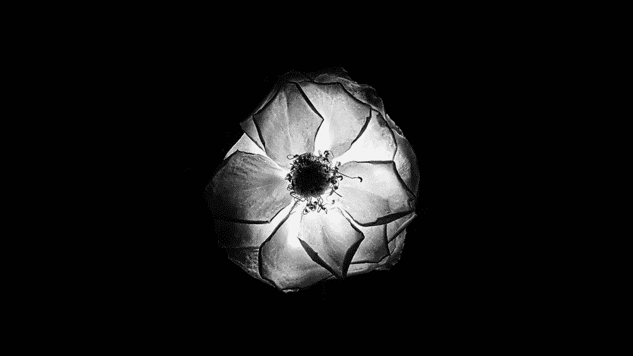

# 贾树森-手机摄影高手（完结）：4.【大神】超详细的后期修图软件教程：第4讲 照片怎样调黑白

🎼大家好，我是大叔。现在开始今天的分享。😊。

我们经常会听到一句话哈，叫做。逼格不够，黑白来凑啊，也就是说。把照片转成黑白，然后这个艺术感马上就提升一大截哈。😊，啊，那到底什么样的照片，它适合转成黑白呢？呃并不是所有的照片都适合转成黑白啊。

呃这句话呢有一些杜撰的成分。😊，呃。其实彩色呢它讲究一些搭配，而黑白呢它讲究对比。很多彩色照片并不是意为拍的不好，而是因为就是照片当中的某些元素啊，色彩太过于跳跃，它影响了主体内容的表达。

所以呢他就成了照片当中的干扰因素了啊。这样的照片如果我们转成黑白，其实是可以有效的减少干扰因素，并且呢更容易让大家把重点把视线转移到主体的身上。那到底什么样的照片适合转成黑白呢？

第一个就是说你的图片当中，如果阴影在很大部分的时候是可以适合转成黑白的，它的明暗对比就特别强烈。这个照片整个的冲击力就会加强。第二个适合转黑白的就是比如说我们要摆脱某些干扰因素啊，对画面的影响。

那我们在户户外啊，比如说拍照片的时候呃，碰到一些背景，我们很难就是改变它。那这个背景拍下来呢又影响整个画面的一个体现。

尤其是它的颜色太过于喧宾夺主的话，那这个时候我们转到黑白，能让主体呢受到相对较少的干扰。第三个呢就是说如果我们拍摄的画面主体啊涉及到一些纹理的时候，我们可以把照片做成黑白。

这个时候呢啊照片当中的这些纹理呢会得到很好的加强。比如说街道当中的一些砖呀瓦呀，还有像这个我拍的这张哈里面的很多线条呀，啊，我们可以把这照片做成黑白的。这个图案后的纹理呢就会更加的突出。再一个呢。

如果我们想要表达某种情绪的时候，也适合把照片做成黑白的。我们之前曾经讲过哈，我们拍照片的一个比较高的境界，就是要拍出情感。那么。我们拍的照片当中想要表达的内容啊，尤其是有人参与的照片当中。

他的情绪可能会占据更主要的位置。那在这样的情况下，如果转成黑白，我们可以把照片当中很多复杂的色彩因素给它完全抛弃掉。没有了色彩的干扰，黑白照片呢更加能凸显人物面部的一些表情、细节以及眼神。

所以呢这样的照片更能表达出强烈的情感。所以其实我们在转黑白之前啊，我们可以问自己几个问题，就是说我们。第一个问题问自己什么呢？就是说色彩是不是必须的。那这张照片咱们看一下最大的看点是颜色还是其他因素。

如果画面当中的内容构图影调完全足够表达你的意思，那么颜色反而影响了主题的表现的时候。黑白就是一个很好的选择。展示黑白之后呢，能够削弱杂色，使主题得力突出，可以避免让颜色分散观看者的眼球。

第二个需要问的问题就是这张照片里面的光影对比是不是有趣？把照片处理了黑白之后呢，呃颜色之间的对比就被弱化了。那么黑白灰的对比就加强了。这个时候能够更加简单纯粹的去表现光和影。

第三个要问的问题就是照片当中的纹理和轮廓是不是比较独特？我们拍照片的时候呢，这个纹理呀。呃，必须用我们的眼睛去感知。当我们把照片转成黑白之后啊，我们照片当中的一些。

存在的纹理哈呃像木头啊、金属啊、石头啊，甚至植物和人类的皮肤。那么这些纹理在黑白照片当中啊，它通过呃一些细微的层次调整，可以使平时肉眼无法注意到的地方呢得到强化啊，从而呢加强这个照片的冲击力。😊。

第四个我们需要问自己的问题，就是我们这张照片到底要表达怎样的情感，传递什么样的情绪。我们要根据我们自己要传递的情绪和情感，将照片。转成黑白照片。所以一张照片是不是要从彩色转到黑白。

其实呢我们还是要经过很多考虑的。我们生活的世界呢是五颜六色的，而黑白呢呃则是将写实的彩色世界变成抽象的黑白灰影调，成千上万种色彩和层次被简单单调的灰接表现的淋漓尽致。

呃，这个其实是一件神奇的事情，正像佛说的那样，色即是空，空即是色。我们用在摄影上来理解的话呢，就是这种意境了哈。那缤纷的色彩，有的时候确实会干扰我们的视觉扰乱我们的情绪。我们将它们清空为0。

那世界呢顿时变得安静平和。我们可以更好的欣赏到画面当中的元素，更好的体味画面当中的主题，却不因此妨碍我们对色彩的想象和判断。😊。

所以呢我们其实呃对世界我们都有客观的认知，对吧？呃，比如说我们知道天空是蓝色的那树叶子是绿色的。所以黑白影调呢它呃游离了真实的世界。😊，但他又以独特的手段表现了真实的世界，给人更多的想象和思维空间。

这节课的后半部分还是要大家把播放模式切换到竖式全屏状态。黑白照片我们是可以在拍摄的时候直接拍成的。比如说我用苹果来拍照吧，然后在拍照界面里面，然后打这个啊点一下。再看下下面这儿啊有各种各样的模式啊。

这个之前的时候我们曾经说过。像这个单色呢，他拍出来的就是黑白照片啊。比如说我们简单勾一下图啊。对角线。然后再往右呢，银色调啊，这也是一个类似于黑白的效果，也很棒啊。还有一个呢就直接叫做黑白。

第三个都是可以直接拍的。有一些安卓手机啊是可以直接有黑白模式来进行拍摄黑白照片的啊，这些东西都是可以直接拍成。不过呢我个人来说的话，我一般都是先拍成彩色照片，然后呢再进行呃。调整。也就是说。

用后期的软件把它做成黑白照片。因为我在用软件转成黑白的这个过程中呢，我可以做很多的变化。呃。有很多人为的因素啊，比如说我加一个绿色镜啊什么的，我可以把这个照片当中黑白的关系给转换一下。那具体怎么做。

我们等一下会讲到。照片转黑白的方法呢有非常多种。嗯，咱们的软件啊前面讲过的vissco。呃，sed，还有后面即将要讲到的mix等等，都可以把彩着照片转成黑白照片。

那这里面呢vissco是模拟胶片感觉的哈，然后mix呃也不错，其实找黑白。我经常用到的转黑白的是snap see里面转黑白的这个功能。为什么要用snap see来转黑白？

那这个工具呢我们在前两节课里面都没有讲过啊，这节课呢重点给大家介绍一下snap seed转黑白的方法。我们首先把sapse给打开。然后呢，选择一张图片。好的，我最终决定呢用这张照片给大家做一个示范。

这照片打开之后呢，我们点工具。找到黑白。这个进来之后呢，有好多种啊模式啊，对比啊、明亮啊、昏暗呀、胶片和暗好天空等等。模式说完了之后呢，我们来说这个啊中间这个符号把点开之后呢，这里边可以调亮度。

可以调对比度，还可以调颗粒。啊，分项目啊上下去滑动可以改，然后左右去滑动呢可以改明暗度。我们再来看这个符号，这是比较重要的。这里面呢有5种颜色。红色、橙色、黄色、绿色和蓝色。

那这是我们在转黑白照片的时候，他给加了一个绿色镜，这些绿色镜它有什么作用呢？简单的说呢，它就是可以改善原来画面当中的一些明暗关系啊，就是在你转成黑白照片的时候，它加一个绿色镜。

它把某种颜色给加强或者减弱。我们简单的试一下，大家能有一个直观的了解。好，我们先把这个模式放在中性灰上，然后呢，我们来看一下这些绿色镜对照片当中的明暗色调有什么影响啊。比如说红色大家看一下啊。

从中性切换到红色。照片当中红色的部分变得更加明亮了。成设。啊，有橙色调的东西变得明亮，草地比刚才亮了，对不对？😊，黄色。整体又亮了一些。还有绿色。蓝色。照片当中绿色的部分变得相对来说比较暗啊。

用绿色的时候呢，绿色的东西上面的层次也是比较强烈的。简单的理解呢就是说。比如说红色绿色镜，它会让红色的光通过的更多。所以呢照片当中有红色色彩成分的地方就会变得比较明亮。我们可以利用这个原理呢啊改善。

我们黑白照片当中的影调。那就这张照片来说的话，我。会怎么来把它转成黑白呢？我完整的示范一下哈。首先呢这张照片这现在是原始状态哈，打开，然后呢我会利用工具里面的，比如说戏剧效果，我把它。😊。

给加强一下它的这个反差呀，明暗关系什么的。比如说我用一个戏剧一吧，但是程度呢有一点强烈，对不对？所以呢我要把它给它降低一点点程度，大家留意天空中的云的层次啊，看看啊，原来是什么样子，现在是什么样子。

然后呢，饱和度其实我还是要拉上来，我等一下要用那个彩色绿色镜，所以呢这个其实还是有一定影响的。好的，调好之后点这个。现在转黑白。选中性。再来选这个绿色镜。比如说我们可以试试红色。橙色。黄色。

哪个感觉好呢？😊，红色的太强烈了，对吧？可以用橙色黄色。可以不断的去尝试一下。OK我觉得这个黄色就ok了。选好之后呢，我们点这个。现在呢我们感觉这个地方还稍稍有一点。层次不够多。然后呢。

我们可以用这个氛围稍稍再调整一下，看一看啊。好，大家能看到感觉吗？变化的OK略略加一点点，让它呢稍稍有一些层次就OK了。然后点退出。这个时候呢我们可以把照片啊。锐化一下。结构让后加强一下，大家看一下啊。

我们调的时候，照片上的层次是有加强的，然后呢锐度稍稍加一点。好的，可以打勾退出。保存这张图片导出。我们可以来看一下对比啊，原片是这样的。现在调成这样。大家看看。

天空部分这个云的感觉以及呢树木的这些层次都得到了很好的加强。🎼今天的分享就到这儿，我是大叔，我们下次再见。😊。

