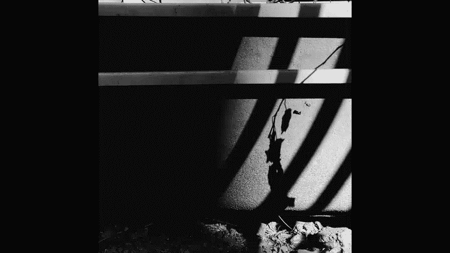
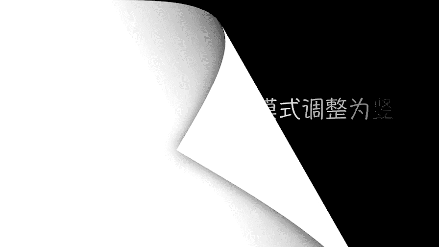
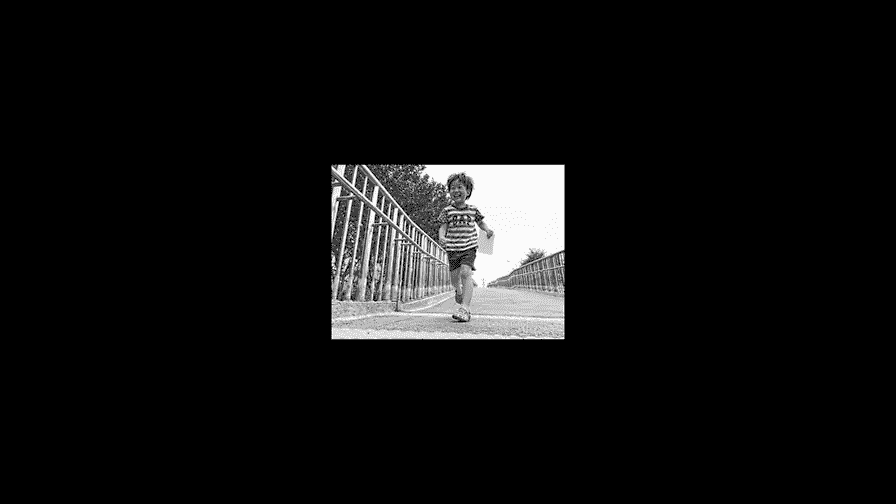
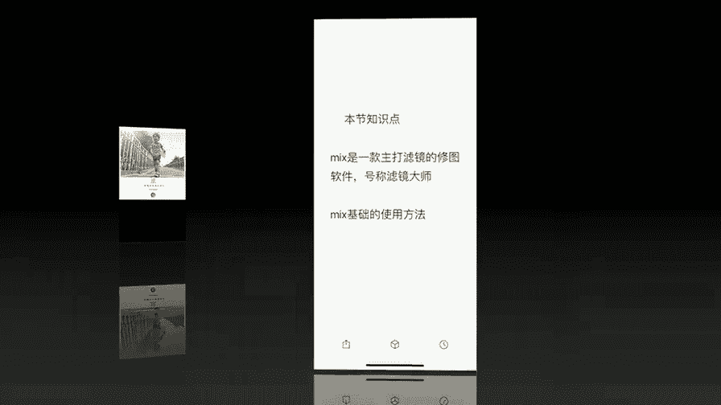

# 贾树森-手机摄影高手（完结）：4.【大神】超详细的后期修图软件教程：第5讲 为什么MIX被称为滤镜大师

🎼大家好，我是大叔。现在开始今天的分享。😊。

mix呃他自诩为滤镜大师哈，其实呃当然了，我个人使用过之后啊，我也觉得有一些名符其实。mix的滤镜呢其实跟vissco的稍稍有一点像，都是套用滤镜，不过呢它还是有些不一样的地方。呃，现在来说的话。

mix免费的滤镜呢也是不少的。但它总体的滤镜也是非常多，他自己号称超过130个啊。啊，当然现在已经有一部分要付费了。最开始的时候它基本上是套用滤镜。那么后来他的很多次改版增加了非常多的其他的功能啊。

所以其实呢它已经超越了单纯的滤镜。这个范畴了大家能看到啊，一会儿我们会逐一去讲到它有很多的工具啊，我觉得这一款软件还是不错的。跟其他的软件一样，我们首先要在桌面上找到mix。点击就能打开这块软件。

我们首先认识一下他的这个初始界面哈。我们能看到有这么多项目。我先说第一个哈啊编辑，然后局部休整艺术滤镜和照片海报。上面这4个。是我们在编辑的时候会经常用到的这么四个功能啊。下面这个。这个学院。

这个学院点开之后，这里面有很多有关于修图的，或者是拍照的一些小技巧啊，那大家可以自己进来学习还是不错的啊。商店呢。商店就是买东西的对吧？然后这里面有很多滤镜啊什么的啊，可以购买。再看一下这个啊，我的。

这里面我着重说一下，大家看右上角这有个设置，我们把设置点开。建议大家把这一个地方选上啊，保存超高品质的图片。然后保存图片是覆盖原片啊，一定不要选啊不要选。啊，保存到mix相册。

还有这个将所有工具放入到编辑工具箱，也不要选啊。呃，雪了之后里面的界面就发生了变化了哈。好的。设置就这样就可以了。我们先说第一个啊。这个编辑。进来之后呢，就是相册，我们可以从这里面选。

不过大家留意一下这个地方啊，我现在是在个人收藏的这个相册里面。好，我们点一下这个向下的箭头。介入到全部照片，呃，点向下箭头的时候呢，你就可以选相册啊，就是你的照片存在哪个相册里面，你就从哪个相册里面选。

好，现在留意到这个地方啊，现在是全部照片O。找一张适合在这里面用的啊，这张吧。O。进到这个编辑界面里面之后呢，我们看一下这儿哈。啊，有这么几个啊，有内置滤镜，有自定义滤镜，还有收藏滤镜哈。

我现在自定义和这个收藏都没有，就没做。然后看看内置滤镜，内置滤镜呢有这么多款。它这个款呢是里面啊每一项目里面又有非常多的滤镜啊。大家看啊mix我点开啊。大家能看到这里面有各种各样的。

然后再往后翻啊往右翻。我用翻看看啊，刚才是存在这儿的彩色翻的片，我看看啊。就是说你再点一下，就是把它收起来啊这个。然后。点彩色翻转片又这么多，对吧？你一直往后翻也可以啊，就是说翻到这个这是下一个的。

但你像刚才那样的，你再点一下这个滤镜，它就收起来了。然后呢，就是下一个项目，这一个项目里面又有好多款拍立得的，有好多种。然后还有电影色电影色调的也有非常多啊。啊，选一个啊。啊，随便选一个好了。

给大家示范哈。选完之后呢，这个小窗户是呃变成半透明的这种了啊。😊，我们点一下这个小窗。可以调整程度。这一点跟vissco很像，对不对？可以调动程度，只是数值不一样而已。好的，调完了之后呢。

我们点这个向下的箭头就收起来了。后面还有啊这么多，这里面呢我重点说一个这个啊。魔法天空。我把天空。像这张照片这样呢，天空比较白，我们可以给它换个天空。当然有的不一定合适啊，比如说这张就不合适。

我们可以再换。那这张还可以，对不对？然后还有哎，这张也可以，就是说他可以瞬间把照片换个天空哈，一秒换个天就是有的时候会。达到非常好的效果啊。但是这个程度也是可以改了啊，这个滤镜的程度也是可以改。

就有的时候你可以把它简淡一点啊。甚至连这个。都可以换哈，换一个星空的啊，换甚至甚至个连这个极光的都有。😊，好，这是它的这个滤镜。然后我选一个合适一点的吧。O就这个吧，我把长度改一下。我们这调滤镜的时候。

我们留意到这个地方，这个滤镜它是蓝色的哈。那么下边还有这么多项啊。左右翻一翻，还有很多啊。那我们接下来看调整了这一项哈。调整这里面呢就是一些基础的调整工具啊。呃，比如说亮度啊，就是曝光对比度啊。

高光阴影啊什么这些我们都讲过。然后这上面也有字会说的很清楚。然后这里面有个层次啊，其实层次这个跟那个。sC里面那个。氛围有一些相似啊。他改变照片的一个整体的分布情况啊。然后这里面有一个中心亮度。

就是说你能把照片中心提亮。其实说白了它跟这个加暗角也差不多的啊，就是反过来的。我们再来看一下效果。它的效果呢也是分好多种，在这里面呢可以去选。比如说胶片也分好多啊，再点一下胶片。

把这个胶片本身的这个收起来，还可以有美肤啊，美肤也分这么多种，再点一下美肤呢就收起来，或者你一直向右滑动啊，有非常多的可以选择的东西。那么这些效果呢都可以逐一去尝试哈了解它每一个的特性。然后呢。

根据需要来使用。其实这个呢我建议大家还是进来多看看啊，因为这里面确实非常多。比如说你像天空啊，你进来之后，它有很多种加天空的这个方式，不像咱们钢头的时候，在滤镜那里也有。

但是那个地方呢没有这么多哈这么多变化。在这里呢有更多的变化，大家呢也需要了解一下。呃，反正我觉得这个mix呢，它这里边。层级做的太多，啊，容易眼花缭乱。大家需要一段时间来适应它哈。好，这是效果。

效果之后呢，我们再来看一下这个纹理啊。这个纹理呢也是分特别多的种类啊。第一个接累就是玄光哈，我已经打开了这个玄光，那么就是镜头各种反光的感觉，有好多种把玄光点一下，就收起来。后面看啊有渐变，有漏光啊。

有颗粒，这都模拟胶片的，还有什么舞台的感觉。啊，灯光舞台、灯光各种各样的。还有呢舞台收起来，还有雨滴和天气啊。就是模拟下雨的感觉啊，然后天气这里边呢还可以模拟下雪的各种各样的啊。

当然这个程度也是可以调的啊，就是它这个程度啊点一下这儿。点开这之后呢，程度可调，然后呢，角度也可以调啊，这些东西都可以调的。好，再往后面大家看这几个啊，就是虚化曲线和这三项啊色相饱和度啊。

色调分离和色彩平衡。那么这几项呢，它其实也是属于调整的范畴的。之所以把它放在这儿，就是因为啊这几项呢。他认为是相对来说。比较专业一点的调整方法。那么建议初学的同学呢，就是先暂时不要去碰它。

用熟了之后可以慢慢的去尝试啊，虚化这个这里面有三种虚化的方式都可以改。然后呢，用两只手指在这上面做开合状，就能调整啊这个的大小和它的范围。那么曲线呢其实跟snap set里面那个曲线差不多。

也有一些预设在这儿。摄像饱和度啊，这个跟vissco里面那个HSL那个差不多，就是每一个颜色可以单独调饱和度，调明度、调亮度这些。还有色调分离，这几个。这里面呢就相对来说更复杂一些了。

所以建议大家在其他的基础功能用熟了之后，再碰这几项啊。还有一个回来到这儿第一第一个项目里面叫剪裁。好的，剪裁进来呢，它默认的在这儿啊叫调整水平啊，我们来滑动一下这个滑块看一看啊，照片如果歪了斜了。

可以进行一些旋转。其实也就是啊。然后再接下来呢，长宽比长宽比这个地方呀。我们点一下哈。第一个呢就是自由剪裁，它进来就说默认就这样的，就是你拉动任何一个角都是可以这照片啊随便进行剪裁的啊。

当然你也可以调整这个比例的啊，各种比例也都有。另外一个就是旋转。图片旋转还有翻转啊，就水平翻转啊，它本来向左边跑，对吧？我们翻转一下就向右边跑了哈，就这个像我后边这两项啊，一个是纵向透视。

一个是横向透视。那么这两项呢，其实我们前面都有涉及过啊，一个是水平方向，一个是垂直方向，一个是X轴，一个是Y轴啊，可以调整一下，看看啊，纵向透视调一下。相当于vissco的Y方向的调整，对吧？

横向就是水平方向的，相当于vissco里面的X。拉伸啊，这是它多的一个拉伸呢是可以把照片横向或者是纵向啊，现在是纵向啊，这样是横向拉伸。可以把人变得很胖，也可以把人变得瘦一点啊，女士们会很喜欢这个功能。

对吧？但是不要拉的太狠啊，变形太厉害，就太假了。OK一般我们在剪裁的这个地方呢，想想再出去到编辑那儿点一下滤镜就可以了，就到编辑的这个地方了。到了这儿之后，也可以进行其他调整。

如果觉得修好了点保存就直接保存了啊。但是现在我还不要保存。我要告诉大家一个机关啊，在这里有三个点儿，我们点一下之后来看一下啊，一个是保存。还有保存滤镜，也就是说你可以保存滤镜之后呢。

就做一个自定义滤镜了。啊。另外一个呢，我们可以进到局部调整和照片海报。大家注意这两项哈，我现在不从这进，我要退出去。退出。再退一步啊，然后呢我点这个局部修整。还选。这张图片啊。好的。

这里面呢有有一些项目是可以做局部。修整的，比如说涂抹，那么你可以给照片加马赛克啊，然后呢或者是加荧光笔去涂。啊，有这么多项目啊，还可以涂小星星，在上面小心小星星啊，各种图OK我不做修改。还可以去污点。

这个呢跟snap C那个修复功能差不多，还可以加渐变镜啊，这个渐变镜是要花钱的，我没有买啊。然后呢，调整笔刷。这一点。跟snapse里面那个画笔功能有一些些像啊，大体差不多。可以调笔刷的大小。

笔刷的硬度和不透明度啊，这些呢都是可以调的。好的，我们这回可以从这儿看看啊。可以直接进到照片海报。其实呢前面那个那那个地方呢是有点像个大门啊，这地方像一个小侧门。我们可以直接进到侧面里面。

就是进到它另外功能，可以给照片做成海报啊。呃，这里面有这么多项目，大家能看到这里面有一个有些有锁的，这些呢我们是没有办法用的啊这个。要花钱或者是要分享之类的。比如说我们可以用一个免费的吧啊。

可以加个这个。那这上面的字儿呢都是可以挪动位置的啊，用手指去弄，它就拖挪动位置。并且呢这个字也是可以改的啊。比如说像这个fat by mix，我们可以改成自己的双击啊，两只手指在这上面点一下。

大家看一下，就是两只手指在这点一下，就可以改这个字儿。哎，我们可以随便改啊，就改了。字体啊这些东西都可以换，都在这儿啊，这一排字体可以换。颜色也可以换啊可以换颜色。还可以呢加一些图形啊。主件呀什么的。

这里面有一些东西也是需要买，反正是免费的。有一些我觉得基本上够用啊。好的，我们这项不做啊，退出来。这地方要留意，如果点退出来之后呢，就完全退出了啊。我们完全退出。到这儿。走这之后。

我们刚才是从这进的照片海报，对吗？也可以进到编辑界面里面去。就我们第一项那个大家还记得吗？哎。但是有一项呢他还是进不了，我还是要退一下啊，退出去。在这儿有一个艺术滤镜。我们可以进来。好的。

在找那张图片啊。找这张图片，这个艺术滤镜呢。就做这些的像绘画效果的。啊。绘画效果的。这个程度也是可以改，它直接就跳出来在这里啊。免费的就。没有太度啊，大概这么些，然后还有一些需要付费去买的。

然后从这里呢也可以进到其他的一些小项目里面去啊，但是他只让进到招聘海报。也就是说你做了这项之后，那两项你进不了了。如果你还想用那两项再做的话，那么就把它保存，保存完了之后呢啊再重新打开。

因为mix啊后面这三项功能都是后加的，所以呢它现在呢就是这样做，其实我个人认为呢是稍稍有一点不太方便的。不过我大抵用的功能呢就是这个编辑功能。所以其实还好好的。

这几张图片呢是我用mix来进行修片的效果啊，原图和修好的对比图啊，大家可以看一下。关于mix呢，我们今天啊就跟大家介绍这么多它的一些基础使用方法，具体怎么用呢？还要大家自己呢多去尝试啊，多去摸索。

🎼今天的分享就到这儿，我是大叔，我们下次再见。

