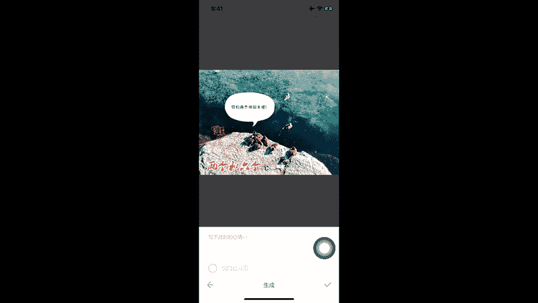
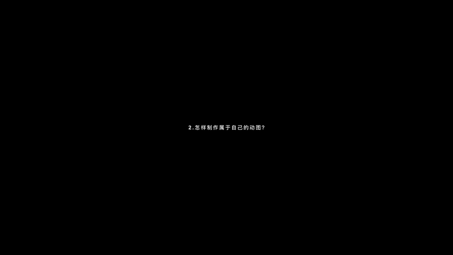
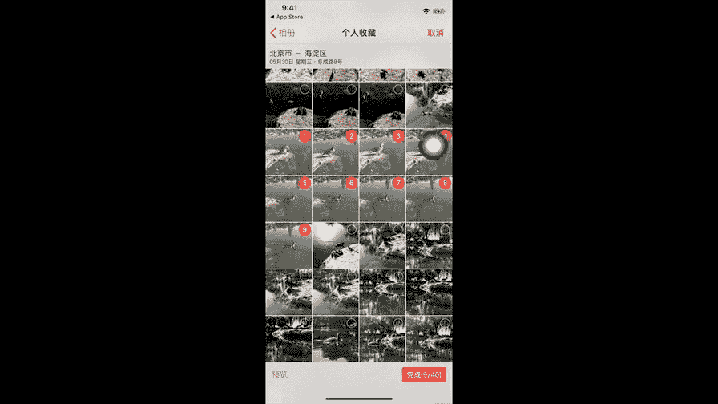
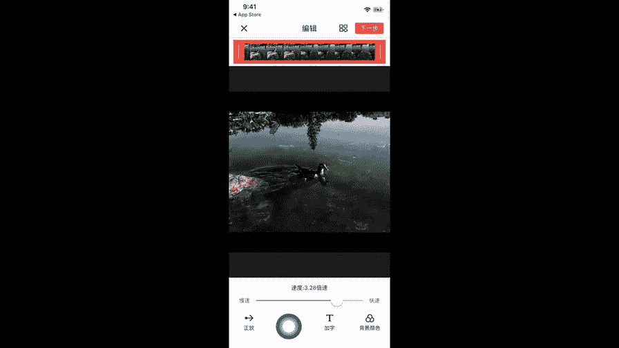
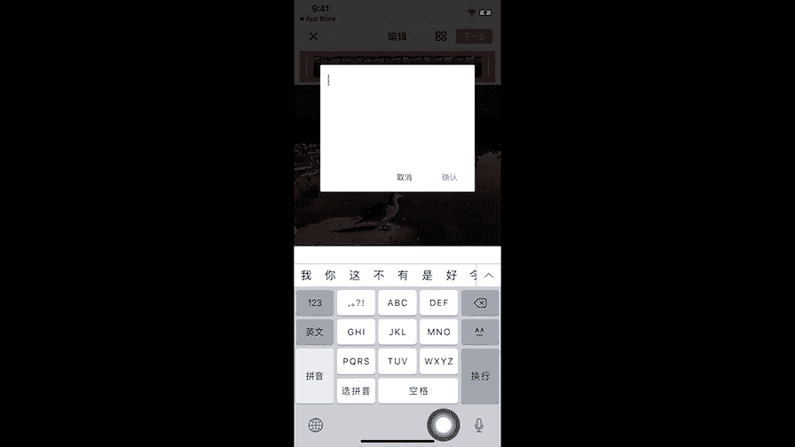
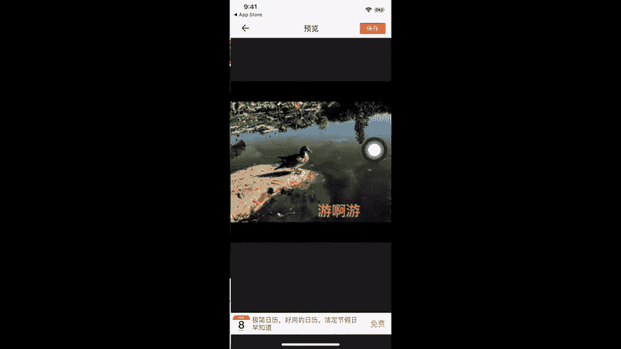
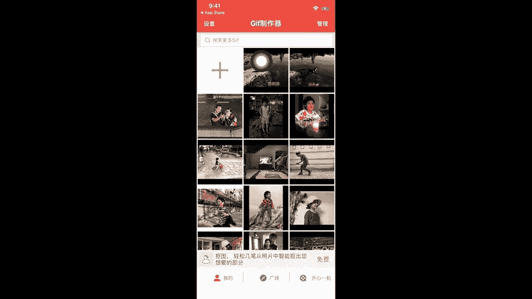
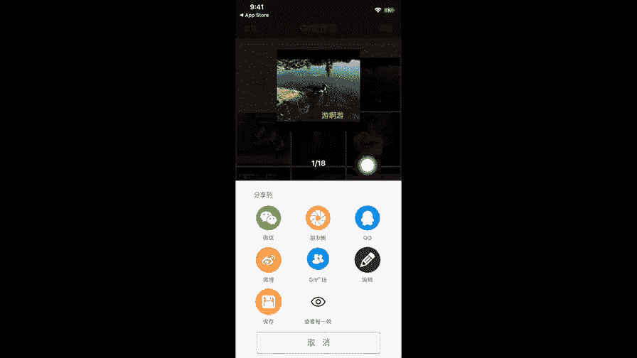
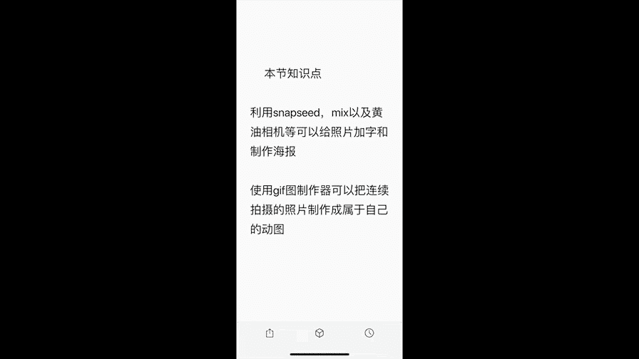
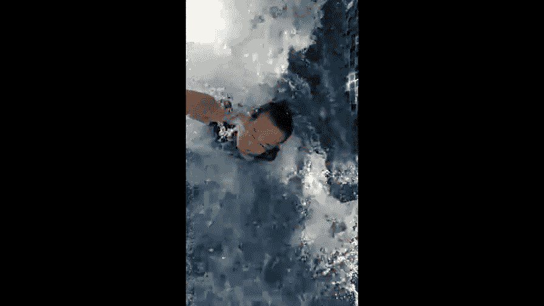

# 贾树森-手机摄影高手（完结）：4.【大神】超详细的后期修图软件教程：第6讲 怎样做海报和动图(2)

D也不错哈。那就选大地吧。如果不合适，我们再进来调整啊。比如说像哎美颜就算了。曝光，然后可以稍微拉一点。这个要等一下啊，因为它的这个反应没有那么快。好，挺合适了。这次呢我们要看一看这个元素啊。

因为刚才讲了模板，然后布局我们也说了，滤镜呢就是现在我们在用的那下边这个我们讲这个元素啊。元素积累之后，我们第一个花子。用手指呢点一下之后。可以往上加很多种。啊，画字。呃，比如我们就用这个吧。

这个字我们可以改啊，这个字我们是可以改的哈呃，位置可以改，大小可以改。太大，然后。好的。我们把这个字改一下。双击。好，重新改字啊。改字怎么改呢？嗯，好，随便说一个吧。OK好，学好之后。

屏幕上点一下就O了。在接下来我们还可以点这个文字。文字呢就是我们双击。比如说起个名字叫。两个。和。看几个12345啊，随便说一个吧，6个。O。点对勾。好的，现在这个字体呢是这样的。

字体想换的话是在这儿换啊，我们随便去点就能换啊，点一个就能换。啊，比如我们就选这个吧哈，这个孟伟这块呢是一个小购物车，如果觉得字体不够用，可以去购买。字体学好之后呢，我们可以更改。

字体的颜色哈字的颜色哈，红色呀、绿色呀。浅绿色呀、粉色呀啊这些。橘红色呀都可以。那这张照片呢，我选用红色。然后呢可以改他的位置。大小双另用两个手指去开合，就都能改啊。又说脚放呢。

这个位置自己可以去琢磨一下啊，看看放在哪儿合适啊，我就放在这个石头上吧。这个时候我们可以去调它的透明度哈，在这里。比如说你点那个解号吧。它就会越来越浅，点加号呢就加回来。稍微减一点哈，然后这个地方。

这三个A这可以加阴影啊，字上面有个阴影啊，然后还可以加描边，描边这个就比较明显了，对吧？也可以呢给字加个背景啊。好，这张呢我就打算用。描边啊。ok。这儿做好这个这块呢是可以字体，就是字呢就是排列方式啊。

它是如果你。要是字比较多啊，去可以改这些东西，这里还有很多可以改的。我们呢也可以去给他加一个贴纸。这个贴纸里面呢。基础图形这儿是免费的。如果想要买，比如说像我这些照相机的，我都是买的啊。

然后这里有个小购物车点。购物车就能买去。呃，我随便加一个吧好，就加个这个吧。O。点这个对勾。这个大小和位置都能调的啊，比如说我把它放在这里吧。旋转也可以，但是这张我不想让它旋转。大小可以调调。

这个颜色呢不太醒目，对吧？那它的颜色是可以改的，在这里啊。比如说也用一个红色。绿色不醒目，弄一个橘红色。嗯，这里标醒目的还是红色吧。O。做好之后呢，我们点这个。再点这个向右的箭头。

仅自己可见。保存。那么这张图片呢就做好了。

制作动图呢我使用这个软件啊啊叫技辅制作器。呃，我在这个地方呢给大家搜索一下，看一看啊。

一般输入这几个字儿。好，就这个。这个啊直接点搜索。呃，能出来很多呃动图制作的软件，我选的是这一款啊。我在这直接打开了啊，就不用桌面图标了。打开之后有很多广告，这款软件比较讨厌的就是广告比较多。

但是呢这个是我目前用的比较好用的一款啊。呃，操作方法是这样的，我们点这个加号。选择拼接照片啊，那这里面其实也可以用视频来做，也可以自己录制啊，也可以从电脑传等等。但是我用的比较多的就是拼接照片。

这个拼接照片选择上是有一定技巧的。我们要选择那些呃使用连拍功能拍下来的一串照片啊，这样制作起来会比较流畅。呃，当然你可以选用其他的，就是比如说跨度比较大的两张图片来制作也是可以的哈。呃，我在。

相册改一下啊。在个人收藏里面。啊，去找一下啊，大家看一下，就这几张哈，然后呢我点击就能选这几张图片，是我使用连拍功能拍下来一连串儿的啊。我们来看一下效果，点击完成。

接了之后它默认的速度呢是一倍速，就正常速度。这个数字呢我们可以减慢啊，当然呢我们也可以把它弄快。一般稍微快一点会好看一些哈。啊，这是最快的，但是太快了，对不对？看我们两倍。3倍左右吧。啊。

对这张图片来说的话还可以。再看下面这一排。这个啊带箭头这个正放倒放，还有一个呢先到后正有这么三种。可选啊。我这张呢就选正放吧，但是也可以剪裁图片啊。

呃，说一说这个加字儿，点击加字儿之后呢，就随便加一个字儿，输好之后点确认。

大小和位置都是随便改的啊，位置可以随便改，大小呢用双指开合就可以了，随便随便改。然后这里啊有三个圆圈的，看见没有？红黄蓝点击之后呢，可以改字的颜色啊，绿色。然后比如说改个红色。橘红色。O。可以了的话呢。

我们就点击下一步。

在右上角这。这个地方一定要留意，我们要选择低清微信必选的这个版本，选择其他的呢，我们微信上没有办法分享。

再点保存。啊，广告又出来了。那我们刚才做的这张呢，在这里。

我们把它点一下。这时候呢我们可以选微信。

分享一个人。这时候我们要选择留在微信这个啊刚发的这张。长摁。这时候选添加到表情。那么这个动图呢就添加到我们自己的表情包里面去了。在哪里呢？我们看一下啊，在这个状态下点这个叫笑脸进来之后啊。

它可能在这个位置，我们一直翻啊，翻到最右边，接着还翻哎，就能翻到这儿了。这个系列呢都是我以前啊就是做的啊，我以前做的一些。很多了，然后这是我自己跳的。啊，数妈的，然后。我跟小树的我跟小树的。

都特别有意思。我们刚才存的这个呢就是在最后边这儿在这儿啊。这样我们就可以跟朋友聊天的时候呢呃使用自己。做的动图来跟他们进行互动了。

🎼今天的分享就到这儿，我是大叔，我们下次再见。😊。

