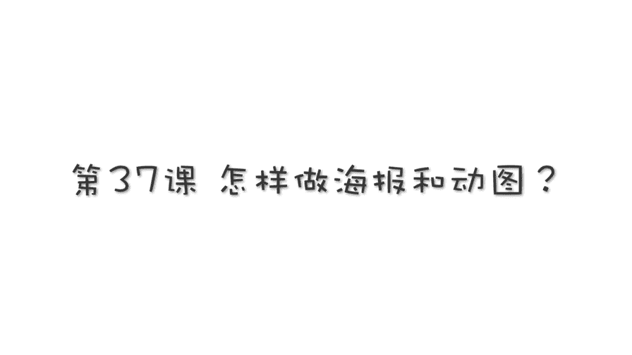
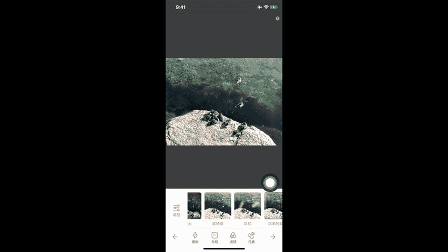

# 贾树森-手机摄影高手（完结）：4.【大神】超详细的后期修图软件教程：第6讲 怎样做海报和动图（1）

🎼大家好，我是大叔。现在开始今天的分享。😊。

给照片添加文字，或者是用照片来制作海报。我们之前讲过的软件里面像呃snap see。它也是可以添加文字的对吧？在工具里面点开，然后有个文字把它点开。这里面呢。双击就可以更改。2。文字。

大小也可以调位置也可以调，然后呢，颜色在这里调啊，可以把字改成颜色，打树用绿色的吧，然后。放个位置放个位置啊。再小一点放在旁边。OK不透明度也是可以调的字的不透明度啊，它的。浓淡程度可以调。还可以倒置。

看看倒置。就是别的地方都成这样了，但是这个其实也挺好玩的啊，倒倒置这个大家看一下啊，把它放大之后呢，眼睛露出来一只。😊，两只。哎，放小一点，看看眼睛可以露出两只嘞。

其实我们可以用这个来做很多有意思的事儿哈。😊，比如说这两张照片也是用snap C的这个加文字倒置的方法来制作的。然后还有这里我们看一下。这是专门改字体的啊，如果修改好之后呢，我们可以点这个对勾保存了。

这是呃snap C的一个加字的。我们再来看一个mix mix上节课其实我们讲过了，然后这里面呢有一个专门处理文字的，叫做海报，对吧？我们可以直接进到它的海报里面。有各种各样的海报可以添加好。

还是挺方便的，有一些模板是可以套用的啊，可以套用这个字呢也是可以改。啊，制作海报来说的话。mix也蛮好用的。那这节课呢要重点跟大家介绍另外一款加字的软件叫做黄油相机。

这节课呢给大家介绍另外一款专门给照片加字的软件叫做黄油相机啊，就是这一款黄色的。打开之后呢。我们点这个啊，下边这个圆圈的符号。进到我们手机的相册里面去选择一张照片。同样的啊。

点这个地方是可以更改你挑选照片的相册的。呃，我进我的个人收藏里面找一张吧，然后。好的，我们就选择这一张把它打开。打开之后呢，如果你之前有没有完成的啊。他会提示你一下，我之前有没做完的，先不继续。

进了之后的界面呢，我们看一下，首先第一个啊，我们点一下，看看叫做调整。调整呢是现在可以做什么呢？像曝光啊，它也可以调的啊，也可以改变照片的曝光。它反应相对来说比较慢，大家稍微等一下啊。曝光往下调一调。

然后剪对勾。对比度也可以调。饱和度啊，还有褪色、锐化色温等等。啊，都可以调的，调完之后呢，调整着点对勾。好的，再看这儿啊，后面这些呢是滤镜。这个呢就第一个叫不添加任何滤镜，然后呢，再往后面啊。

像这块滤镜，我看啊。这是可以下载的，它有很多免费的，就是可以下载，然后再调这个。华动相机现在增加了很多的滤镜，呃，有的时候我觉得还是蛮好用的啊。好的，这张照片来说的话呢，我觉得底特律就很好。

可能反差稍微有点大哈，我们再调整这把它调整一下。比如说呃有点反差大的话，我们调什么样对比度？对比度往下减一点啊。钱太多了。OK他反应太慢。好的。😊，我们点着对勾。这就歌。那照片的调整就OK了。啊。

这个也不错啊，😡，好的，就选这个吧。然后照片的调整就这样就完事了。接下来呢我们可以呃看这个下边这一排了。这排呢是关于文字的编辑。呃，先看一下这个布局。布局呢就是可以调整照片，比如说你加个白边呀。呃。

改变画布笔呀什么的，1比14比3什么的这样的东西哈。啊，我看哈我再加多一点。加加这个吧。照片的位置也是可以调整的啊，用手指摁住图片，上下可以调中线。也可以对准OK好的，我就调个这样吧。然后下面留个白边。

好，进行下一步操作啊。然后点对勾，接下来呢可以调这儿，比如说模板。模板这里面呢就有很多现成的模板，我们可以去可以去这个套用。模板套用呢。比如说称。称霸朋友圈哈，然后我们看一下这个字儿呢，我们是可以动。

然后呢，点击这个字儿之后呢，它就有一个编辑窗啊，我们可以把它挪动位置，也可以呢把它放大啊。哎，放大这个分庆节已经过了哈，然后这就是应个景吧，然后。😊，这个比如说放大缩小。呃，这个模板呢我们可以继续选。

不要这个。又换了一个啊。夏天哎这个还挺合适，对吧？但是这个放在这儿不合适，对吧？我们把字儿往下挪，点一下，夏天挪下来，然后呢还有小字儿也挪下来。😊，拿下来哎呦打。然后呢弄大一点行啊。

我晓得地方大好看还有个横杠。O。这些字呢我们都可以再把它弄大。比如说夏天让他大大的。然后呢，杉木。把这两个横杠，其实这两条横杠呢不想要，可以去掉。😊，点这个叉。这个也点一下。叉去掉。好。

夏天OK这个我就对称吧，放在正中间。夏天对这张照片来说的话，我觉得还不错，我可以把它保存。点这个对勾。这个地方要选一个仅字己可见。然后呢，让它保存，这是原图和制作好的图的一个对比。

保存之后我还想继续做啊，我们重新再打开一张图片。好，选这张吧，就这一个系列的啊，我们还是选这张哈，跟刚才那是一个系列的。进来之后呢，我们首先选一个滤镜啊。找一个适合他的，和翻凡看看啊。

