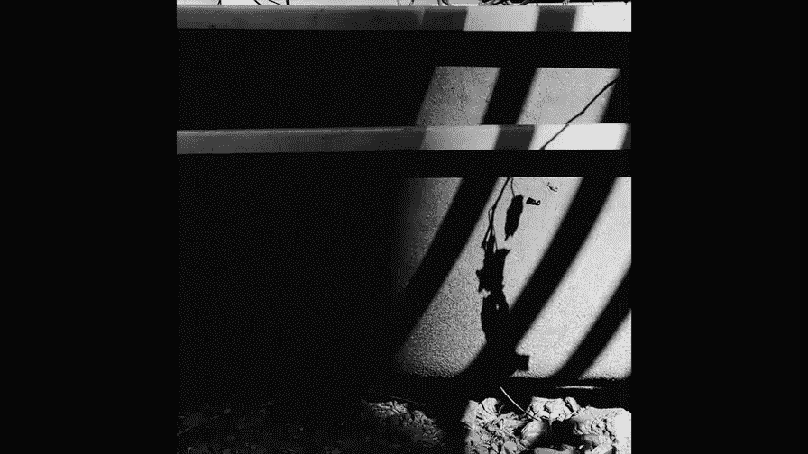
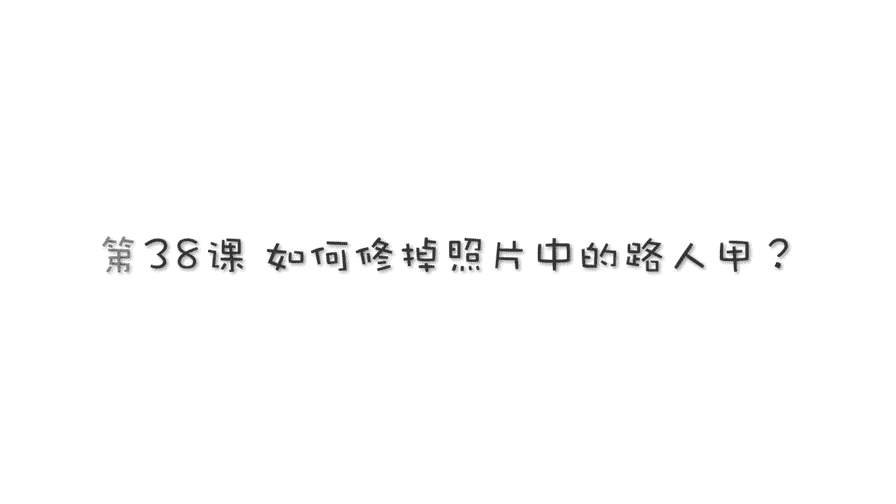

# 贾树森-手机摄影高手（完结）：4.【大神】超详细的后期修图软件教程：第7讲 如何去掉照片中的路人甲？

🎼大家好，我是大叔。现在开始今天的分享。😊。

有的时候我们拍的照片里面确实有一些我们不想要的内容，但是呢我们有的时候确实也是躲不掉，避免不了。比如说像这样照片里面的呃背景当中这躺了一个人，还有塑料袋，然后还有一些线，还有一个摄像头。

还有呢这还有一个嗯，这其实是这个一个游乐场的一个立柱啊，也是没有办法避开的。但是拍的这张照片呢，我又挺喜欢。很多时候我们我们也没有办法去重新再拍一遍啊。尤其你像抓拍孩子的，或者是你抓拍的其他的东西。

你没有办法重演。那么像这种情况呢，呃我们使用呃sap C里面那个修复工具是没有办法把这些东西搞定的。那今天我给大家隆重介绍一款软件啊，它的名字呢就是这个。Touch， retouch。啊。

这块软件的名字就叫这个。苹果手机的用户可以直接在APPstore里面去搜索啊，它的名字叫做touch touchuch。T。有。CH好，就是这个了啊，弹出来了，就是这个就是它长得像一个六一样的这个绿标。

这款软件在苹果里面我们搜索找到这个。直接下载就行。但是呢这块软件呢在苹果手机里面它是收费的啊，我记得好像在12块钱左右吧，应该是这样，因为我已经用了很久了。呃，这块软件大概用了两年。

使用安卓手机的同学呢，有可能你在你的市场，就应用市场里面搜不到这个软件，可以在手机上下载一个叫做搜狗手机助手。使用这个呢。再在里面搜索这个名字，它叫做抠图大师。下载了之后，如果你安装。

估计手机会有一些提示啊，呃一般你就点了解风险，继续安装就可以了啊。还有他需要一些授权啊，总之你就授权给他就可以了。使用安卓手机的同学呢。啊，下载的时候确实是要稍微麻烦一点，但是呢好处是免费的。

要想使用这块软件呢，首先也是在桌面上找到这个图标，把它点开。进了之后界面这样，它的使用说明其实呃大家可以去啊看一下啊呃他会给大家介绍一些它的一些使用方法。好的，我们现在从相册这里打开一张图片。

就打这张啊，我们刚才说的这张照片打开之后呢，大家观察一下哈这里。下面哈有这么几项，我们先说第一个吧，删除物体。我们点一下。它有画笔或者是锁套，其实这两个呢都差不多，一个是直接涂而像这个直接涂。

那像这个锁套的呢。好，这个位置我要修改一下，再我回一下啊，然后。我们再看一下这个锁套，锁套就是你圈一下啊，就是画线圈一下，完了之后它一样也是变绿的。所以这两个其实差不多。当然它也有个橡皮。

比如你弄多的地方，它可以把它擦掉啊，先多了这个地方，多余的可以擦掉啊。😊，我像这张照片的话，你看这个边缘啊我们还是没有弄好，对吧？没有弄好，我们把它弄一下。边缘接着再插，可以放大了一点去插啊。

把它插的尽量。靠近一些。咱们看看这个物体它能删除的怎么样啊，反正如果这个物体用呃sstepap C的修复功能删的话，是绝对没戏啊，能弄得一塌糊涂。😊，点这个啊就是弄好之后点这个go。大家看到了吗？

我觉得扇的还是不错的对吧？😊，有一些小瑕疵啊，这些瑕疵没关系，等一下呢，我们用另外一个工具把它给搞定。但这边也有设置啊，我们看一下它的设置，也就是说是画笔的大小。就是刚才我们去画的时候。

那个画笔的大小是可以改的啊。😊，好，这一项目介绍完了。😊，我们再介绍一个快速修复，点一下快速修复呢，比如说。试一下吧啊。试一下这个躺的这个人，哎呀，鞋还在这，我们看一下这个快速修复能达到怎么样一个效果。

不是特别理想，对吧？但是也还行啊，把人弄掉了。😡，多做两次，有的时候会做的比较好一点，有的时候做的不好啊。好，这个线条它搞不定，那就先这样把这个鞋再修一下啊。😊，好的。像这个地方的投影也弄一下。

看看这个塑料袋他能做的怎么样啊。哎，还可以啊，有瑕疵的话，咱们等一下可以做。😊，ok。就先做这样，然后这个还有一个这个叫做呲点消除器啊，这个是一般是修脸上的这一些啊小杂点啊就是。小斑点啊什么的。

修脸上的啊，这个我用的比较少。好的。但是他也有设置了啊，就改画笔的大小OK。😊，这个地方呢这个是别的地方都没有的，叫做线条删除器。线条散透器看看我们这上面有很多线，对不对？

那这种线呢其实有的时候修起来比较麻烦，但是我们使用线条渗透器就非常的容易啊，我们先看一下设置啊。😊，这里面呢就是先选一个细的啊，它默认就是细的。所以我跟大家说一下，先然后像这种细线啊，我们在这涂一下。

看看啊线条散热器啊，这细线大家看一下啊。😊，在这画画一下就行，你也不用画的，就说特别。😡，值啊大概差不多，它就会自动去认这个线，看到了吗？这线直接就不见了啊。😡，看啊刚才那个锈不掉的，看看啊。😊。

这个线。好，这成这是有一一个小线段啊，那咱们选一个叫线段颤读器在这儿。😊，你有个线段，哎，把它弄掉，对吧？咱们挑战一下，其实啊它这有它这可以选粗细，我们看看啊，可以选粗细，我们选一个粗的啊。

我们来挑战一下，看看能不把这树给弄掉。😡，哎。我觉得还是挺厉害的，对不对？好的，这个是给大家示范一下，其实不想把这书修掉是吧？然后怎么办呢？修多了，我们用这个啊，这有箭头，我们往往回回回再回回来了。

如果觉得回多了再点这个啊，往前走，就刚才做的这步啊，所以我们就回到这一步啊。😊，这个是线条删除器，还有一个特牛的叫克隆印章啊，这个东西是特别好用的。刻路印章这个。呃，看到这里有橡皮啊，然后呢后边有设置。

我们先看一下设置。点开之后呢。有大小、硬度和不透明度哈，这个不透明度是什么呢？就是我们拿一个毛笔来比喻吧，这个大小呢就是指我们用的是呃粗的毛笔还是细的毛笔啊。😡，然后呢，这硬度呢就是。

比如说你用的是狼好还是阳好啊，这笔的硬度是不一样的。那么你这个。东西啊，你去试一试就知道了，它能差在哪。就这硬度特别大的时候，这个边缘就特别硬啊。😡，小一点硬度的时候呢。

这个边缘就相对于来说没有那么过度，就是稍微自然一些。不透明度就是指我们蘸的墨汁儿有多少啊。😡，弄到最右面的时候，就沾的墨汁特别特别的浓，这一笔下去啊就很浓很浓的。所以呢我们看修什么东西啊。

比如说修上面这个吧，修这个我们可能硬度要多一些，大小呢不用挑太大，要把图片放大啊，把图片放大。然后来试一来试一下。那。这个东西就是在图片上啊，在这个点一下在这里点一下，为什么在这里点一下。

我们要用这个区域来替换这个地方啊，要找一个就是跟这个摄像头。😡，它后面的背景差不多的天空，我们现在看来这个稍稍有点小，我们再把它做大一点啊，纸做大一点。好的。你点一下，然后呢在这里点，看到没有？

手指在这滑就行了。在这滑。再放大一点，也是从新点一下取点划啊。这个取点很关键，如果你取点的位置不合适的话啊，比如说我们取到这儿来了，看到了吗？取到这儿来了，然后我们在这弄的话，就把这个地方。😊。

给复制过去了啊，它叫克隆图章，这个克隆啊，大家。字面意思啊很好理解。好的，我回一步啊。😊，靠近数的边缘的地方，我们可以再放大一点，用数来替换它啊。比如在这点一下啊，用数来替换它。😡，好，这个边缘。

再用天空，这个时候就把这个弄小一点了，弄太大就不好使了。好的。左上角这有一个放大镜，我们可以看的比较仔细啊，在做精细操作的时候，我们可以看这个哎我们。可以给它按照树的形状。去描一下。好。

大家看看现在呢就是做的不错啊，如果有时间，其实呢就这个树上这个也可以修掉的啊，就很好修。😊，很好修。对啊。最重要的就是你选点的位置啊，大家看一下，我动的时候，那个也是跟着动的，你要留心它动的位置啊。

你要是把不准的话，可以试一下啊，看看它用的那个位置行不行啊。像这个线都是可以修掉啊，不合适，大小的话就可以修一修，把大小调一下。😊，浓度太大的话，可以把这不透明度稍微往下弄一弄哎。这个也是需要耐心的啊。

就是想修的特别好的话，就需要耐心。期果软件我觉得它设计的是还是不错的，特别好用。然后收点费也是比较比较合适的啊。😊，好的，这块这个板儿我也把它修掉啊，利用同样的方法。要不断的调整这个大小和不透明度。

好的。O。修边缘的地方一定要留心啊一定要留心。啊，看着左上角的放大镜来修。好的，然后这个地方用它来替啊用它来替。OK把它修掉了，这个图章是特别有用的。比如说这里还有一个人啊，我们也把它给修掉。😊。

插到边的位置一定要看仔细啊，看左上角的小窗户OK。这里还有一点不太好的，也可以修啊。刚才修这个人的时候，我们修的比较粗暴呃，这个边缘不是很好。这个时候哎这个图章就派上用场了，我们可以把它稍微弄小一点。

这个画笔稍微弄大一点，怎么办呢？刘一欣看啊，我们把这个。😊，点到这儿啊。看一下对准放在中心的位置，然后呢，下一笔下在这儿啊，手指在这摁住。看一下啊。看一下上面的放大镜，我们往右边去移动啊。

用它来复制刚才那那一段。当然有的时候我们可能会高一点或者是低一点。没关系，可以重新再做啊。如果没做好的话，看看右边还有没做完的啊，我们接着来重新再点一下，然后呢我们再下笔。下歪了也没关系啊，重新做。

好的。像这个地方要把它修了。修掉。呃，其实这块的影子如果人不在了的话，它其实也应该不在了啊。如果讲究一点的话，也是要把它修掉。大家可以试一下啊，其实可以修掉的，就稍微把它画一画。

但是画的太多呢也会比较假。所以呢。哎。差不多就可以了啊。这个地方很明显的，有一个就把它修一修，好好修一修。好的。刚才还修了一个什么塑料袋，对吧？塑料袋这个地方弄得不是特别好。好的，我们用这块的草地啊。

用这儿的草地来替换这块的草地。大家看看刚才修的这个地方，很明显就能看出是修的是吧？然后咱们把这个点儿点到这儿来。😊，看到了啊，然后呢我们在这修。哎，在这修一下。修一下呢，然后这个地方出来一个草。

我们也把它修掉。这个草土长在这里啊，好的。是不是这样看起来就不错啊。啊，这个按影也给它修掉，不太对。好。好，右边这些绣的差不多了，但是这块呢还有还有这个，对吧？😡，还有这个这个呢我们怎么搞定呢？

我们还是用那个线条吧，点一下这个右箭头啊。😊，线条删除器。好的。用线条啊点画看啊。他有的时候不会修的那么好，没关系啊，再做两次就OK了。哦哦，这个不行了，我要回一个，太贴近这个数了。

一会儿我们用图章把它修掉吧。这个地方我们改用线段扇出器啊。😊，哎，用线段。放大一些会比较有利于精细操作啊。好，剩一点点剩一点点的话呢，我们可以用这个图章啊点下这个箭头就就回到上一步了啊。回到上一级菜单。

然后我们点克隆图章。继续用克隆出章来修这些啊。好的，不好的地方，我们找点啊把它给对上去。把它给对上去。如果浓度不合适了，在这调啊，比如说太太太强了，或者这个太小了，我们都可以在这改一下ok。

天空这位置也是要改一下啊，刚才修的时候一定要留意它发生了什么变化。如果不对的地方，我们要把它弄好啊。还有竖这里对吧？刚才用那个线条是不行的。然后这个时候我可能要把这个。弄多一点啊，让笔浓一些。

然后呢用它是哦看这个就歪了啊，弄多了，然后回一步重新开始看啊。好，这下差不多OK。就是下笔的时候有可能下歪了，没关系，再重新来啊。好的。这个数我们就OK了，对吧？😊，接下来我们再看一看这个地方。

我们刚才使用这个删除物体，对吧？把它给删了。那么过渡的不是很好，对吧？有些地方不行。我们用这个来做啊。用这个来做这样做看一下啊。在这里选点。在这里选一个点吧。啊，好像有点大，不过我们放大一点啊放大一点。

😊，哦，s。点错了啊，点错地儿了。好的。在这里叠好之后呢，我们在这下下。这笔啊。哎，好像有点歪了，对吧？重新再来。😊，重新再来啊。好，这回对值了。好的。看一下哎。很好，是不是啊？然后包括在上面的这些。

我们去T一下。海平面这里不对了，对吧？海平面这里不对了，没关系，我们重新做一下海平面，单独做海平面啊。😊，把这个放放在海平面上，然后呢，我们这个下笔好，很好，对吧？海平面这里做好了。

胶州炒地这一块还稍稍有一点不太对。然后呢，我们再重新来一下啊，把它做一做。Okay。啊，这个地方也不太好，我们把这个做小一点，再做小一点。好的，把它稍微去。整修一下啊。去整修一下。好。

还有呢就是这里这里明显就是复制的变化的感觉呢啊不太自然。我们把它就稍微的修一修啊。明显变得两个一样的，把它给咔掉一个看到啊。好，还有这些。脚印儿其实还好吧，如果觉得这儿也不太自然的话，可以稍微弄一弄啊。

这个地方但是不是很好弄，容易就弄不好就假了啊。😊，所以这个要留意哈。弄不好就假了。O。大概弄一下吧，我觉得已经很好了，对不对？比刚才那个好太多了，是不是？😊，啊，这个克隆图章还有一个用处啊，我们。

我们点克隆图章啊，这里还有一个镜像。这个镜像干嘛用的呢？比如说。我们点开啊。他有这么几种选择，我们在刚才做的时候，这个镜像这个地方。😡，是选的否？他默认的是否，现在我把它选成。😡，现在我把它选成。水平。

我们来看一下啊。干嘛用的呢？就是我在这张照片上做出两个人来啊，看一下啊，我现在把这个点点到小树的头上这里，然后呢，我得。这里啊看看我开始画。啊，我开始画。系。我是不是又画出来一个小朋友啊？啊。

这个克隆图章还可以这样用啊，就是你可以在你的图片上做一次，二次创作啊。做一个二次创作。当然了，我们做完了之后，可能这个边缘不太对啊。比如说有的地方多了，有的地方呃。通常都要做多啊。

要不然做少了的话是不好看的。呃，做多了怎么办呢？这里有个橡皮好，大家看一下，点击个橡皮，把图片放大来。做多了的地方把它擦除掉啊，看看这个这个树干这里啊，我们把它擦除，擦的时候要注意。

不要擦到孩子的身体啊。不要擦到他的身体。然后呢，这里看。OK就大概这样吧，示范一下啊，就是说这个可以呃给我们做两个小朋友出来。😊，还是挺好玩的对吧？修好之后呢，我们可以点这个。😊，保存。点击保存为副本。

这就保存完了。在这个地方我要跟大家说一下它的设置问题啊。😡，把设置点开格式里面可以选择，一般就选勾币器就可以了。如果你对图片要求特别特别的高，可以选tF。

然后这个大小我们就选最右边这个最初啊就是初始值是多少，就是你的原图哈，勾B机的质量选最大百分之百。保存当前设置这个打勾。好的。设置就这样。那这张图呢是我们刚才修的啊，原图和修改之后的对比图。

大家可以看一下效果。好的，有关于touch retouch就跟大家介绍到这儿。😊，🎼今天的分享就到这儿，我是大叔，我们下次再见。😊。

