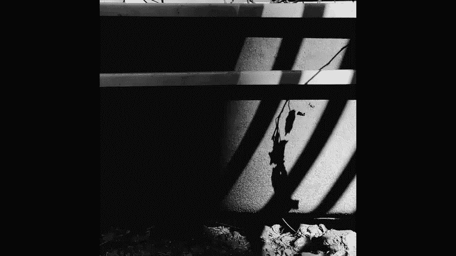
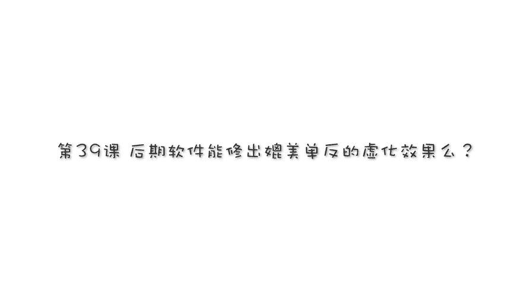

# 贾树森-手机摄影高手（完结）：4.【大神】超详细的后期修图软件教程：第8讲 后期软件能把照片修成虚化效果吗？

🎼大家好，我是大叔，现在开始今天的分享。😊。

截止到目前为止，我用过的最好用的把背景调虚的软件，可以媲美单反的虚化效果的软件哈，叫做after focus。呃，苹果的下载方式呢也是特别简单，在APPstore里面去搜索。阿特 f。他的图标是这个啊。

大家不要搞错了。像一个小光圈一样的，它可以做很多事儿啊，这里面点开之后，大家看看啊，它是这样的。把它下载就行了。苹果系统的这块软件应该是收费的。大概也是在12块钱左右啊。

跟那个我们上节课讲的touch touch是可能是差不多的。安卓系统的手机呢有可能在应用市场里面还是收不到。那这款软件我大概试了一下哈，在那个浏览器里面是可以搜索得到的，而且呢还是汉化版的。

大家可以使用浏览器去搜索，然后下载安装就可以了。安装的过程中依然会有很多警告啊，选择统系就行了啊。😊，好处呢就是依然是免费的。在桌面上找到它的图标，把它点击打开。打开的界面是这样的啊，呃。

苹果手机的下的这个是英文版的，我们使用中间的这个选择图片。到相册里面选择一张图片啊，我选从个人收藏这个文件夹里选吧啊，这张吧。OK进来之后啊，我先说一下这张照片哈。

就是说这张照片是我使用啊iphone叉的前置摄像头拍的。其实iphone叉的前置摄像头是已经可以虚化背景了。😊，说白了，我们现在很多手机的后置摄像头，前置像头都可以虚化背景的。

那么但是虚化背景这个功能啊，在很多时候它虚化的效果并不是特别理想，而且啊它拍摄的速度相对来说较慢。同时呢它对于拍摄距离也有很多的要求。那么我们通过这个软件可以在后期把它做虚化，非常的简便啊。

操作方法就这样啊，进来之后他默认的，大家看一下这里啊。是一个焦点。那么我们刚才其实也看到了啊，就是那是安卓手机的一个黑化版的。当然你用苹果下载之后，最开头积累，它也它也有很多的引导呃。

引导的图片文字给你有说明，你自己要设置一下。那么我现在我常用的这个界面就这样的，大家注意这块啊，是一个铅笔的形状啊。这个时候呢我们这儿在焦点这选栏，然后呢在照片上画哪个地方想要清楚就画哪儿啊。😊。

看画出来这是白线啊，比如说我人物肯定要清楚的对吧？白线画上去。照片整体变红了，对吧？这个时候我们选这里。背景。OK我们看到背景的地方。没有颜色了，但是我们还要把它放大仔细看啊，边缘的地方一定要处理好。

处理不好，就像我们有的时候用手机直接拍的那样啊。好的，这个地方过渡多了，我们再回来选焦点，选背景啊。就哪个地方清楚就选想要清楚就选第一个。想要虚域就选这个啊。话说这是黑线的。这些小毛毛刺儿都要处理好。

好。还有头发这里。头发这里有一点，对吧？我的头巾，你看他有的时候计算的不是那么准确。没有把它重新做一下。他对于一些复杂的结构算的不那么准。大部分时间还是可以的。像这个地方。他就算不准了。

他不知道该从哪里切。然后呢，这个地方呢它又切多了，对吧？我们再把它涂上。涂完之后又变了，又重新再做这里。系い。呃，可能有的地方过渡还不是很好。那这个时候我们可以呢啊。点这里啊。把它变成一个魔法棒。

我们把它选到这儿，大家看一下魔法棒，这个时候我们可以用笔呢去画啊，这上面有一些过度不好的地方。比如说有毛毛刺的地方，我们可以去画选背景当画背景。但然这画笔的大小也是可以选的啊，选这里啊。

小一点呢大一点呢都可以啊。如果哪一步做的觉得不合适了，我们用这个符号啊。就后退可以后退。后退完了呢，我们重新再接着修补啊，哪地方不好，再修修补补哈。如果觉得都合适了。都弄好了，点这。好。

背景这时候已经变虚了。如果觉得效果。可以，我们就接着往下做，效果不可以啊，我们点这个啊。再回去。重新再进行哪个地方没做好的，再进行做一下啊，没没处理好的边缘什么的。好的，回到这儿。😊。

回到这儿我们接着往下做啊，大家看这儿第一个像水滴一样的。这是虚化的效果啊，我们来选。虚化的感觉，这个呢是虚化的程度。第一个啊，虚化的程度我们可以调大或调小。其实通常我们先默认啊。

先给这搁着虚化的这个方式啊在这里。它默认的是镜头虚化，还有一种是运动虚化，我们可以点一下运动虚化，看看是什么效果啊，把它放大到最大呃，就像你这个人在动一样哈。😊。

这个呢等一下我们再用另外一张图片啊给大家示范一下哈。好的，我们还改回来，青头虚化。然后呢，大家再看一下这个点开之后呢，它是它有很多，它是这是光圈的形状哈，光圈的形状。

但这个我觉得对画面的虚化呢影响不是特别大哈，所以一般也就不用动它了。再看看这个这个很重要。😊，我们选这个，大家看看效果的变化哈。变化在这里，就是说我们刚才用这个模式的时候，后面全部都虚的一塌糊涂，对吗？

但是我们改了这个之后呢，好，大家看一下。啊，这个地方没有虚的那么厉害，其实这个呢就更像是呃用单反相机来拍照片虚化的这种感觉，它是一点点变虚的，它不是一下子变得那么虚。所以呢我们通常啊要做一个这个啊。

大家留心啊，用一个这个。然后呢，我们这个啊刚才调到最大了，所以我们这个也不要调到最大呃。调的稍微小一点，然后呢边缘过渡呢还会更加自然一些。如果一下子需要特别特别狠啊，反倒就看起来有点失真啊。好，这是。

虚化的调整这一块哈有一个滤镜啊，和曝光度，还有对比度的一个简单调整。它的滤镜不是特别多啊呃有这么几款。啊，我觉得实用性并不是特别的强哈，我还是更愿意用呃其他的软件来改善这样照片的这个颜色。

当然我这次呢我就简单做一个吧哈。好，简单做一个。O。把它收起来，点一下就收起来了。然后再看这个FX2。这里面一共有4项，第一项我们看一下啊，就是加一个暗角。想不要。打开再点一下就取消了。好。

我们把这个再点开。看一下这个它叫做color mask。这个color mask，然后呢是焦点位置。😡，是彩色的，其他位置变得黑白了。那这个地方看有一地方有一部分没有变黑白。

是因为我们刚才选了一个这个对吧？我们把这个改到这个模式的话，它就会变成。局部黑白。和彩色的一个切换哈，还是挺好用。然后我们再点一下，把这个取消，点一下就取消了。这个效果stickker我们看一下。

就是加一个这个啊，有像贴纸一样的，然后呢再点一下把它取消。最后一个是一个锐化啊。他的大概的。效果切换就是这样。啊，这个地方我把它改成这个，然后我们再看一下这个啊，弄好之后我们就直接就。保存。

点yes就行了。说一下它的这个设置吧，在这里。下面说一下这个设置啊，在这里像齿轮一样的，把它点开。这里面呢。就尺寸最大啊最大。然后。下面这块啊选的跟我一样就行了。选头两个这个编辑啊。

他们这些都没所谓了哈。选好之后点这个。就OK了，我们再来重新打开一张图片，看看那那种效果啊，就是刚才说的一个动感效果啊，选一张。啊，这张吧这张照片呢拍的，然后因为它速度比较慢，所以也没有拍出虚化的。

就是动感那种追拍的效果。我们可以用这个软件把它做成那种动感的效果。😡，好的，怎么做呢？做的前面的方法都一样啊，把想要十的部位给画上白线。画上白线啊，十的位置都尽量给它画上。O。尽量贴近边缘化一些啊。

这样的话呢后面做就相对来说省事儿一点。好，画多了的在这儿啊回一下。这个杆儿这个地方要仔细一点，然后呢还有风车。好，大概圈完了之后再选背景啊，这里。把要变虚的位置全部。给他描上。大家看一下啊。

这个结构就比较复杂了，很多地方过渡的都不好，所以呢就需要我们更精细的去做啊。有的地方多了，有的地方少了，这都需要反复的去做啊。反复做。这个得看仔细了，要不然做出来效果就假了。好。

这胳膊缝里边这个也都要弄到。好吧，用线呢我觉得大概差不多了，我们把它切换到另外一个模式啊，用手指去画，嗯会光滑一些。我们选一个笔的大小呃，现在这大小还行。

然后先这样把图片放大焦点啊焦点清楚的看看这轮儿这儿把它给画上。然后这个轮它已经把它甩出去了，把它画上。多了的也往下去啊，选背景往下去。这里也多了。毛毛刺特别多啊，因为这个结构实在是太复杂了。好的。

这个过程比较漫长，我就快进一下哈，大家看看效果，最终做成这样。然后做到这一步的时候，我们点这个符号啊，向右的箭头。😊，先虚化的效果这样，这个时候我们要切换啊，在这里点这个水滴。然后换成动感虚化。

动感虚化的呢，这个程度我们可以加多啊，我看放大看一下哈，有些边缘的地方还是没有弄好，大家能看到，对不对？那这个时候我们可以回来。😊，再点这个啊，可以回来接着弄弄，看看哪个地方没有弄好啊。

比如说脖子这里对吧？脖子里多了多了，太明显的地方，我们要再做一做，对吧？然后胳膊这里好像也多了。好的，勉强吧。然后我等一下再仔细的调一调哈，最终给大家一个效果。呃，示范呢就给大家示范到这儿啊。

保存输出就可以了。😊，after focus，它大概的使用方法呢就这样的。🎼今天的分享就到这儿，我是大叔，我们下次再见。😊。

