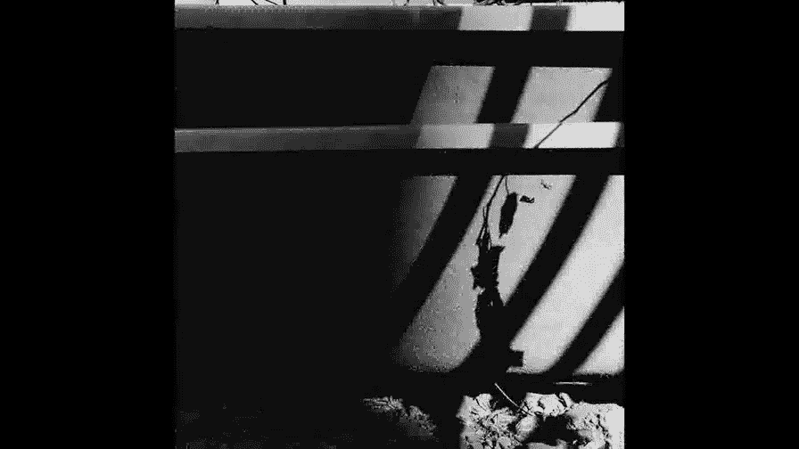
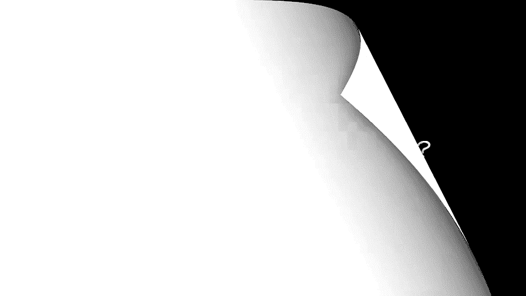
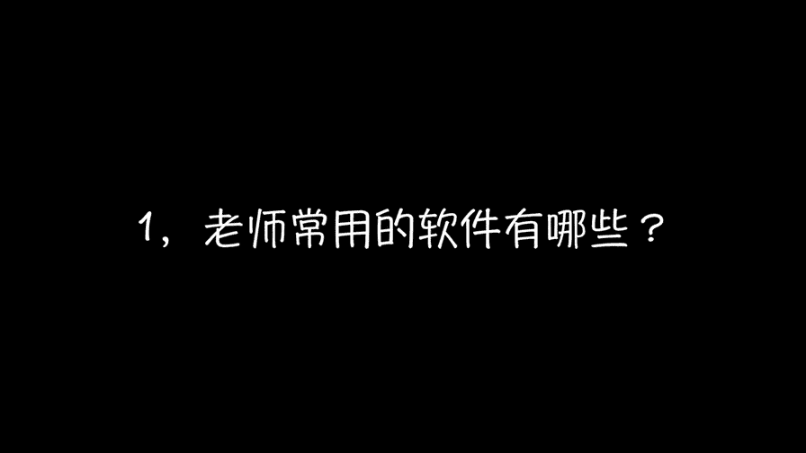
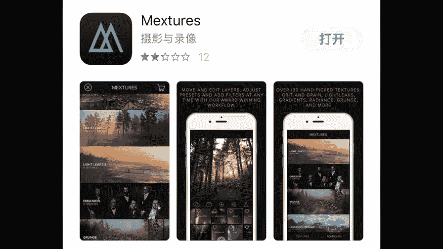
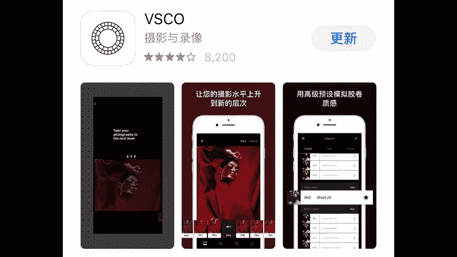
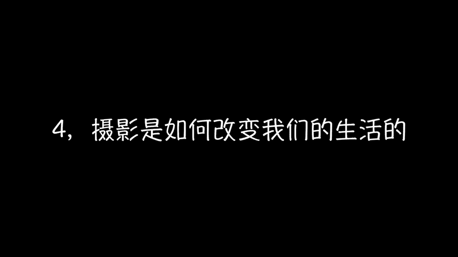

# 贾树森-手机摄影高手（完结）：4.【大神】超详细的后期修图软件教程：第9讲 后期修图的标准是什么？

🎼大家好，我是大叔，现在开始今天的分享。😊。

其实我知道大家一定特别好奇，就是老师，你平时用什么软件来修照片啊，你的手机里都装了哪些软件啊。好吧，其实我跟大家实话讲，就是我经常用的软件修图的最常用的steppe Cvis go。

mix还有touch与touch。还有after f。当然我在做黑白照片的时候，我经常用一款软件叫做film burn。另外我还会用软件，这个叫black cap，这也是一款转黑白的软件，呃。

偶尔会用一用。然后还有一款软件叫做himatic。那这块软件它是一款啊主打就是lomo风格啊，拍胶片这种感觉的相机。但是呢它也可以用来修图。有的时候也会用maxs，这个ms呢，它呃主打像胶片的划痕啊。

漏光啊等等。这些啊滤镜的添加也蛮有意思的。另外呢我前面拍夜景的时候讲过这两款软件叫做net cap和slow shutter这两款是主要是苹果手机用来拍慢门的啊，拍夜景啊。

拍这个像瀑布留下来的那种拉细线的啊这种都用这个软件来拍。还有呢有一个软件叫做。

pix art啊，偶尔会用它来做一些特殊的效果。但是这款软件现在加载的广告太多，所以呢我用的也不是特别多。嗯，还有印象也可以套用一些滤镜。总之，其实我最常用的软件。呃。

snap seat和vissco它俩的频率基本上能占到90%以上。使用软件来说呢，我个人认为不求多，要求精。

看来这个软件太多了，也不是什么好事儿，对吧？呃，到了后来你就没法选了，到底用哪个修很头疼。嗯，我给大家建议呢，就是说呃我们找那么几款软件啊，比较好下手的，自己有喜欢的。呃，把它熟练熟练掌握。

你了解他的脾气，他的性格，他能做什么不能做什么。然后呢，你拿到一张照片的时候，你去分析一下我这张照片到底我要修改什么地方。然后呢，你把你存在你的存储器里面啊。那些东西调出来，然后看看哪一个合适用它来修。

最开头的时候难免要多花时间，然后去多做一些尝试啊。老师曾经就对一张照片做了三十几版的修改啊，这一点不夸张，你修完之后你才能比较出来到底哪一个适合这张照片。你在这个修的过程中，我在这个寻找的过程中。

你就了解了这块软件，它到底能干什么，不能干什么啊，时间久了之后呢，你一看这照片，你就知道哎，这个地方我需要加强这个地方。哎，那一款软件s see可以做这件事儿，或者vissco可以做这件事儿啊。

或者是唉。mix可以。所以呢到这个时候你就能想到的一些。其实我们去修一张照片的时候，我们不一定只用一款软件把它修完，对吧？每一个软件有它的特性，有它的特长，他擅长干什么。

比如说那个touch touchuch，我们可以把照片修的干净一些哈，路人甲修掉，对不对？难看的东西修掉，O我们把它修完之后再进到s，然后对它进行一些其他的处理。处理好之后呢。

我们可能调色上我更喜欢用mix或者是vissco，这都可以的。😊，当然了，如果我们只用一款软件能把一张照片搞定，那是最好不过的。因为在各种软件之间呢，倒来倒去难免画质上会有些许的损失。软件的使用方法呢。

我们可能学会了哈，但是有的时候我们却不知道从哪下手，这张照片到底怎么修，绣到什么时候，修到什么样子才算是好呢？后期修图其实很难有一个统一的标准，因为它毕竟不是标准化，它没有一个公式。

但是我们的确要知道修图的时候修到什么样为止，修到什么时候停这个特别重要。😊，软件那么多，我们也学到了它怎么用。但是照片我们却不一定能把它修的好，最重要的就是我们要用对方法。

因为拍照片呢它本身就是一件特别私人的事情啊。往大了说呢，它是搞艺术，搞创作啊，你想表现什么啊，表表达什么情感啊，然后这个东西呢是确实很私人。我们没有办法给1个ISO标准，统一标准啊123。

但是呢老师可以说几点，老师个人的对于修图的一个认识啊，老师的一些感受啊，一些小经验。我觉得第一点呢就是我们在修图的时候，一定要记住一句话，就是少记是多，千万不要把这个片子修的面目全非。

知道什么时候停是非常重要的。我知道在最开始的时候，大家肯定不知道在什么时候停啊，包括老师也是一样。最开始的时候修一张片子，用一个软件，有可能把图片修过了。

那么我建议大家呢在初学的时候可以啊把一张照片多修几遍。当然了，三十几遍有可能有些夸张哈。不过呢你可以啊分程度的去修几张照片。比如说我这次把这个工具用到了百分之百，那么我下一次我用到50%。

再下一次呢我用到25%。那这几张照片我到时候把它放在一起，我去自己去比较一下，或者是放几天，我再看一下，那么你大概会了解到这张照片啊，我到底修到什么样子才算是好。第二点呢就是我们尽量保持照片的真实性。

呃，创意类的除外啊，那些有创意感的，我觉得可以天马行空，面目全非，都是OK的。脑洞大开，最好让别人完全想不到。但是呢我们比如说记录生活的，比如像那些街拍呀，记录家人哪啊。

拍自己的朋友啊、老公、老婆孩子啊这些照片我觉得尽量保持真实，在真实的基础上进行美化。就OK了。第三1点呢就是建议大家多去看一些好的照片。啊，看一些获奖的照片。那从这些照片当中汲取灵感。

或者你可以直接把这张照片拿过来，你去模仿啊，你看看它的色调秀到什么样子啊，找一张类似的照片啊，去修一修看一看啊多去做这样的练习。我觉得很多获奖照片呢，他在啊照片的拍摄上以及处理上都做的非常的好。

所以呢在大家初学的时候可以去进行一些模仿。你把它模仿了之后呢，其实这些东西慢慢的就长到你的脑子里面去了。并且你在以后的实践当中呢，其实是你也可以慢慢去思考他他为什么这样做？他为什么调成这样的调子啊。

这些东西呢，你在思考的过程中，其实就是你成长的过程。😡。

在上课的过程中，有很多同学关注了我的微博啊，经常有同学在微博上跟我互动，然后啊问我一些问题。嗯，有的时候老师特别忙，然后没有来得及回答，也希望大家啊原谅哈。看到大家这么努力用心的去学习啊。

我也特别的感动，特别开心。啊，我也会呢尽量抽出时间来回答大家的问题啊。

说到这儿呢，其实我特别想跟大家表示一下，感谢啊，非常谢谢大家在那么多的摄影课程当中选择了大叔老师的课哈啊非常的荣幸。其实说的这个课呢，老师做的也是特别用心啊，绝对是老师走心之作哈。不信我们来看一下哈。

老师的这个。😊，课程提纲我们来看一看啊，密密麻麻的啊，大家能看清楚吗？能看清楚吗？然后除了提纲之外，我们做了很多的注解，甚至包括背面啊，大家看一下。😊，大家看一下啊，不断的进行修改啊。

然后绞筋脑汁儿就是把老师会的这些都是用特别接地气的方式啊，在这里传递给大家分享给大家。所以呢老师也是特别特别真诚的希望啊，这个课程能给大家带来一些特别真实的体验。

然后呢能让大家在摄影技术上有一个质的飞跃啊，有一个特别大的一个提升。我们在前面的第三课里面啊。讲过就是什么样的照片才是好照片儿。在这当中呢，我也曾经大家提过啊，拍照片呢。最高的标准啊就是要拍出情感。

这是我们拍照片更高的一个要求。同时呢我们在第三课里面也讲了就是。要锻炼我们的摄影眼。我相信经过第40课呢，我们的摄影眼力肯定是得到了很大的提升。我们拍的呢是照片，有可能觉得是外部的东西啊。

街上的呀或者是风景呀，或者是家人或者什么的，感觉都是在拍别人。但实际上我们真正拍摄的真正记录的恰恰是自己的生活。这些照片一张张的理记起来，它就是你的生活。我们的镜头呢就是我们记录世界的工具。

它就是我们观察世界的一个方式。😊，现如今呢摄影无时无刻不出现在我们的生活当中，你走在大街上随时随地都能看到拍照的人。我们跟朋友跟家人聚餐的时候，人还没吃呢，得先拿手机消消毒，对吧？😊。

我们经过了40课的学习，大家可能了解到了一些构图呀、光影啊，一些基础知识，也许还不太熟练。但是我们知道摄影呢已经成为我们生活当中不可分割的一部分了。那么，摄影到底让我们的生活有了哪些改变呢？

首先我们变得更加开朗，更喜欢跟陌生人交流了，对吧？因为总是会遇到各种各样的问题，需要跟被拍摄的对象去沟通，这是需要沟通技巧的，也是需要一点点胆量。😊，第二点呢，摄影让我们的生活变得更加丰富了。

每一个空闲的日子，几乎都要拿出时间去拍照，长假呢也更愿意出去旅行而拍照。生活呢有了更多的期盼。同时你的审美水平也提高了，对吧？平时有个什么影展呀、画展呀，哎也会抽空去看看，也更愿意去电影院啊。

看看电影啊，观摩一下，学习一下，怎么样去构图，怎么样去啊用光。还有你也可能喜欢往各种各样的地方去钻了啊，比如说以前从来不去的菜市场，那些小破巷子啊，高楼的顶层等等。😊，你可能因此见识了不同的人生啊。

跟妹子跟帅哥去搭讪哈，也变得更加简单了，对不对？😊，还有呢我们的另外一半啊一言不合，就让我们给他拍照是吧？因为我们的拍照水平呢蹭蹭的提高呀，对吧？😡，朋友们出去聚会呀，出去旅行啊，出去玩啊。

都喜欢带上我们，因为我们能把它拍的特别漂亮。😡，还有我们也可以给自己拍一些好看的照片，对不对？我们驾上下架，我们可以自拍。当然了，我们学好技术，主要是为了给女朋友拍照啊。😊。

同时还有一个特别重要的就是摄影让我们能够。特别有耐心的去做一件事情啊，因为你去想要拍一个东西，很多时候你是需要去等待啊，需要去慢慢的寻找。也会像一个小孩子那样，就是看到一个特别有趣的场景啊啊。

有趣的事件呀，就特别的惊喜啊，迅速的去抓拍啊，拍到了就特别的有成就感哈。😊，另外，摄影也会让我们变得更酷。当然了，摄影也有的时候可能让我们变得像神经病一样啊，就比如说看到个镜子啊，看到一个反光的东西啊。

都想凑上去自拍啊。当然我们也会因为摄影认识很多志趣相投的朋友。也许有一天你对摄影的爱好，会变成职业。在我们去寻找各种各样场景拍照的时候，我们不知不觉又多走了好几千步。😊。

我们的身体变得更加强壮了。其实我们在拍照的时候，我们也能从取景框当中去感悟世界。同时作为父母的，我们来说，跟孩子玩的时间更长了。因为我们总想啊拍下孩子成长的点点滴滴。摄影让我们更加的珍惜现在，珍惜当下。

并且开始去留意那些我们以前不曾留意到的一些细节，也会去找很多生活当中的美，也开始在这当中呢寻到乐趣啊，并且呢摄影也改变了我们对于生活的感受，其实说到底，因为摄影我们变得更加热爱生活了。我们无法改变世界。

但是我们可以改变看这世界的方式。关于这个问题，其实我之前啊写过一个小文章啊，我给大家读一下哈。😊，生活总是琐碎的，而我们的情感就存在于这些琐碎之中，用不同的态度去观察和体验生活。

你就会得到完全不同的生活，体验到完全不同的人生，同一件事情，有人觉得有趣，有人觉得无聊。对于敏感而又热爱生活的记录者来说，善于从琐碎的日常生活中发现并记录下喜怒哀乐，仿佛是一种与生俱来的能力。事实上。

任何人都需要打开自己的心，来真正的融入生活，才有可能发现平凡生活中的那些美好。你也会发现每一张照片都是有温度的那是我们对家人的爱的体温，那是我们生活的爱的传递。我们全部四十节课到这儿就结束了。其实呢。

做客做的还是挺辛苦的。但是到了这一刻呢。😊，突然还是有一点舍不得哈，然后。😊。

希望大家多去记录生活，记录生活当中的那些美好，多拍照片儿。

拍好照片。祝愿大家呢都能成为生活的记录者，都会因为摄影而更加热爱生活。好了，就到这儿吧，谢谢大家。😊。

🎼今天的分享就到这儿，我是大叔，我们下次再见。

