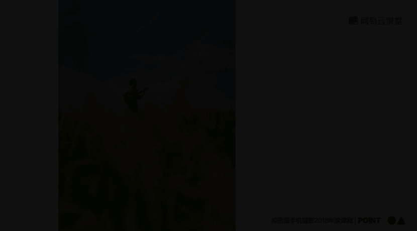
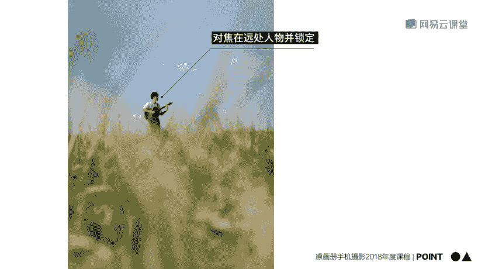

# 韩松-跟全球iPhone摄影大赛冠军学手机摄影，随手惊艳朋友圈（完结）：课时02.学习准备与基础操作

🎼，🎼，🎼学习手机应该如何准备？🎼那么首先呢就是器材的准备。那么这一张照片大家看到会不会觉得有一些吓人啊？是我们平时的器材档所有的一些嗯装备。我们来看一下，有非常重的单反。

还有看起来就非常麻烦的各种镜头以及三脚架，还有各种各样的充电装备等等。那么如果是一个手机摄影爱好档的话，就可以去掉其中的大部分的装备了。我们来看一下，就剩下这一些东西。那么主要是外置镜头。

还有最右下边的那一个呃手动呃手持的稳定器，那么还有我们最重要的中间的充电器手机，还有最右边的那一个三脚架。🎼那么其实这样的一个装备呢，我们还可以把它精简一下啊。因为我自己平时出门的时候。

一般就只会带这四样东西，充电宝、手机，还有耳机以及三脚架。🎼那么用这样的简单的装备，我们就能够拍出很棒的照片了。好，那么说完了硬件的准备之后，我们再来看一下软件的准备啊。

软件的准备呢我自己呢平时使用的后期处理，一般只用这四款软件 retouch school这几款软件呢会在后面的课程中为大家做一个详细的介绍。那么为什么我没有用更多的软件去处理照片呢？

因为我自己给大家的建议啊，一是集中在少数几款软件，用金就好。第二呢，我自己是觉得后期处理的过程中最重要的是懂得原理。那么所以说呢我自己会选择最优质的软件进行一个后期的处理。

这几款软件呢就是我从很多软件中筛选出来用的最熟练的软件。🎼好，那么学习这一套课程呢，还需要大家做好一些心理准备啊。因为这套课程中有非常多的干货，大家可以有着那样的一种强烈的get到干货的快感。

但是呢也有少部分是一些需要大家深入理解的理论知识。这一部分内容呢可能会有些烧脑。但是一旦大家理解之后是会有非常大的作用的，也请大家注意一下。🎼Yeah。🎼好，那么接下来呢就来进行我们今天的第三部分。

我会为大家讲到当今智能手机下的90%最重要的操作。学会这些操作呢，可以将我们的拍摄过程以及后期过程都有这样的一个事半功倍的效果来看一下有哪些重要的操作啊。第一个呢就是对焦。

那么对焦呢就是让画面中我们想要表现的那一个特定的点。🎼变得最轻。🎼出大部分。情况下呢，系统会帮我们自动选。🎼这一个焦点。这样的一种情况下呢。

我们什么都不用做来看一下这一个场景系统呢自动帮我选择了前面那一本体积比较大的书作为焦点。来看一下这个情况下呢，背景中书已经变得模糊了。当然这个时候呢我们也可以主动出击啊，点击画面中前面那一本书。

然后这样的一种焦点呢更加的确定。如果我们想要让后面那一本书变清晰，怎么办？很简单，只需要点击后面那一本书上的字母地方就可以了。我们可以看到这个时候呢，书上的CCP那几个字母变清晰了。

而前景中的字母呢变模糊了。所以说总结一下对焦呢，就是点击屏幕中任意一个我们想要表现的那一点，让那一点变得更加清楚。🎼好，相信大家看完上面的视频呢，都知道对焦的原理了。我们来看一下这一张照片。

🎼那么通常情况下。🎼比较大离我们比较近的物体会被自动识别为画面的焦点。刚才已经为大家讲到了。那么这一张照片呢，我想要表现的是后面纽约曼哈顿的高楼群，所以说呢使用的手动对焦对焦在远处。

那么因此前景中经过的路人就被虚化掉了。大家看的非常的清楚啊，这一张照片。好，那么接下来呢我们再来看一下调节曝光这一个非常重要的操作。我们来看一下下面的这一个视频。所谓曝光呢就是指画面的明暗程度。

一般情况下呢，系统会根据这一个特定的场景进行一个他认为正常的曝光。这种曝光呢我们也可以通过手动来调节。首先点击画面中任何一点，然后呢往上滑动，我们可以看到画面变亮的曝光增高了，往下滑动。

我们可以看到画面变暗了曝光减少了通过手动曝光呢，能帮我们建立一个更大的自主可控性。那这样的一种操作呢，在所有的智能手机里面都是相同的，在这里呢就不一一赘述了。🎼每一个简单的例子。

🎼这一张照片在纽约的曼哈顿拍摄到的。🎼当时呢是一个傍晚时分，我滑动屏幕降低曝光，获得了这样的一种欧美调色般的昏暗的场景。🎼那么为什么会需要这样的一种操作呢？是因为当时天色较暗。

我们的手机呢会自动测光拉高曝光。那么拉高曝光之后，那样的一种暗暗的氛围就完全没有了。所以说呢我做了操作，再为大家重复一遍，滑动屏幕调低曝光。🎼好。再来看一下下一个好用的操作曝光和对焦锁定。

我们来看一下这一个视频。

🎼对焦和曝光锁定呢是指画面的焦点和曝光，长期锁定在一个物体身上来看一下这一个场景。首先呢我点击背后的那一本书为焦点，可以看到前景的书为模糊状态。那么我移动一下手机。那么这个时候呢。

我们可以看到系统重新将焦点对在了前面那一本书上，背后的那一本书变模糊了。因此呢这种情况下，在苹果手机中，我需要长按住我的画面直到出现上方的那一个黄色方框，自动曝光，自动对焦锁定。那么出现之后呢。

我们再来看一下，重新移动一下我们的手机可以看一下系统的焦点和曝光都是没有发生变化的，仍然锁定在背后那一本书上面。呃，这一个操作的应用呢非常的多，具体的应用案例呢，我会在后面的课程中为大家做一个详细的讲。

解。🎼那么这一张照片是为我的好朋友民谣歌手陈宏宇在呼伦贝尔拍摄的一张照片啊，大家看一下，我将焦点对准在远处的人物，也就是对准在宏宇身上，并进行了一个锁定，为什么会进行这样的操作呢？

我们来看一下前景就明白了。因为这一张照片前景是一个草原呃，草呢非常的多。如果我不将焦点对在远处人物并锁定的话，那么焦点呢会干扰，会跑到前面的草上面。那么这个时候红宇就模糊掉了。

所以说呢我需要将焦点对准在红宇的身上，让前景的草处于一个虚化状态。这样呢才能够保证主体人物的突出。

Yeah。这天快黑了，我们通过这样的一个前景。锁定对焦，然后呢再移动到背景这样的一个方法来拍摄种城市的这样的一种模糊的霓虹景色。来看一下，把那根杆子移开啊。弄到这儿。好呢我再调整一下曝光。

因为开始那个杆子的曝光是比较亮的。那么拍摄城市你或者说可以曝光减暗一下，这样呢拍出的这样的一种呃城市效果要更加的摩登。我们还可以等车的经过啊，我在这个车的经过。来看一下。看一下背后有没有。这重新算。

可以看一下呢，可以看一下经过的人也可以把它纳入其中。哎，来了一个骑车的人。过我的画面。没什。好，那么因此呢这一段的points也分享给大家。那么第一呢，我自己对我自己而言。

90%的操作都离不开对焦变焦和曝光调节，他们极大的方便了我的一个拍摄体验。第二呢，手机会自动进行测光，可以改变焦点，那么或者是调节曝光，得到自己想要的曝光程度啊，这个呢会非常方便我们的后期处理。🎼好。

今天的内容呢大概就是这一些，我们下一堂课再见。

