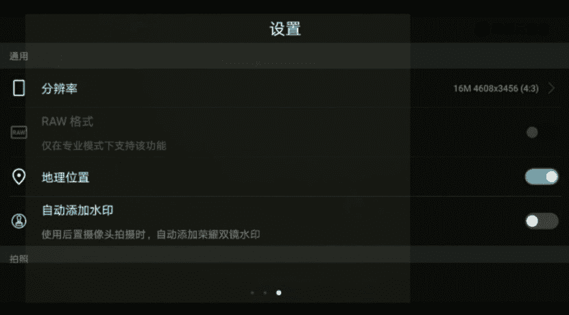
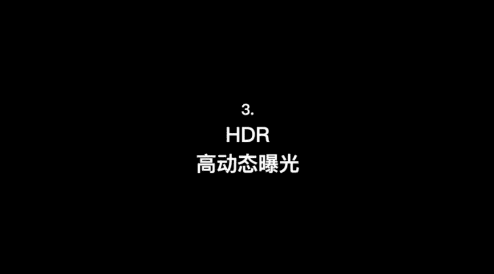

# 韩松-跟全球iPhone摄影大赛冠军学手机摄影，随手惊艳朋友圈（完结）：课时03.手机摄影附加和辅助功能

🎼，🎼，🎼，🎼好，那么接下来呢再来看一下第四部分附加模式和辅助功能。我们来看一下有哪些好用的辅助功能。第一个呢就是网格辅助线，首先来看一下苹果手机打开设置，然后呢打开相机，把网格辅助线给调整出来。

那么我们再回到相机里面就可以看到出现了。

🎼横着的两条和竖着的两条交错的九宫格。再来看一下我们的安卓手机啊，在这里以华为手机为例。那么在界面中从右往左的滑动一下，然后呢往下调整一下，看到一个参考线，把参考线中九宫格打开，再回到我们的操作界面。

九宫格就出现了。

🎼好，我们利用网格可以进行怎样的操作了。来看一下一个弹琴的小哥哥，我想要拍摄这样的一个他的手和琴键的这样的一个构图。那么如果没有这个九宫格的话，可能就对不齐琴键了。那么我们来看一下。

用九宫格的两条边缘线去把我们的琴键对齐，再来看一下中间的那一个十字按钮啊，那么把它对齐之后呢，就能保证我们的手机是处于水平状态了。那么利用这两个功能呢，就可以将我们拍摄的具有线条的物体拍的横屏竖值。

那么把它处理为黑白的，就会是一张非常棒的照片呢。再来看一下第二个触发快门的功能啊。She。我们下面呢就来看一下手机快门触发的几种方式。第一种呢最简单，也就是直接按右边这一个圆形的按钮啊。

点击就可以拍摄一张照片。嗯，很多时候呢被大家忽略的是第二种。大家看一下手机侧面的那一个音量键的加减号。我点击加号，或者是点击减号都可以顺利的拍到一张照片。这一个功能呢在街拍的时候非常好用。

因为街拍的时候呢，很多时候物体是突然出来的。那么这个时候呢，我们有可能会单手拍摄，单手拍摄的时候，我们呢可以看一下，用我们的大拇指啊，就可以很容易的拍摄到一张照片，点击音量键。来看一下这个场景。

我在纽约街头，然后呢，对面经过来一群人我立刻用食指单手触发快门的模式抓捕到了全部瞬间，全都是用连拍抓不到的。好，那么还有第三种拍摄方法。第三种拍摄方法呢就是接上我们的看到没有？接上我们的耳机，然后呢。

用耳机上面的那一个音量键的加号或者是减号，也可以拍到一张照片。大家有没有看到我们来点击一下耳机上面的加号。再点击一下耳机上面的减号，都可以顺利的拍到一张照片啊。

那么刚才为大家讲到的三种快门触发方法里面的前两种啊，长按我们右边的那一个圆形按钮或者是长按我们的音量减加减号都可以进行一个连拍的拍摄这个连拍速度呢大概是每秒钟10张以上啊，非常惊人的速度，嗯。

在拍摄运动物体的时候非常好用。连拍过后的照片呢，我们可以看一下，我们可以把它调出来，然后呢选择其中这一个选择的按钮点击进去之后呢，我们来选择一张我们最满意的照片，然后点击完成。好。

那么就出现了全部保留或者是仅保留一张个人照片。那我一般呢是选择仅保留一张个人收藏照片。这样呢我们手机的内存。存不会存的太满。好，其他的就删除掉了。这个呢就是手机快门的三种方法。呃。

那么我们再来看一下安卓系统的手机啊，刚才是苹果手机，实际上呢安卓系统的手机完全是一样的操作。呃，我们长按这一个圆形按钮，或者是我们再长按一下我们的那个音量键。哎，它的音量键呢是在反方向的。我们来看一下。

长按一下音量键都可以进行一个呃。连拍的操作啊，然后呢这里如果接上我们的一个快门线的话，接上一个耳机的话，呃，也可以用耳机的那一个加减号进行一个快门的操作。

接下来呢我们用连拍的方式来抓捕一下这一个疯狂弹琴的过程啊。大家看到我一直在连拍，然后呢拍了70多张照片。在连拍项目中呢来选择一张，我满意的来看一下哪一张效果最好呢？嗯，还是刚才那一张吧。好。

选中这一张照片啊，将其他的都删除掉，保留这一张就好了。然后最后用黑白处理的效果也非常的棒。好，接下来的第三个好用的功能呢是HDR高动态曝光。我们来看一下。

在这一个场景中，画面中的黑色部分和白色部分，它们的亮度差别非常的大。因此呢需要用HDR。我们来看一下怎么样解释呢？如果这个时候我将焦点对在后面的黑色部分，我们可以看到前面的白键部分呢是完全曝光。

反过来呢对在白键部分，我们可以看到黑色部分呢是完全黑暗，没有细节的。因此呢这个时候我们来看一下，我需要打开我们的HDR功能。然后将焦点先对在黑色的部分，其中。我们来看一下。那么这个时候拍下一张照片。

我们再将那个HDR功能关闭，再将焦点对在其中，再拍摄一张照片。我们来看一下两张照片的对比，这个是没开HDR的，可以看到白色部分完全过曝。来看一下，打开HDR的部分呢呃它的那个细节是相对保留完整的这。

下面呢我们来看一下双摄人像和大光圈模式。首先呢来看一下双摄。现在很多智能手机呢都为我们贴心的安上了两个摄像头，有了两种不同的焦距。这个弹琴的场景现在用的是原始的一倍焦距，可以看到背景中有很多杂物。

因此呢这个时候呢我需要点击右边的那一个一成，让它变为二层。点击之后呢，我们可以看到远处的景色一下拉近了画面呢扩大了两倍，变得纯净了很多。这个操作呢在我们的街头摄影中也经常运用到。

那么接下来呢我们再来看一下人像的操作啊，在苹果手机里面呢，人像的操作就在照片的旁边，它可以让背景虚化变得更加纯净。好，我们来看一下原始场景里面的背景比较杂乱。那么这个时候呢，我们调整为人像，可以看到。

背景虚化了很多。那么苹果手机的这一个人像模式呢，大概会在离我们的拍摄人物呃1。2米到0。2。5米这一个范围之内呢，会被自动激活。那么出现这样的一种背景柔和虚化的效果，突出我们想要表现的主体人物。好。

我们来尝试拍摄两张照片啊。然后呢，后期用调色的方法把它处理出来，就可以看到是一张很棒的人物摄影了。那么我们再来看一下安卓系统的华为手机和苹果系统的手机操作有所不一样。

它的人像模式或者是大光圈模式呢都是在一倍焦距的环境中激发的。好，我们来看一下这样的一个拍摄。现在呢是大光圈模式，我们可以看到背景呢也是进行了一个柔和的算法虚化。

那么我们呢再把这样的一种模式呢调整为呃左上方的人像模式。实际上呢它的效果也是类似的。那总结一下今天的第三个points啦。第一呢是对齐辅助线连拍，这些都是非常简单的易学即会的辅助功能。

其实许多优秀的照片呢，就是将这些简单的功能合适运用所得到的。第二呢请大家一定要注意啊，我们手机的人像模式、大光圈模式，这些都是算法背景虚化。需要时刻检查图像中有没有出现bug，特别是我们的背景比较。

复杂，特别是有那样的一种线条的背景出现的时候，很多时候呢容易出现bug。所以说呢这些是让大家一定要仔细检查的部分。第三呢是各个型号的手机人像模式，最佳拍摄距离大概都是1。2米至2。5米这样的一个范围内。

请大家注意一下。🎼好，今天的内容呢大概就是这一些，我们下一堂课再见。

