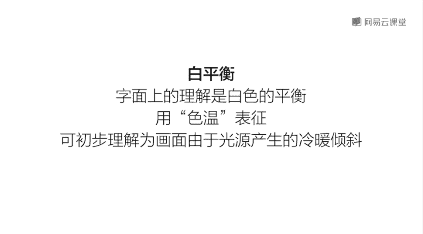

# 韩松-跟全球iPhone摄影大赛冠军学手机摄影，随手惊艳朋友圈（完结）：课时04.手机摄影专业模式

🎼え？🎼，🎼。接下来我们再来看一下今天的第五部分专业模式和拍摄原理。下面呢我们来看一下华为手机的专业模式。在拍照界面下呢，从左往右滑动我们的屏幕，选择专业拍照就OK了。专业拍照呢从下往上分为6个模块。

我们分别来看一下最下面的这一个模块呢是测光模块分为三种。🎼系统自动默认的是第二种中央测光最下面的这一个我们首先来看一下是平价测光。这种测光呢作为中庸系统呢会根根据画面中所有的亮度进行一个平均测光。

中间这一种呢是中央测光，主要针对中间的那一部分测光。我们最后呢再来看一下点测光点测光呢是一个非常精准的测光，它会根据我们选择的那一点进行测光。好，我们来看一下，比如说我们点击一下画面的。下部分。

🎼这个时候呢我们来看一下画面呢是不是明显变亮了很多。再看一下换一下上部分，那么明显变暗了很多，也就是根据那一个焦点处的地方进行了一个精准的测光。

我们再来看一下评价测光中这样的一个往下的点击或者是在上方的点击，它的测光变化不是那么明显的。🎼所以说呢我们接下来再看一下ISO这一个感光度。第二个嗯需要掌握的参数啊。

感光度呢是主要是指画面中呃对于光的敏感程。那我们来看一下。第一个呢使自动往上走的广感光度越来越高。走到最上面的时候，我们可以看到画面已经明显过曝了。那么这个时候呢，我们扩大一下画面来看一下。

那么感光度调的过高的话，画面的画质会急剧的下降。所以说呢一般的情况下呢，我都建议大家用自动感光度进行调整进行拍摄。那么高感光度呢一般会出现在比较暗的地方，比如说室内或者是晚上拍摄的时候。

我们可以适当调整，感光度调高。这个时候呢可以保证我们的快门速度不至于过慢。好，接下来呢我们再来看快门速度这一个参数啊，那么同样往上走，快门速度呢是越来越慢的。那么调到一个时候的。

我们就可以发现画面呢是进行了一个明显的过曝。因为是在白天它并不需要那么高的快门速度啊，所以说呢快门速度为解，建议大家一般调为or自动就OK了。好，我们再来看一下曝光补偿。来看一下往复调整曝光补偿。

画面变暗，往正调整曝光补偿的画面变亮，这个非常好理解啊。相当于是一个手动曝光的功能，让我们有了更多的。操纵曝光的可能性。好，最后呢我们再来看一下呃几种。不同的对焦。那么最下面的这一种呢是单次对焦。

我们来看一下。比如说在这里呢，我首先对准地面对焦，然后呢，我再将焦点移远，我们可以看一下远处是模糊的焦点没有发生变化。我们再来看一下中间的这一个啊连续对焦，就是我们使用的最多的一种对焦方式。

我们再来看一下，我先对准下面再往上面看一下，看一下焦点呢也是自动发生的转移。啊，这是一种最方便的对焦方式。那么第三种呢，我们再来看一下最上面的手动对焦这种方式呢，哎，我们可以进行一个自动调整。

我们想要对焦在什么地方。我看一下将手动滑滑动它那个模块之后呢，我们可以发现画面呢一会儿变清晰了，一会儿变模糊了。实际上呢这个在我们拍摄夜景的时候非常好用。最后呢我们再来看一下啊这一个调整色温的工具呀。

那么华为手机呢是我们为我们准备的第一种是自动色温，第二种呢是多云。那么第三种呢是那些钨丝灯下面的色温。那么我们看一下每一种色温下面的画面都会带来不同的情绪，有一些是偏蓝的，有一些是偏黄的。

那么最后一个呢是可以进行一个手动的色温调整。我们可以看一下，从上到下色温是K值不断的在减少。那么画面呢是越来越偏黄的。

那么所以说呢呃这样的一个。专业模式可以让我们。的拍摄更加具有自主可控性。

我们来看一下，在MF手动对焦模式下往下滑动模块。我们可以看到呢画面的虚焦程度是明显增大了，越往下滑动，虚焦的程度越大，那么会给人造成这样的一种城市摩登的感觉。以上呢就是本堂课的内容。其实总结下来。

手机摄影已经将拍摄功能简化的不能再简化了。我们需要掌握的核心技能就是对焦调节曝光而已。连拍HDR锁定曝光和对焦点等等功能，也在本堂课中有所提及。请大家务必拿起手机对准身边的物体，多多体会这些操作。

那么在这里呢给大家留下一个作业，如何用手机在白天拍摄一张暗调的车灯虚化照片。🎼今天的内容呢大概就是这一些，我们下一堂课再见。

