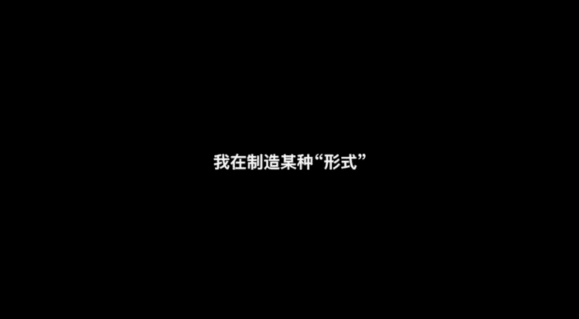
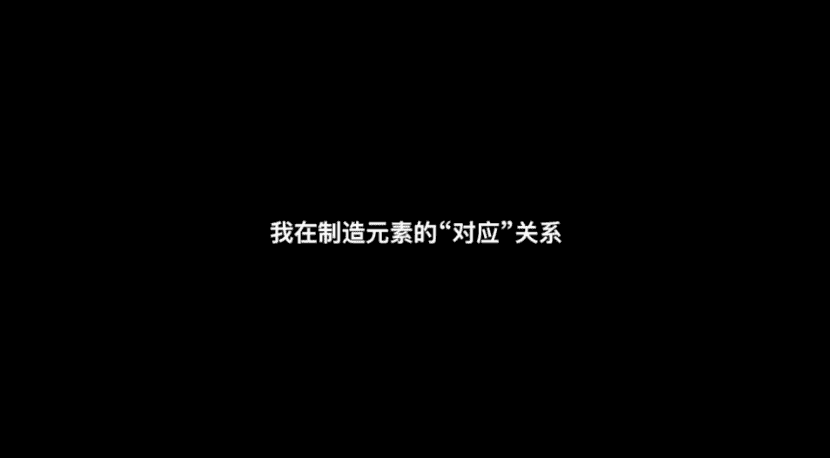
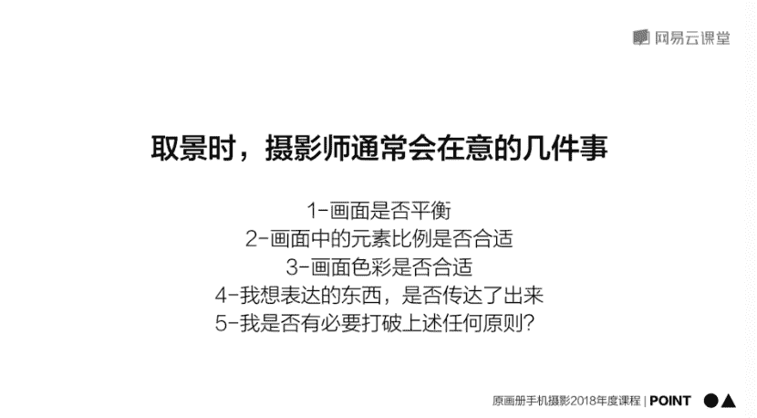

# 韩松-跟全球iPhone摄影大赛冠军学手机摄影，随手惊艳朋友圈（完结）：课时05.摄影师拍照时在想什么

🎼The。🎼，🎼，🎼上节课中我们学习了基本操作。那么这堂课中呢，我们就开始关注构图和取景呢，这和观察力有很大的关系。为了让大家更好的掌握知识，这节课呢我将带来大量的实意拍摄案例。

让大家在真实场景中感受拍照时应该如何选择取舍和创造。请大家一定要注意听今天的第二部分美学规律。这是对取景构图的理论知识总结，理解后呢会对大家摄影产生质能影响。这堂课很多拍摄场景都来自旅行。

大家也一起感受一下在路上拍摄的感受吧。首先我会为大家分享一个小短片，在这个短视频中呢收录了我在拍摄几个具体场景的全过程。大家可以看一下，在拍摄的时候，我在想什么是怎样进行取景的。

在曼哈顿混杂的街头，看到这样的一个场景啊，对面一位女士牵着一条狗，然后呢，我先把他们对焦，用连拍的方式抓捕他们在车辆之间这样的一种动作。好，那么再多连拍几张。最后呢选出了这一张。

主体非常突出的样子为大家做展示。所以说呢我刚才的动作在确定主体。🎼我们来看一下另外一个场景，同样在曼哈顿的街头，人来人往，车水马龙，高楼林立，非常的摩登。我们来看一下在这一个场景中。

我们能够抓捕到什么样的有趣的内容。我选择的角度呢是从上往下观察，看到街边的一个烤肉摊。首先呢我用一倍焦距去拍摄啊。这个时候呢我们可以看到比例有一些小周围的车非常的复杂。所以说呢我加成了3倍。

那么这个时候呢画面中人物的比例所占更。🎼呃，主体呢就会更加的突出。好，那么如果三倍会觉得有一些过劲的话，我觉得用两倍是最合适的。这个时候呢，人物在画面中是比较突出的。

然后呢呃烤肉摊在画面中的比例也是在一个比较大的一个比较主要的位置。所以说呢我再多拍几张，等待一个合适的瞬间。🎼那么最后的成片呢就是这样，我们可以看到人物的姿势也非常的。🎼好。

所以说呢我自己呢在比较主题所占的比例，然后呢再多拍几张，抓住一个最有意思的瞬间。我们来看一下同一个场景，我找到一块发光的玻璃，将手机呢放在玻璃上抓捕到了下面的人物，在玻璃下面处于这样的一个对称的结构。

呃，那么利用这样的一个街头的小小物件，也可以拍到很多有趣的照片。下面呢为大家展示一下成品啊。所以说呢我们可以看出来，在照片中，我在制造一种对称的形式，营造画面的美感。

接下来呢我们来看一下下面一个场景。那么在这个场景中呢，我们可以看到我像拍远处的桥，但是呢近处的这些人行横道线，还有马路，还有树木，非常的复杂，太抢眼了。所以说呢我直接靠近那座桥。

然后呢用二倍焦距进行了一个拍摄。我们来看一下，在这个场景中，我在稍微的移动一下手机，让桥和近处的这一个像远处延伸的木桩之间有一种比较平衡的关系。那么这样看起来呢，画面就会更加的美观，更加的得当。

好，我们再来移动一下。那么移动到这个时候呢，我们可以看到得到了干净美观的画面。所以说呢在拍摄的时候呢，我在想各种方法去规避多余的不要的元素。我们来看一下在法国罗纳河的边上，我看上的这一个灯柱啊。

它向上的直线以及弯曲的曲线及聚集和的美感非常的漂亮。我要怎么把它记录下来呢，我向上移动，我的手机将河面的部分去除掉，将电线杆干净的放在画面中，等待一个人的经过。我们来看一下，在这一个过程中。

电线杆的直线和人物的点状形成的这样的一个点线元素的搭配，非常的完美，非常的好看？那最后呢我们来看一下拍成的照片啊，人物出现在右边，那么也可以像这样。等人物再经过一些出现在两个电线柱中。

所以说呢在这一张照片中，我是在制造元素的对应关系。

🎼相信大家看完之后都会明白，在取景时，我会通常在意这样的几件事。第一，画面是否平衡。第二，画面中的元素比例是否合适。第三，画面的色彩是否合适？第四，我想要表达的东西是否通过画面传达了出来？第五。

我在拍摄的时候是否有必要打破上述任何原则呢？

🎼所以说今天的第一批points，第一批观点就是。🎼摄影构图和取景无非关注两个问题，形式美和内容美形式的问题可以基于接下来会告诉大家的形式美学规律进行学习。在拍摄的时候呢，要有打破规则的勇气。

这样呢才有助于形成大家独特的美。好，那么今天的课程呢就到这里，我是用画册的韩松。谢谢大家。

