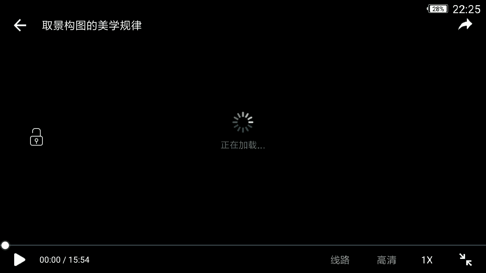
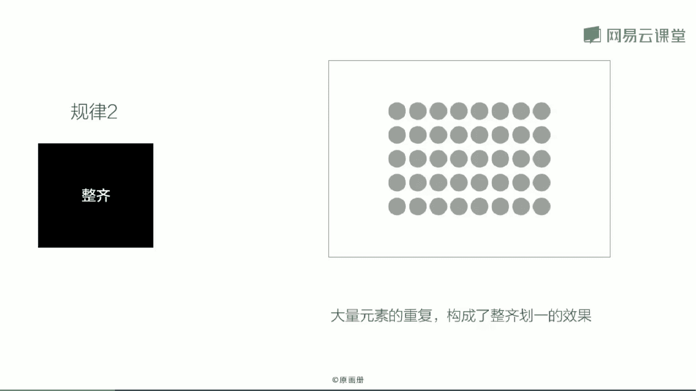
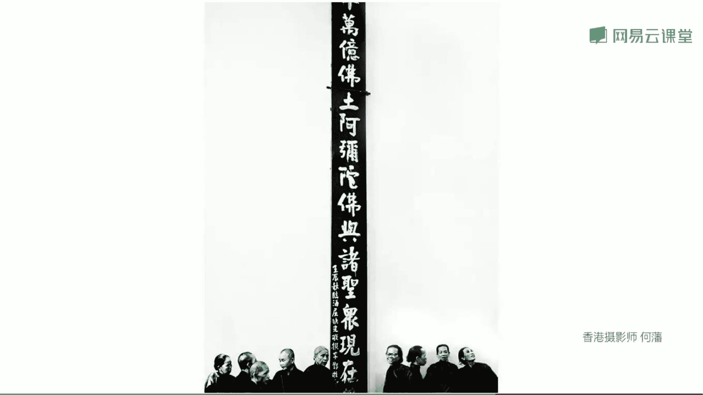
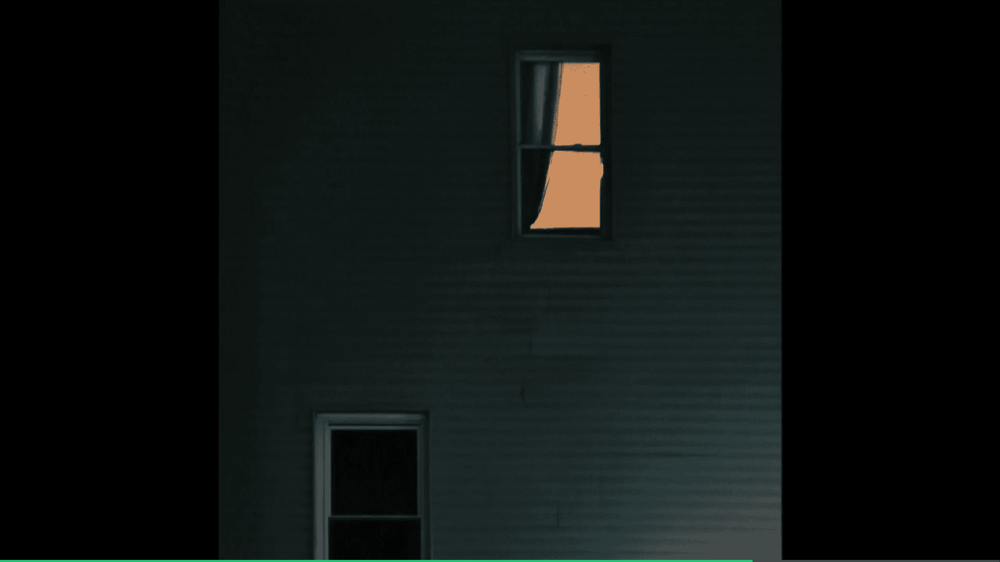
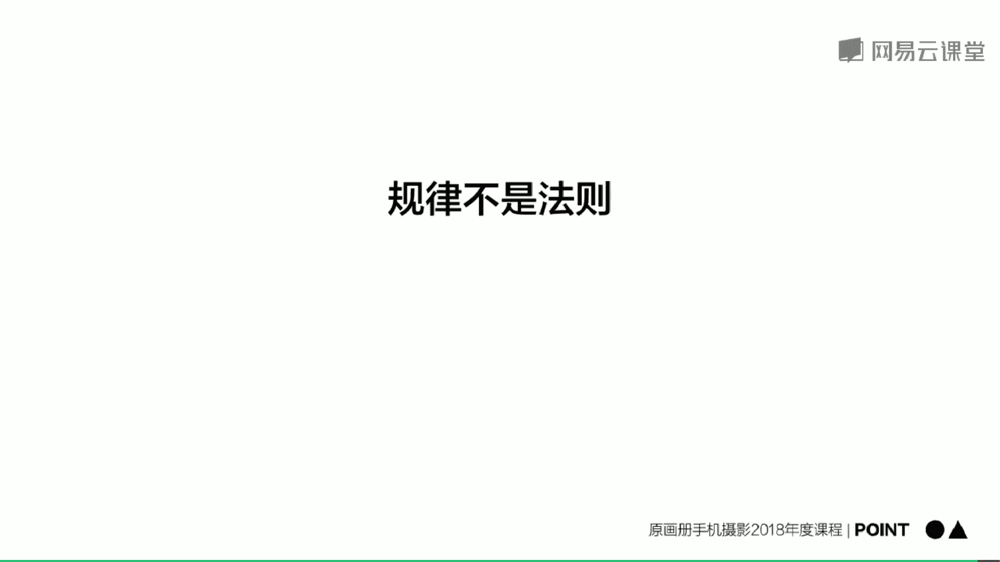
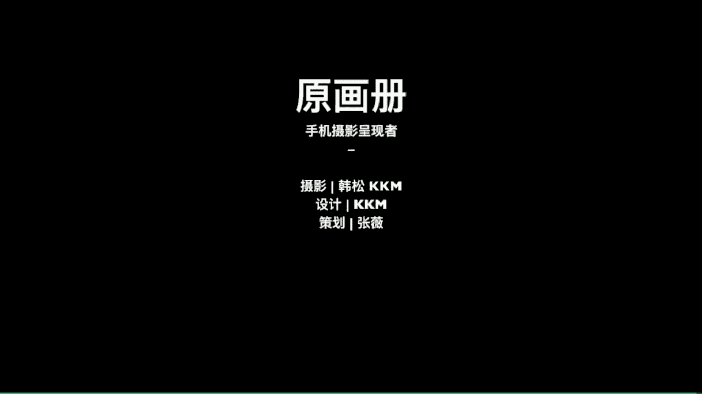

# 韩松-跟全球iPhone摄影大赛冠军学手机摄影，随手惊艳朋友圈（完结）：课时06.取景构图的美学规律

🎼所以我们接下来就来学习取景构图的形式美学规律。首先呢我为大家总结一下这样的所谓的形式美好看的照片，有怎样的视觉感受呢？第一，在某些方面，他们是趋于统一的。第二，他们都有较为清晰明快的结构特征。第三呢。

在这一些照片中有些具有有意义的对比和冲突。那么通过这样的好看的视觉感受，我们来总结一下有怎样的规律，通过怎样的规律能够达到这样的一种视觉感受呢？第一个规律，最简单的单一纯粹。

单一纯粹是一种非常棒的突出主体的效果。我们通过画面的一个最为重点的元素，达到引人注目的感觉。🎼这张在冰岛拍摄的照片，背景是一个峭骨嶙峋的山峰，前景中有一个小木屋。

我们可以看到小木屋在画面中是绝对的视觉中心。香港摄影大师河帆的这一张照片拍摄的是一个雾天城市前方的河和上面的一艘小船，我们可以看到小船是绝对的视觉中心。为什么呢？背景中的元素，由于是在雾天。

所以说城市是朦朦胧胧的，那么河上的感觉也是朦朦胧胧的。所以说小船就更为突出更为清晰了，而且它放在画面的正中，小船朝两边伸出了两条桨，还有上方的桅杆和下方的倒影。

这让它扩大了更大的体积造成了一个更为中心的存在，所以说它是一个单一纯粹的方法，用这样的方法突出了主体。我们来看一下这一个场景，在中央公园的周末午后非常的闲适，非常的舒服。

那么我们想要记录这样的一个场景要怎么办呢？如果直接随便拍的话，可能会觉得有一些杂乱，少了一点什么，少了一点美感。那么这个时候呢我们来看一下我的取景呢是采取刚才所讲到的单一纯粹这样的一个原则。

一个小孩跑过，把我们的视线呢引向了这一个近处的人身上。所以说呢就以他为主体，以它为画面中的中心。我们再来移动一画移动一下画面，看一下周围，我自己觉得呢将远处的建筑物和近处的人物。

同时表现在画面中是不错的。有这样的一种更强烈的氛围感场景感。🎼第二个规律，整齐通过大量元素的排列重复，形成一种整齐划一，一种视觉震撼的效果。德国杜塞尔多夫学派的摄影家古斯基这张照片就是一个非常棒的解释。

🎼相机离远处的货架非常的远。我们可以看到远处的商品从左往右形成的这样的一个一个一个一个的整齐排列，产生了一种震撼的效果。🎼那么我们来看一下皮纳包什的春之记这一个剧照，从左到右是男和女这样的依次排列。

那么形成了这样的一种有动感的整齐的画一的效果。那么受这样的影响，在德国的柏林这样的一个体育馆拍摄的时候，我拍摄到了这样的一个场景。我从上往下，从近往远构图。

拍摄到了一排椅子这样的一个一排一排一排一排从近向远处延展的场景。我们可以看到通过这样的一个高度整齐画一的感觉，给画面造成了一种强烈的震撼感。那么有时呢在这样的一种整齐中，我们还可以去寻找一种变异。

例如这一张柏林的犹太人纪念碑。我们可以看到背后的纪念碑，在阳光下形成了整齐的光明面和阴暗面这样的一个交替。🎼一个极具几何美感的背景。在这样的背景中，有一个小女孩在拍照，那么无疑她就成为了画面的视觉中心。

有了这样的一种变异的美感。那么何帆的这一张照片也是运用了相同的拍摄手法。背景中的油筒整齐的排在一起，形成了一个极具几何结构感的呃这样的一个场景，前景中的小孩正在喝水，那么形成了这样的一个有变异的感觉。

那么就是一个整齐画一中的变异手法，更加突出主体。来看一下这个场景，夜晚的成都太古里。本来呢场景是非常复杂的。但是呢我却发现了这样的一个小角落，电梯下方那一些亮着的圆形，他们排列在一起。

形成了一个重复元素形成的美感，非常的有意思。我将相机的焦距调到哈尔贝，哎，我们可以看到这个时候呢，下方的线条和上方的圆点形成这样的一种重。

复的美感就会更加的强烈。所以说呢这些容易被人忽略的细节把它抓捕下来也是非常有趣的。那么我们下面呢就来看一下，那么用这样的一种重复的美感这样的一个规律拍到了照片。

🎼第三个规律，对称与经均衡，这实际上呢是两个关键词。对称指的是画面中两个完全对等的部分，它们构成统一稳定的美感。均衡呢是指画面中不对等的各部分，构成了一种活泼微妙的重量平衡。🎼这张照片很明显是对称。

左边的建筑物，右边的建筑物，中间的两个人，加上天空的一只鸟，他们无时无刻不再传达出这样的一种对称的美感，这样的一种强烈的视觉冲击力。🎼来看一下这一张照片，是我的好朋友婴儿音乐人陈宏宇拍摄的一张照片。

选择场景的时候，选择了这样的两边的枯枝，他们是完全对称的。而且头上的枯枝呢也是形成了这样的一种对称的圆拱的效果，将红宇放在其中形成了这样的一种天然的对称的美景。

那么这一张照片在濑乎内海前面拍摄的也是一个对称。左边的女孩右边的男孩，还有中间的小鹿，他们三个元素形成的画面，这样的一种强烈的对称之感。🎼好，那么接下来呢是均衡这样的一个关键词的理解。

来看一下这张照片吧。前景中的椅子和背景中的影子，虽然说它们不是完全对称的，但是呢我们明显能够感觉到这两个元素之间的对话。前景中的椅子比较大，背景中的椅子影子呢比较小，前景中的椅子比较亮。

背景中的影子比较黑。通过这样的一种对比的手法形成了一种巧妙的均衡之感。那再来看一下这张照片，英国的街头，黑人问号脸最大。那么它偏向画面的右方，所以说呢在画面的右方就再加上了一个比较小的女生。

在画面的左方加上了一个相对来说比较大的嗯，这样的一个男性的角色。所以说呢形成了这样的一个左边中，那么中间偏右最大，那么最右边最小这样的一个巧妙的均衡。来看一下这张照片，那么街头的一个列车。

🎼我们可以看到左边的列车和右边的电线杆也是形成了一个巧妙的均衡。那么这一张雪景左边的数比较大，右边的房子比较小，左边的数比较清楚，右边的房子比较模糊。

形成的这样的一个清晰和缥渺大小前元这样的一些均衡之感在画面中，我们可以尝试用物理学的概念来理解一下均衡这一个关键词，也就是让画面处于天平般的平衡，我可以在画面左边右边加上完全相同的元素。

那么这样就是对称了。那么我可以在画面的左边加上一个小元素，在画面中右边比较靠中心的地方加上一个稍微大一些的元素。我么我也可以在画面的左边加上两个小元素，在右边加上一个大元素。

这样呢都会形成画面的均衡之感，感受视觉的重量是最重要的。🎼来看一下这三个这三张图的一个分析吧。左边的这一张是一个很明显的均衡，一个很明显的对称。那么中间的这三张，那么黑人占的比例最大。

那么左和右是次大和最小。那么最右边的这一张我们可以看到，虽然说那一个列车它占的比例比较大。但是右边呢是有一根电线杆有这样的垂直往上的柱状效果，增添了画面，右边的重量。

所以说呢他们两个仍然能够形成这样的一种均衡的感觉。在其中。🎼嗯第四个规律，对比与调和对比呢指的是画面中互相矛盾的元素，他们相互对抗，形成一种刺激的美感。

那么如果画面中的各个部分是具有这样的统一的效果相似的性质。那么把它放在一起，会形成和谐的效果。那么这个就是一种调和了。来看一下对比有几种。第一种色彩对比。

在我们的太阳夕阳夕阳西下之后很容易抓不到这样的一种场景。这张呢是在天津拍摄的，阳光已经下去了，天空呢出现这样的一种浪漫的蓝色，下面呢刚好亮起了红灯红与蓝冷与暖形成的这样的一种对比。那么这一张照片。

巴黎街头拍摄到的，冬天行道树剪得非常的整齐。那么画面的左边是密的，那么右边的天空什么元素都没有，它是疏的，那么形成了这样的一种疏密之对比。🎼那么经常呢在下午四五点的时候。

我们可以看到阳光斜射进入我们的窗台，形成了这样的一种明暗的对比。比如说这张照片获得了今年的全球手机摄影大赛的金奖。那么它就是使用的这样的一个下方明上方暗这样的一种明暗对比。🎼那么至于调和。

我们可以看到刚才是颜色对比，我们也可以进行进行一个颜色调和。巴黎的一个博物馆中，我们可以看到莫奈的睡莲和前方的女生穿的毛衣，他们的颜色是非常棒的融合在一起了，形成了这样的一个巧妙的视觉调和。

好像女孩走入画中的一般。那么这两张照片左边是对比，右边是调和，为什么呢？因为左边是有这样的一个明显的暖橙色的衣服的人出现在画面中给冷峻的背景，带来了这样的暖色，有了一个颜色，冷暖的对比。

那么右边这一张照片是调和，因为整体是处于冷色调的场景中。那么对比和调和给画面带来了两种不同的视觉感受，但是他们都是给我们带来形式美感的。再来看一下何帆这一张照片，那么也是一个视觉的对比。

中间的那一个高高的佛牌和两边的人物形成的一个高与矮的对比。

来看一下夜晚的新泽西街头，我想要拍摄远处那一个发光的窗户。所以说呢这个时候我要做的是怎样呢？我首先往上抬起手机，然后呢将拍摄元素组织在画面中。我们来看一下上方的那一个窗户呢是放在了画面靠右的位置。

将下方的那一个窗户呢也一起放在了画面中，形成了这样的一种位置的对比。那么还有色彩的对比，以及明暗的对比，这三种对比，同时出现在画面中。那么最后呢在经过一个简单的后期。

我们就可以得到这一张主体非常明确对比也非常明确的照片。

🎼那接下来我们再来看一下第五个规律，尺度与比例，尺度是绝对的概念，比例是相对的概念，它们都是指画面中元素和元素之间互相的关系，有这样的一种不同的比例带来的美感。🎼这一张照片。

画面中的人物相对整个建筑来说非常的小，是这样的一种比例人般的感觉。那么是一个小比例。那么这一张照片人物变得非常的大，有了具体的这样的一种表情和具体的动作，那么是处于这样的一种人物肖像大比例的感觉。

我自己给的这个tips呢可以尝试多尝试一些小比例的拍摄，拉开人物和环境元素的比例获得更有张力的照片，右边这一张在巴黎国家图书馆拍摄到的照片，我们可以看到右下角那一个人物非常小，反衬出建筑的高大。

柏林的冬天，蒂尔嘎藤里面一片萧瑟。前景中的树木显得非常的挺拔，非常的美感。那么背景中有一个人牵着一只小小的狗，将狗的元素的比例放的非常的小。第一活泼的画面。第二反衬出前景中，树木的直树木的高大。

那么何方这一张照片，那么其实也是使用的这一张小比。🎼你的感觉人物非常的小，背景中的墙壁斑驳和背景中墙壁的高大就体现出来了。🎼第六个规律，节奏与韵律，让画面中的元素按照一定的规律循环往复产生美感。

如果这样的一种循环往复，倔渐强渐密等等变化就形成了韵律。我们来看一下这张照片的节奏就非常的清楚，从左往右小木屋依次排开。那么再看一下这张照片，那么就有一种韵律之感那，为什么呢？

是因为换了一个角度我们可以看到我是斜着对着椅子的对吗？所以说呢椅子的前面显得比较大。那么像远处延展呢，它就越来越小形成的这样的一种渐变的韵律之感。那么这一张照片呢也是一样，从远处到近处。

那么层层递进的韵律之感，其实呢就是一个非常简单的街头乌云的感觉。我们再来看一下这一张照片，巴黎街头的一个光影回廊。呃，这张照片呢是那个盗梦空间里面的场景啊，那么也是从近处往远处这样的一个回廊的递进。

再加上地面的那一个影子，那么加深了这样的一种渐变的感觉。那么从近处到远处就会有了这样的一种韵律之美感。我们再来看一下香港摄影大师何帆的这一张照片吧。拍摄的街头的黄包车，为什么他没有拍摄一辆。

为什么他没有去抓捕一个人的具体的表情，那么就是利用了这样的一种韵律的美感，从左到右依次排开，形成了这样的一种节奏韵律之感？所以说呢今天的第二个points分享给大家。总结一下刚才的形式美规律啊，第一。

单一纯粹美学规律的基石整齐。在整齐给我们带来震撼这样的一种前提下，我们可以去打破完全的整齐，形成这样的一种有效的变异，对称与均衡，造成视觉的重量感对比与调和，给画面带来更强的情绪、尺度与比例。

让画面更具张力，节奏与韵律。这个呢是音乐相通的某种规律。那么要注意的是，这样的规律不是法则灵活运用才是最重要的。

🎼好，那么今天的课程呢就到这里，我是原画册的韩松，谢谢大家。

