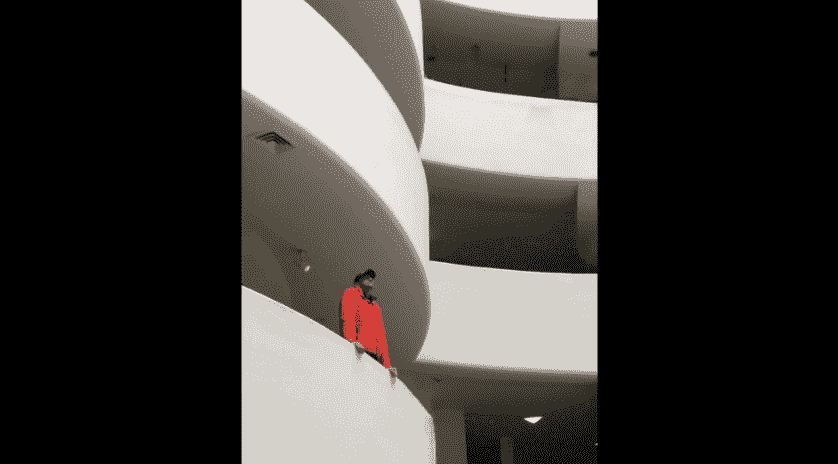
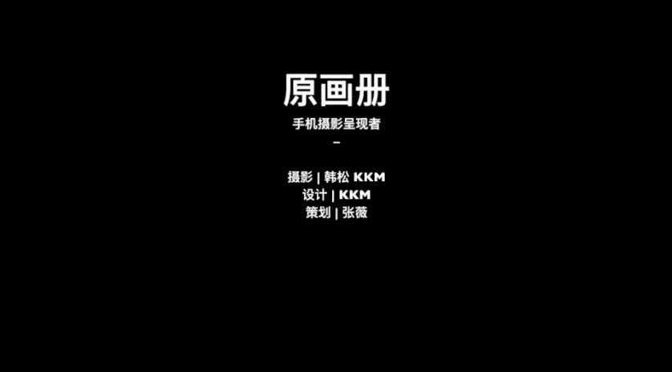

# 韩松-跟全球iPhone摄影大赛冠军学手机摄影，随手惊艳朋友圈（完结）：课时07.摄影师拍照取景案例

🎼，🎼，🎼，🎼接下来呢我还会为大家分享几个具体的拍摄案例，大家仔细看。第一个呢是在葡萄牙的里斯本海边拍摄到的拍摄这一个场景的时候，那么其实大家都可以明显的看出，就是刚才为大家讲到的。

单一纯粹那一个美学原则，在一个海滩这样的一个大场景，前面有一个小女孩在玩沙这样的一个小比例人物出现在画面中形成了一个单一的视觉中心。那么这张照片的原始场景是这样的，为什么不好呢？

是因为画面中有了更多的多余元素，比如说右边的石头，还有多余的人。而且呢这一张照片我们可以看到明显天地的色彩是有冲突的。嗯，这样的亮度是不够的，给人感觉色彩不通透。所以说呢要抓捕到刚才那一个场景。

我们需要耐心的等待，等待到这个小女孩她单一出现在画面中的时候。第二呢是需要调高曝光，让整体的颜色更为通透。好，那么这一张照片在里斯本的电车上面拍到的是一个具有欧美暗调美感的照片。

我想要的就是这样女孩非常呃感觉情侣的感觉非常的romantic，呃，感情非常好的，依偎在一起，形成这样的一个大特写的这样的一种感觉，然后整体调和的光线出现在画面中给人一种浪漫的感觉。

那么我们来看一下原片是不是这样的一种浪漫感觉就完全没有了。为什么呢？是因为在拍摄的时候，女孩脸上是不是明显过曝了，这样的一种欧美暗调色的美感就没有了。然后呢，画面中下方出现的过多的其他元素。

让画面并不显得那么单一纯粹了，所以说呢在拍摄的时候，我需要用二倍焦距获得更近的特写构图。然后呢在拍摄的时候要手动调节曝光，往下滑动，调低曝光，让画面显得更加的柔和幽暗。再来看一下这一个场景吧。

莫斯科的地铁中，我们可以看到画面是利用了刚才为大家讲到的哪一个形式美规律呢，是不是有节奏和韵律这样的一种感觉。我们可以看到从左边到右边，人物依次排开。但其中呢有一个老人他做的非常的高。

而且他的表情非常的严肃，也给画面带来了这样的一种强烈的视觉中心。那么这一张照片为什么不好呢？因为这一张照片太为平庸了，而且呢人物相互重叠，破坏了这样的一种结构的分布。因此呢要抓捕到好的照片。

我们需要多次的实验，耐心的等待，直到抓捕到最为戏剧的那一个场景为止。里斯本的街头，葡萄牙馆这一个建筑呢非常的通透，阳光打在上面尤为好看，极具几何的美感。我想要的就是这样的一种建筑光影的节构感。

而且呢还有一个人物出现在画面中体现出构筑物的尺度。那么这一张原片为什么拍的很失败呢。第一是画面的右边出现的天空，还有远处的海，这样的一些东西，实际上呢是破坏了画面中建筑的节奏感。因此呢我需要将它们去除。

保留中间的那一些重复的元素。所以说呢我需要做的，第一就是采取掉多余的部分，只保留中间的那一个光影的建筑回廊。而且呢要等待人物的出现，衬托出建筑的尺度。那么这一张照片的效果就会好很多。

那么接下来呢还会为大家放几个视频。大家看到这几个视频中呢，我会为大家再多分析几个具体的案例。

下面我们来看一下在。在大都会博物馆里面的场景是一个站。听的中庭，我们来看一下在这样的一个场景中，如何运用刚才讲到的美学规律。对来拍摄。首先呢我们来看一下这样的古典建筑啊，它的中庭一般是对称的。

所以说第一就用最对称最正中的角度拍摄一张用这样的一种对称的原则去组织画面。我们将手机抬高一下，看一下天空中的那一个天景，天花板的地方是一个几何的圆形，这样的一种单一纯粹的方式，也可以来组织画面。

我们再将手机呢向右下移动一下，可以看到我们的呃画面中有这样的一种弧线的线条，用这样的一种线条的对比，也能够拍到一张完美的照片。最后呢我们再来看一下柱廊从近处向远处延伸，有这样的一种节奏感。

所以说呢最后呢就可以很轻松的拍到这样的一些非常棒的照片呢。我们再来看一下谷根海母博物馆啊，它的中庭呢也极具特色，是这样的螺旋状上升的弧形。首先呢我们来看一下由这样的一种弧线产生的。

韵律自然呢就可以形成一张非常棒的照片了。我们将手机呢再稍微的抬高一下，然后呢我们来观察一下这一个建筑的穹顶，它的穹顶呢也是一个完完整整的圆形。

那么我们可以用这样的一种圆形带出的单一纯粹的感觉来组织一张照片。那么我们再来观察一下这个建筑的一些细节方面的东西啊，我们来看一下，在每一层楼上呢，都有一些人出现在画面中。

我们可以将人物和弧线的线条组合在一起，形成这样的一种对应的关系。那么还可以采用这样的一种对称的构图，加上人物单一纯粹的效果来组织画面。那我们最后呢就得到了这样的一张照片。

🎼所以说呢最后我们来总结一下，为什么我们不学习构图法则呢？死记硬背是不行的，只有看到想要拍摄的具体场景，灵活运用我们刚才所学的那些美学规则，才有可能拍到完美的照片。

这节课就讲到这里，我们再来回顾一下要点，构图取景需要注重的不是构图法则，而是美学规律。也就是这堂课中为大家讲到的单以纯粹整齐对称与均衡对比与调和尺度与比例、节奏和韵律。可能其中有些原理。

初次理解起来会有些抽象，多体会，我在课中给到的案例，平时呢多观察多拍摄，一定会有进步的。那么还是给大家留个小作业，找移动建筑，拍摄6张照片，分别运用6种形式美的规律，看看有什么可能性。🎼好。

那么今天的课程呢就到这里，我是用画色的韩松，谢谢大家。

