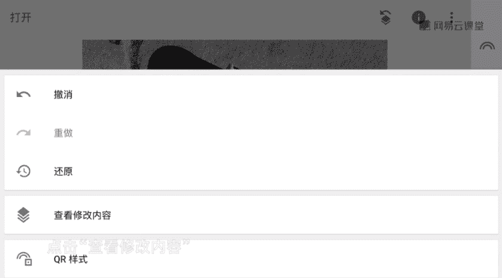

# 韩松-跟全球iPhone摄影大赛冠军学手机摄影，随手惊艳朋友圈（完结）：课时08.snapseed调色操作和基本术语

🎼，🎼The。🎼，🎼今天的第三节课，我们先来学习后期调色的基本原理。请大家注意，这节课主要是讲原理。学习后期大家得首先知道什么是亮度，什么是对比度等等。调节高光阴影又会产生怎样的变化。

那么这节课也有干货，我会帮助大家入门nse和basco两款软件的使用。这两款软件呢在我后期调整一张照片的过程中，大概占到了95%以上的比例。那么在这节课中呢。

我还会用基本原理解释日系照片、黑金等等流行风格的本质，教大家调出一张干净通透的照片。通过这堂课，大家可以对手机摄影后期有一个系统的初步认识。那么为了帮助大家在短时间内入门后期调色。首先呢今天的第一部分。

我会为大家讲到三大后期的呃基础板块。第一个呢引掉。第二点呢。色彩第三点是矫正。实际上呢这三点内容正是我们照片后期的3块基石。

下面我们就通过snap seed这一款软件来为大家讲一下一张照片后期处理的基本过程。🎼包括影调色彩，还有校正部分。snap这一款软件呢是谷歌公司出品的。在苹果系统的手机里面。

还有安卓系统的手机里面都可以免费下载，可以进行这样的一个手机照片后期的综合处理，可谓是手机后期软件里面的photoshop。好，首先呢我们打开snap z的这一款软件。然后呢载入照片之后，就如图所示了。

我们看一下最右边中间的那一个铅笔按钮，我们把它点开就可以看到各种各样的后期处理调整的步骤。首先呢我们选择一下左上角的那一个调整图片。然后呢上下滑动一下我们的手指就可以看到各种参数了。

那么首先呢我们来进行影调部分的调整。影调呢解释一下啊，它是跟照片的明暗程度相关的。比如说这张照片，我们来看一下天空部分和地面部分最亮。是画面中的。🎼高光影调部分。

我们再来看一下房子的上部分是处于中间亮度的。所以说呢它是一个中间调部分。再来看一下房子的下部分，那个地方是一个比较黑的部分。那个部分呢是画面中最暗的地方叫做阴影部分。

所以说呢大概影调一张照片的影调可以分为最亮的高光部分，还有中间的中间调部分以及最暗的阴影部分。那么我们来看一下影调可以通过怎样的参数去改变，达到一个我们想要的这样的一个程度呢？

那么调整影调的参数呢有亮度对比度，高光阴影，还有氛围等等。这些参数呢都可以在snapse里面进行一个方便的调整。那么我们首先上下滑动一下我们的手指啊可以看到各种参数了。我们首先呢来调一下亮度。

然后往右滑动一下手指，我们可以看到亮度的参数是在变大。这个时候呢我们看到天空变亮了。那同时那么建筑部分也变亮了，地面部分也变亮了。所以说呢它可以带来画面中高光中间调，还有阴影，同时的变亮。

那么反之呢我们往左滑动一下手指啊，我们来看一下整个画面都变得非常的暗，它带来的这样的一种变化是非常明显的。好，我们再来看一下第二个参数对比度。同样呢往右滑动一下手指，让对比度增大。那么这个时候呢。

我们是不是可以看到天空还有中间地面的部分，他们的对比呢是增大了。再来看一下这一个过程，往右滑动一下手指天空变亮。然后中间原来阴影的部分呢，也变暗了，所以说呢进行了这样的一个高对比。然后呢。

我们再反之来看一下对比度减少的时候是不是觉得画面变得灰蒙蒙的，天空的亮度和地面的亮度，它们之间的对比呢是减少了。哎，所以说呢哎如果我们的画面原片显得有一些灰，我们可以适当的增加一些对比度。

如果我们的原片的对比度本来就比较大。那么我们可以适当的减少一些对比度来获得满意的画面。但是要注意啊，一定要调整，不要过度过度之后呢，就会造成画面。的画质急剧的下降。接下来呢我们再来看一下第三个参数。

那么就是高光的参数。来看一下，还是同样的操作，往右滑动一下手指。我们可以看一下高光增大了。这个时候呢。它和亮度有什么区别呢？我们再来看一遍，往右滑动手指，注意一下天空的部分。

我们是不是可以看到天空呢是变亮了，因为刚才呢还是处于比较蓝的状态。那么这个时候呢已经感觉亮的发白了。但是呢我们来看一下画面的中间的建筑部分还有下方的阴影部分，那么这些地方呢是基本上不变的。

所以说呢调整高光。高光增加它只会影响画面最亮的区域，而画面中的中间调和阴影调的部分呢，它是基本上不会改变的。有这样的一个保护作用。那么我们再反方向调整一下高光减少。

我们是不是可以明显看到天空的部分的亮度减少了很多。但是呢我们再来观察一下那个建筑中间的部分，还有下方的阴影部分，它们是不是基本上没有变化的。哎，所以说呢高光是一个很好用的功能啊。

它可以调整画面中的一个影调，也就是高光部分的影调，而保护画面中的另外两个影调，也就是中间和阴影部分的影调。好，那么理解了高光之后，那么阴影这一个参数就很好理解的。

它是与高光相对的比如说我们调整阴影为正直。我们是不是可以明显的看到画面下方的那一个原本比较暗的地方，它有了细节变亮了。但是呢画面中上方的高光的天空部分，还有中间的墙壁部分是基本上没有变化的。

那么我们再来反方向调整一下，是不是可以看到画面中的阴影部分变得更暗了？但是呢上方的部分还是基本上没有变化。所以说呢阴影是一个和高光相对的参数。那么在阴影参数中呢，它可以调整画面中最暗的部分。

而保证画面中亮的部分和中间的部分不受影响。🎼好，那么我们最后呢再来看一下氛围这一个参数啊，这一个参数呢是snapse里面的一个特有参数。

也是我在调整阴影参数中呢阴影这样的呃调整引调这一个呃这一个参数里面经常使用到的。好，我们来看一下氛围增加之后。🎼那么这个时候呢，我们是不是可以看到画面中的层次变多了，我们再来看一下这一个过程啊。

🎼氛围逐渐的增加，注意观察一下画面中下方的阴影部分是不是有了更多的细节，高光的部分感觉天也变得更蓝呢，也是有了更多的细节。呃，所以说呢一般氛围参数的增加，可以让画面显得更加的有精神。

也可以显得更加的有通透感。呃，这个呢在前期照片比较灰的时候，可以尝试去增加一些氛围，是非常好用的一个参数啊。🎼好，那么我们说完了影调的这几个参数呢，我们接下来呢再来看一下色彩参数，色彩呢非常的好理解。

好，我们首先呢来看一下。饱和度是形容色彩里面的一个重要的参数啊。我们首先往右滑动一下手指来看一下饱和度增加之后，是不是可以看到画面变得更浓的色彩。那么我们呢反方向的来调整一下。

可以看到饱和度减少之后可以换看到呢画面变得更朴素。那么饱和度直接减到最极端的100之后，那么它就完全是一张黑白照片呢？那么在一张照片中呢，我们可以通过调整饱和度来获得我们想要的一个画面的直观效果。

比如说呢我们想要让画面更浓艳一些，我们可以让饱和度增加。我们想要让画面呢处于一种比较朴素的状态，我们可以适当的减少一些饱和度，让画面更耐看。呃，我给大家的建议啊，一般饱和度增加的话，不要超过30%。

超过之后呢，就很容易造成画面的色彩溢出。好，我们最后呢再来看一下色调这一个参。啊在那个色彩里面除了饱和度之外呢，还有色调，色调呢是主要指的画面的这样的一个情绪的感觉。比如说我看一下，把色调往正方向拉。

是不是可以看到画面明显出现的偏黄偏暖这样的一种感觉。然后呢，我将色调呢往负方向拉，可以看到呢画面明显出现了像蓝色的偏色，所以说呢我们可以通过色调的调整来给画面附上不同的情绪。好。

那么接下来呢我们再来看一下第三个参数的调整，也就是矫正的功能。呃，一张照片呢原片它可能画面中有过多的多余元素。可能呢画面中的线条不是那么直。所以说呢这个时候呢我们必须要使用到画面中的矫正功能。

来让这样的一些参数处于一个呃最为完美的状态。那么矫正功能呢主要是有旋转透视，还有剪裁等等。那么我们同样可以通过snapsed这一款软件进行一个简单的实现。那么首先呢还是请大家选择右边的那一个铅笔按钮。

将它点开。然后呢，我们来看一下第二排的参数里面是不是有呃旋转，还有透视。然后第一排的最右边有剪裁这一个参数。所以说呢矫正呢可以主要通过这三个按钮来完成。

那么首先呢我们来看一下剪裁这一个功能把它点开之后呢，我们就可以看到有各种各样的剪裁方式。我们可以把它剪裁为像这样的一个正方形的参数。那么我们也可以呢将它剪裁为原图的参数，用原图的参数进行这样的一个剪裁。

看到没有？这样的就是一个原图的4比3的比例。那么来进行一个剪裁。那么我们也可以通过3比2这样的一个比较宽的这样的一个参数，甚至呢是16比9这样的一个呃非常宽的这样的一个宽木电影的比例来进行一个剪裁。

我自己呢平时使用的最多的就是图中的正方形，还有原图比例。这两种剪裁。参数哎，那么这里呢我们不妨尝试一下，用正方形这一个参数呃，这样的一种剪裁比例来检裁一下呃，它一般呢会让画面显得更加的平稳一些。好。

那么剪裁完之后呢，我们再来尝试一下，调整一下画面的旋转这样的一个功能。好，我们点击旋转。好，那么点击之后呢，系统呢一般会把我们自动的调整一下，大家可以看一下啊，那么左上角有一个校正角度-0。6。

那么它是进行了一个微微的调整。因为最开始呢画面是有一些歪的。那么我们可以呢通过这样的一个旋转功能将画面的这样的一个建筑呢是拉到最直这样的一种状态。好，那么就可以点勾。然后呢。

我们再来看一下这样的一个透视功能。透视功能呢是一个最灵活的校正功能啊。好，我们点击进去呢选择这样的一个自由变换，它就可以让我们的画面在。🎼水平的X轴，还有竖直的Y轴上面都进行这样的一个随意的变化。

我们来看一下，那么这里呢是出现了4个按钮。我们首先呢选择一下左上角这一个按钮，然后呢将画面我们可以看到明显的可以在从左往从右往左进行这样的一个偏移，那么我们再来选择一下右边的这一个。

那么我们可以看到画面呢也可以进行这样的一个呃从左往右的偏移，那么我们再来调整一下下方的这一些按钮，那么通过这样的一些拉伸之后呢，我们就可以调整画面中的任意的线条，让它处于一个水平或者是那个垂直的状态中。

可进行随心所欲的调整。那么以上呢就是napse的调整的三大基础，它呢构成了照片后期处理的基石。🎼Yeah。🎼，🎼，🎼那么通过这一个视频呢，就引出了今天的第一组points要点啊。

影调的主要调整主要包括亮度、对比度、高光、阴影色调的主要调整，包括色色彩的主要调整，包括色调饱和度、矫正的主要调整，包括。🎼裁剪旋转XY方向调整这些基础的参数，我们把它掌握熟练。

对于我们后期的深度调整是非常有帮助的。🎼今天的第二点啊，我们来看一下snap set的蒙版功能，这就算是一个非常好用的深度功能了。🎼接下来呢我们来看一下snapse里面的一个好用的进阶功能蒙版。

蒙版呢是指两张不一样的照片叠合在一起。如果我们把上面的那一张抠掉一部分，那么下面的那一张呢就会有一部分显现出来。那么下面那一张显现出来的部分和上面那一张没有抠掉的部分组合在一起，重新形成一张新的照片。

所以说呢蒙版可以帮我们任意改变画面中的任何一部分的任意参数，以这一张照片来举例吧，是一个地上的可口可乐的瓶子。我觉得这一个场景呢极具光明感非常的棒。那么接下来呢我们就用蒙版来调整一下。

让画面中那一个红色的可乐瓶显现出红色，让其他部分全都变为黑白。好，我们首先呢先选择右边中间的那一个铅笔按钮，还是选择左上角的调整图片。我们首先呢将整张照片的饱和度调为-100变成完全黑白的一张照片。

然后点击右下角的勾。点击完成之后呢，我们再来看一下画面的这个时候，右上方，请大家找到那一个有两张照片重叠在一起，还有一个箭头的符号。我们点击点击开之后呢，我们选择其中的查看内容。

然后点击右下角的调整图片，中间的那一个画笔按钮。那个按钮呢，就是蒙版按钮了。好，我们把它点击开之后，那么这个时候呢，我们可以看到我们可以在画面上用手指涂抹，我们可以看到涂抹。

玩的部分呢就显现出了这样的一种红色高亮。那么这一部分呢我涂抹的部分实际上呢就是蒙版生效的地方。那么这一部分呢就保留了黑白。好，我们把那一个红色的可口可乐瓶子的其他部分都涂成这样的一种高亮的区域。好。

那么如果像现在这样涂错了怎么办？涂到里面了怎么办？那么嗯不要紧张。那么这个时候呢，我们只需要选择下面的那一个调整图片的参数，把它调为零就好了。然后再重新涂抹一下。那么这个部分呢又重新把它勾画了出来。

然后呢再选为原来的百分之百，然后再重新的涂抹这附近的部分，我们可以调整用两只手把画面调整的很大，进行一个精细的涂抹。好。我们来看一下再继续的涂抹一下。好。那么最后涂抹完成之后呢，就选勾就行了。好。

选勾之后呢，我们就发现那个可乐瓶子的部分变红了，其他部分呢都变为了完全的黑白。用这样的一种方法可以很明显的突出画面中的主体。🎼好，今天的课程呢就到这里，我是原画册的韩松。🎼欢迎大家参加我的课程，谢谢。

🎼Yeah。

