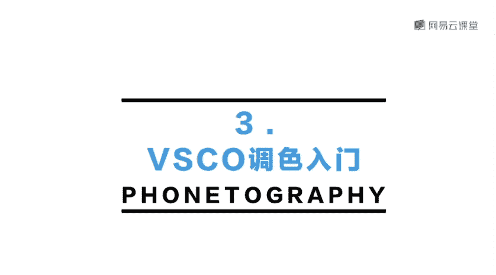

# 韩松-跟全球iPhone摄影大赛冠军学手机摄影，随手惊艳朋友圈（完结）：课时09.vsco基本操作

🎼，🎼，🎼接下来呢我们来看一下大名鼎鼎的vissco啊这一款软件。我在后期处理的时候也经常会运用到它是一款有名的调色软件，尤其以它种类繁多，非常专业的滤镜而注明。好。

我们首先打开vissco这一款软件来看一下它的界面。那么打开之后呢，我们可以看到它的界面呢和nap的是有所不同的。它会帮我们整理一个素材库。也就是我们导入的照片都会在这一个素材库里面。

这样呢有方便我们之后去进行一个查找。好，我们来看一下vissco左上角这一个这一个按钮啊，它实际上呢是自带了一个这样的一个拍摄的按钮，我们可以用vissco，它自带的这一个相机来进行一个拍摄。

🎼好，我们再来看一下，那么中间呢是一个工作室的按钮，可以进行一系列的操作。比如说呢我们vissco现在已经可以处理RAW，也就是无损格式的照片呢。好，我们再来看一下右边右边呢就是增加的按钮。

我们可以通过它导入照片。比如说这里呢我导入这一张照片。等会儿方便调整。好，那么导入之后呢，我们就可以看到我可以选中这一张照片，选中之后呢，可以看到下面的出现的三个按钮。

在这里呢我首先选择一下中间这一个按钮啊，就是vissco的主要操作按钮。点击进去呢就会下方出现4个按钮，最左边这一个就是vissco最有名的滤镜功能呢。我们可以从左往右拉一下，可以看到一整排的滤镜。呃。

vissco的滤镜呢大部分是需要购买的，但是你事先下载好vissco之后呢，它就会送你几款免费的滤镜。免费的滤镜呢很多也是蛮好用的。好，那么我们这里看一下呃滤镜的调整功能。哎，比如说我在这里呢选择一下。

我手如果想选择一下A一号的滤镜啊，点击一下，我们可以看到画面呢是明显出现了一个偏蓝，整体的色调就改变了，画面的情绪也改变了。那么这个时候我再点击一下A一看一下，那么画面呢会出现一个加12。

因为呢系统会自动的认定调整的滤镜强度最强。那么我们把这一个加12朝左边这样的一个滑动一下，我们可以看到它是以0。10。1这样的一个数值递减的。那么调整到最左边0，那就相当于是没有效果了。

那么我们往右边滑动，可以看到调整。到12，那么就是滤镜的效果最强。所以说呢大家可以根据自己的选择调整一个滤镜的适当效果。好，那么我们在这里呢再尝试一下。比如说A4号滤镜，我们可以看到和A1号滤镜。

它的情绪是有所不同的。A4号呢就会给人感觉这样的一种呃夕阳西下时分城市染成这样的一种怀旧的黄色这样的一种感觉。那我们再来调一下A6，那么A6感觉又不一样，就会给人更冷峻更摩登的感觉。

所以说呢每一种滤镜都会给我们的画面带来不同的情绪。这个要根据自己的需求去进行一个选择。好，我们接下来呢再来看一下下面四个按钮的第二按钮，第二个按钮呢，那么就是vissco里面的一些基本参数的调整。呃。

我们的vissco呢也可以很方便的进行这样的一些。比如说曝光对比度，还有锐化清晰度饱和度等等，呃，各种各样的参数调整。它的调整呢相比s的，所以说没有那么专。但是呢显得更加的简单容易一些。哎。

比如说我挑选两个啊，我选择颗粒，然后呢可以把颗粒增大一些，那么就会出现这样的一种模仿胶片的效果。那么它每一档参数呢都是在0到12之间选择的。好，那么我们再来看一下，比如说呃色调分离。

我们可以看到其中有阴影色调和高光色调。比如说我们来选择一下阴影色调为橙色，我们可以看到整个画面暗处都处于这样的一种暖橙色的氛围。我们再来看一下高光色调。比如说我选择高光色调为蓝色。

我们可以看到天空明显变蓝了，它可以调整我们画面中的比较暗的部分和阴影部分的一些色调的关系。好，我们再来看一下，比如说边框这一个功能啊，我觉得哎有的时候用边框来加给画面呢加上一些边框也是比较好看的。

比如说在这张照片中，我们可以看一下画面下方的那一个出租车是橙色的。所以说呢我将它加上橙色的边框，那么就很合适。我们还可以调整上面的数值，然后呢将画面置于哎边框里面调整边框的大小。那么这些呢都是。

非常好玩的visco玩法。好，我们再来看一下下面的从左往右数的第三个按钮，它保留了我们现在调整的所有的步骤。而且呢我们可以把这样的一个调整的步骤设为配方，点击下面的那一个加号，看到没有？

那么出现了这样的一个配方。这个功能有什么样呢？我们来看一下，首先来选择左上角的保存，把这张照片保留下来。好，那么那么这个时候呢，我再来调整一下下面任何一张照片，比如说这张照片吧。那么我点击进去。

那么同样选择下方从左往右数的第三个按钮，那么我就可以选择刚才的那张配方呢，也没有看到，那么只要稍微的一点击，那么刚才调过的所有参数就出现在了这一张照片上面。

那么用这样的一个功能就可以很方便的完成一组照片的调整了。好，那么我们最后再来点进去看一。下从左往右数的第四个按钮啊，那么第四个按钮呢，在这个按钮中，我们就可以选择我们最喜欢的滤镜。比如说在这里呢。

我调整的最多的，平时调整的最多的是，比如说如果是A一号滤镜，那么我们把它打成星号。那么这个时候再保存，我们是不是就可以回来看一下，那么A一号滤镜是不是就出现在了画面的最前方。

那么就由于它的滤镜是非常多的。所以说这一个操作呢，即有利于我们方便的找到最想使用的那一款滤镜。好，这个呢就是viss code具体的一个基础操作步骤。🎼好，今天的课程呢就到这里，我是原画册的韩松。

🎼欢迎大家参加我的课程，谢谢。

