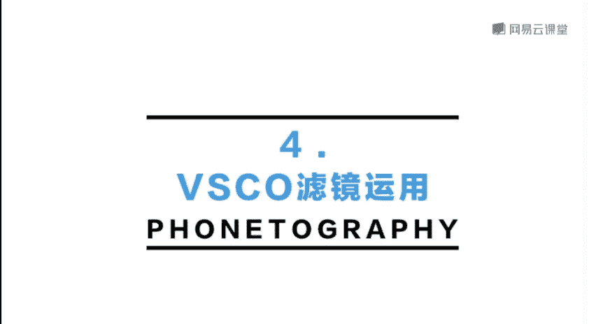
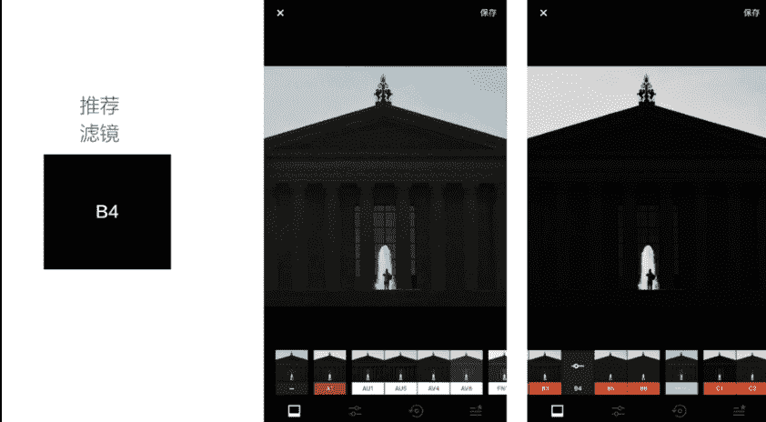
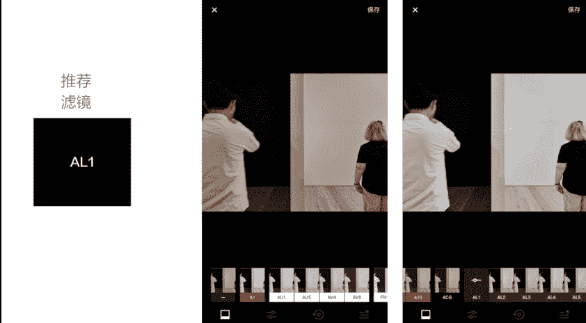

# 韩松-跟全球iPhone摄影大赛冠军学手机摄影，随手惊艳朋友圈（完结）：课时10.vsco滤镜使用导则

🎼我们接着来学习第四课后期调色的基本操作下。🎼第四部分vissco的滤镜运用。接下来呢我会为大家推荐几款vissco的滤镜，都是我平时最常使用的。那么在每一款滤镜呢，我的滤镜调整参数呢都调整为最强。

大家平时呢可以根据自己的需要进行这样的一个调整啊。好，我们首先来看第一款滤镜。A4号滤镜。A4号滤镜呢非常适合像这张照片场景中那样的一个日出或者是日落去表现阳光的过程。

我们来看一下原片呢会感觉有一些过黄，颜色有一些过脏。那么我们看一下调整完A4号滤镜之后呢，画面就立刻出现了这样的一种复古的金色色调，它非常的柔和，而且呢加上呢浅浅的这样的暗角烘托了画面的氛围。

我们来看一下这里呢我是调整为最强的参数。那么大家平时呢可以根据自己的需要进行一个调整啊。

🎼那么A4号滤镜呢还非常适合这样的一个场景。这张照片呢是我和我的好朋友民谣歌手陈宏宇在探索城市中的荒野的时候拍到的。我想要表现的是那样的一种阴天的城市有一些呃暗调，有一些复古。哎。

然后呢有一些这样的一种稍微的颓废的氛围在其中。那么在这个时候呢，也可以使用A4号滤镜。我们来看一下使用A4号滤镜之后呢，哎天空明显变得更灰绿了。

而且地面的颜色呢明显的变变成了这样的一种复古的带有一些金色感觉的呃这样的一种质感给了画面这样的一种极好的情绪烘托啊，我们再来对比一下，和原图的对比。我们可以看到原图呢会感觉灰蒙蒙的。

那么我们调整完A4之后呢，就感觉明显是精神了很多啊。🎼好，我们接下来来看下一个滤镜啊，呃下一个滤镜呢是一款黑白滤镜，也是我经常使用到的这张照片呢是费城的博物馆前面拍到的。

我们可以看到呢原片感觉哎非常的灰暗。那么在这个时候呢，我就想要表现那样的一种。

🎼剪影状态。所以说呢在这个时候我使用的B4号滤镜，我们可以看到，那么用了黑白这样的一种表现手法出现在画面中。那么立刻呢后面的所有的元素都变为了这样的一种极简的黑。

加上呢前景中的人物和这样的一个喷泉就给了画面这样的一种简单的线条效果。我们再来看一下其他的几款B系列的滤镜啊，其实呢都是黑白。那么呢他们呢只是对比度和亮度有所不同。那么在这里呢我选择了最黑。然后呢。

对比度最高的B4号滤镜，给了画面极强的氛围烘托。好，我们再来看一下下一张照片。那么这一张照片呢是表现黄色是在纽约街头拍摄的几辆出租车。那么表现黄色的滤镜呢，我最为推荐的是C系列的滤镜。

那么在这里呢我自己觉得啊C1C2C3都各自有它们的好处。C3呢是更偏黄一些，整体呢会更加的精神一些。我们来看一下和原片的对比。原片的黄呢很明显给人感觉有一些脏，那么变成C3之后呢。

我们可以看到那样的一种黄色就更为精神呢。那么C2的黄呢是更为偏橙色色调的呃，C1呢和C2的区别。我们来看一下C1的区别呢是在于它的暗部，看一下那一个出租车的那一个暗部的细节啊，是更为偏绿色的。唉。

我觉得C一呢是非常适合欧美的街头的。所以说呢如果大家在呃欧。洲或者是美国拍照的时候呢，很多时候可以使用非一滤镜去烘托啊。那么有这样的一种欧美暗调的效果。好，我们来再来看一下下一款我经常使用的滤镜啊。

ALE这样的一个滤镜。那么它主要是在什么样的情况下使用呢？我们首先来看一下这一张照片是晴天的曼哈顿的这样的一个远眺。我们来可以看到原图呢会感觉到背后的那样的一种蓝天感觉有一些灰有一些脏脏的。

那么颜色呢不够通透。那么ALE这样的一款滤镜就可以帮我们调整它的这样的一种颜色通透的效果。我们可以看到调整完之后呢，那样的一种蓝色呢就明显更加的突出，颜色呢也会更加的透通透，感觉更加的透亮。好。

我们再来看一下下一个场景，这一个场景呢是搬到了室内。我们来看一下，哎，室内的时候呢拍摄白墙，很多时候我们可以看到这个白墙呢就明显偏黄偏脏，人物的那个白色的衬衫呢也会感觉。

脏脏的时钟。那么这个时候呢我们来看一下，调整一下ALE的滤镜啊。那么调整完之后呢，完全大变样呢，可以看到明显有一个对比，那个背景的墙就立刻变白了。人物的衬衫呢那样的一种原来脏脏的黄色色调也消除了。

这个呢就是ALE的一个好用的地方啊。在室内的时候也可以经常用到。好，我们再来看一下拍摄人物的时候也经常可以使用AALE的滤镜去提升人物的肤质啊。比如说这一张给我的好朋友演员小熊拍的照片。

我们可以看到原片呢肤色感觉是明显偏黄的。那么这个时候呢，我们用ALE来简单的调整一下，可以看到加入ALE之后呢，小熊的肤色呢就明显变白了很多啊。而且呢ALE在拍摄人物的时候。

特别是像这样的一种前期的人物大光圈啊，我们可以看到它会给画面带来这样的一种哎淡淡的暗角啊，我们可以看到这样的一种暗角呢，有的时候是表现。人物肖像照的时候是会烘托出一种特殊的氛围的。

比如说这张照片我们可以看到加入AALE这一个滤镜之后，整体的效果呢就提升了N个档次啊。那么接下来呢我们再来看一下下面的一款滤镜，A5号滤镜。那么在拍摄雪天的时候，我是经常使用的啊。

比如说这一张在飞机上面的俯瞰拍摄的落基山脉啊，我们可以看到原片呢感觉非常的普通。那么在这样的一种雪景中呢，很多时候我是想加入一些蓝色色调的氛围的。我们来看一下，用A5号滤镜，我们可以看到。

那么立刻呢会就显得更加的精神呢，我们来观察一下那一个黑色的部分。那么是加入了一些浅浅的蓝色色调在画面中整体呢会给人这样的一种唉，感觉有一些忧郁的氛围。在其中啊，呃。

那么我自己觉得这样的一种A5号的滤镜去表现那样的一种冬天的雪景是非常合适的。接下来呢我们再来看一下C号滤镜的一款滤镜啊，那么它呢是在表现晚上那样的一种唉这样的一种夜间的灯光的时候，我觉得非常合适。

我可以看到原片是非常普通的。那么这个时候呢，我加入C7号滤镜来看一下。那么立刻呢那样的一种黄色就感觉更加的偏橙呢，整体的色调呢会更加的偏暖一些。那么在这一张照片呢。

我会觉得这样的一种暖色调会显得更加的有精神啊。好，那么最后这一张照片呢，我们来看一下是还是拍摄的我的好朋友迷谣音乐人陈宏宇。那么当时这一张照片呢就是一张人物的肖像照了。当时拍摄的时候呢。

也是一个阴天的环境。我们可以看到呢天空是白色的。那么在这个场景里面呢呃人物很容易就会整体的五官显得过平。那么这个时候呢，我们来调整一下C呃我们来调整一下A6号滤镜啊。我们来看一下调整完成之后呢。

我们可以看到五官就会立刻显得更加具体了。我们来对比一下，那么红宇下巴下面的那一块阴影部分，调整完之后呢，我们可以看到那一块阴影部分呢是更加突出了A6号滤镜呢，把我们加强了画面的这样的一种对比度。

渲染出了人物五官那样的一种立体的感觉。而且呢呃我们可以看到原始的照片呢，整个。呃，肤色是有一些偏黄的。那么调整完A6之后呢，我们可以看到它调亮的面部的这样的一种亮度。然后呢，肤色是整体片变白了。

然后呢给人感觉整体人像就会更加的精神。好，那么上面呢就是为大家推荐的几款滤镜，是我平时呢在vissco使用中最常使用的几款。那么大家呢也可以去自由探索一下这样的一些滤镜的组合，达到最好的一个后期效果。

🎼好，今天的课程呢就到这里，我是原画册的韩松，欢迎大家参加我的课程，谢谢。🎼Yeah。

