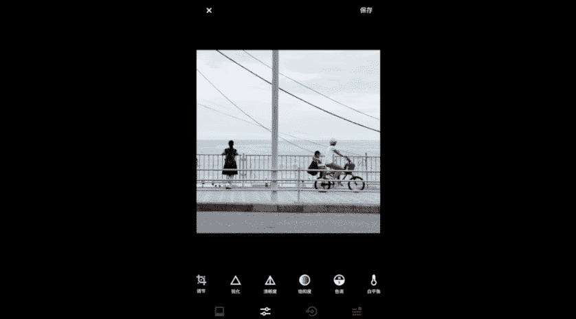
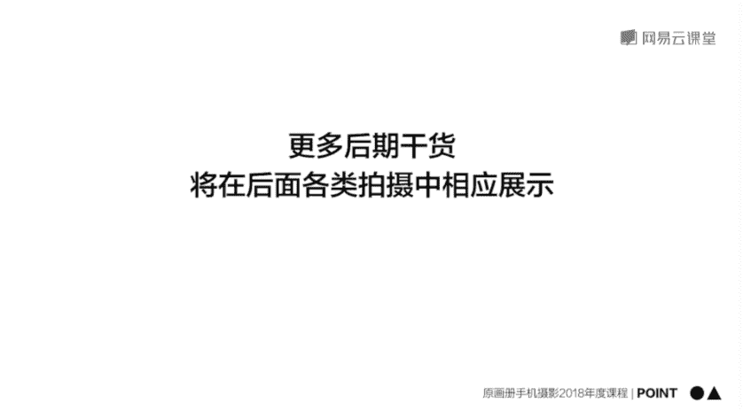

# 韩松-跟全球iPhone摄影大赛冠军学手机摄影，随手惊艳朋友圈（完结）：课时11.日系.黑金.干净通透的照片如何后期

🎼我们接着来学习第四课后期调色的基本操作下。第五部分，结构流行调色话术。接下来我们就通过snapsed来调出一张具有日系风格的照片啊。提到日系风格呢。

相信大家脑海中都会浮现出一种高亮度、低对比度低饱和度会给人一种干净舒适感觉的这样的一种场景。那么其实这一张照片的原片，它的风格呢就非常的日系。因为呢背景是蓝蓝的天空和海面。

前景中的稻草呢也是绿油油的这样的一种蓝色绿色的色块会给人一种自然舒服的感觉。只可惜这一张原片的亮度不够，给人的通透感会感觉非常的差。所以说我们通过napsed里面的曲线功能，嗯。

让这一张照片变得更加的日系。好，首先呢点击右边中间的那一个铅笔按钮，我们可以看到最上方的正中间就是那一个曲线按钮，点击进去之后呢，我们发现出现了一个曲线的参数。我们可以看一下。

🎼从左到右从下到上分别代表着画面，从最暗处到最亮处的一些像素的细节。我们来试着调整一下。首先呢我们呢调整一下最左边的那一个点，我们尝试呢把它往上拉。

这个时候呢我们可以很明显的看到原本画面下方比较暗的稻草的部分变亮了，调整的画面比较暗的部分的细节。那我们再来看一下，把画面最右边最上面的那一个点往左拉一下，我们可以看到原本比较亮的天空。

它的天空变得更亮了，已经出现了死白这样的一种状态啊。好，那么在这里呢，首先第一步我是要调整画面的亮度，我就在中间选择一个点，将它往上拉。那么这个时候呢我们可以看到画面的整体的表现是变得更亮。

🎼那原本那个曲线的直线是变成了这样的一个朝上的抛物线。我们可以看到亮度提升之后，画面整体通透感变强了。那么第二步呢，日系是具有低对比度的。所以说呢我要调整画面最左下方的那一个点将它往上拉。

实际上呢就是将画面中最暗的部分，让它变得更亮。所以说呢通过这样的一个调整去降低了画面的对比度，我们再来看一下这一个过程啊，随着最左下角的那一个点往上拉的过程呢。

那么我们可以看到画面是变得更加朦胧的这样的一种情绪呢是显得更加写意了。🎼好，那么有的时候呢我还可以将画面中，那么最右上角的那一个点呢稍微往下拉一点。我们可以看到往下拉之后。

天空呢是变得是稍微的压暗了一些。那么这样的一种对比度呢，就得到了一个进一步的抑制。好，那么接下来呢日系的照片可能呢还会有一些偏色，比如说这一张照片天空是蓝色的，我还想让它进一步往蓝色色调色偏。

增添出这样的一种夏日的比较凉爽的氛围。那么所以说呢我选择下方从左往右数的第二个按钮调出各种颜色的曲通道，那么这里呢我先选择一下蓝色通道，然后呢同样像刚才调整那一个RGB曲线那样。那么往上调整一下。

我们是不是就可以看到画面是明显变蓝了，来注意一下天空的部分。那么刚才是比较灰。那么我们往上调整一下，可以看到明显增蓝的不少啊，天空的部分。那我们再回到刚才的那一个调整参数。

我们还可以将红色呢稍微一指一些，红色呢往下调整一些。那么这样呢那样的一种夏日的场景就会淋漓尽致的表现在眼前了。那么调到这一步呢就大概是调完了，选勾。然后呢，接下来最后一步。

我们再简单的调整一下画面的饱和度。那么我将画面的饱和度呢是拉低10%到20%左右。一般日系的照片呢调整饱和度都会减少1到2档。那么在这里呢我是减少15%左右啊，是取这样的一个中间值。

那么这一张照片就整体调整完毕了。好，我们长按一下画面来看一下，和原图的区别。可以看到明显调整完之后呢，画面中那样的一种空气感，那样的一种日系的清新，氛围就会表现的更加明显了。那么从刚才那一个视频中呢。

大家都知道了曲线是一种非常重要的调整工具。那么在这里呢再为大家总结一下曲线呢从左到右，包括了画面中的阴影到中间调到高光调的各个的像素分布。那么我们调整其中的任意一部分。

就可以精确的控制我们的画面中这一部分的像素。从而呢达到精准的调整我们的画面的嗯这样的一个亮度，还有我们画面的色调这样的一种功能。那么今天的第二批point呢是日系风格多种多样。

那么最重要的是为大家讲到的刚才那些基础的点啊，高亮度、低饱和度、低比度。那么利用色彩曲线通道，给画面制造一点色片，有利于传达出那样的一种日系的情绪之表达。那么第二个风格呢是黑金城市啊。

这个呢也是最近一种非常流行的风格，它的感觉呢会给人带来一种酷炫的feel啊。

接下来呢我们就用vissco里面的HSL这样的一个好用的功能来调出一张黑金风格的夜景照片来。我们来看一下打开vissco这一款软件，然后选择这一张我在纽约拍摄的夜景，点击进去。好，哎。

我们可以看到这一个夜景呢灯火璀璨效果非常的好，但是呢会给人感觉缺乏一些特点。好，那么这个时候呢我们就来左手将它调为这样的一种黑金效果。好，那么首先选择下方的从左往右数的第二个按钮。

然后呢呃往右滑动到呃最右边的这一个按钮，可以看到HSL这什么意思呢？HSL这三个字母呢？是主要指的。一张照片里面的色彩H指的色相，也就是这张照片的色彩是成什么样子的。比如说红色、绿色还是蓝色。

这个就是色相。第二个S呢代表的是饱和度。之前也给大家讲过，是指的画面的这样的一种色彩的鲜艳程度。最后一个L呢是代表的色彩的亮度。比如说它是呃深红还是浅红，这样的一种色彩的亮度。好，那么。这一张照片中呢。

我们可以看到，如果要将画面调为黑金效果的话，那么我需要将画面中的除了黄色和金色的其他颜色的所有色度饱和度、亮度都调为0。好，我们来看一下，首先把红色调为零然后呢再将绿色的所有参数调为零。

那么再将蓝色所有参数调为零，大家可以看到了。那么效果已经很明显呢。那么因为其他颜色都已经是处于没有了的状态。所以说呢整个画面是出现这样的一种比较酷的，有见未来科技感的这样的一种黑金效果。好。

那么调整完成之后呢，就选择勾。好，那么在这里呢我再呃细微的选择调节这一个按钮来将画面呢可大家直一些，再将下方比较暗的。我分 love。把它给去除掉，因为可能下方的那些地方呢亮灯没有那么明显。

所以说呢要拍摄这样的黑金城市夜景照的时候啊，大家注意到没有？一定要选择哎比较灯火璀璨的街区进行拍摄效果才会很棒。好，我们在这里呢将中间的那一个帝国大厦呢一道画面的最中间好，我们点勾。

那么现在呢效果就很棒了。然后呢最后啊我再通过稍微的滤镜调整。比如说呃调整黄色比较好的C系列滤镜啊，我们再来进行一个，比如说C1号C2号C3号呃，那我在或者呢C7号C8号哎。

这一些滤镜呢调整黄色都是比较好的。那在这里呢，我选择C3号滤镜调整到一个适当的参数打勾。好，然后最后呢我在简单的修整一下画面的饱和度可能。稍的调高一点，然后。嗯。

将画面的那一个白平衡的色温再像暖色稍微偏一点，这张照片的效果就会很棒的。我们来看一下和原图的比较。

那么相信大家看到刚才那个视频呢，其中我提到了HSL这样的一个具体的调整模块。那么再为大家总结一下，H指的是画面中的色相，它主要是指的各种色彩不同的表现。比如说红色、绿色、蓝色它们分别是怎样的颜色。

S呢是指的色彩中的饱和度呃，饱和度越高，色彩呢就会越鲜艳。L呢是主要指的色彩的亮度，那么亮度越高，色彩呢就会越浅越明亮。所以说呢通过HSL可以准确判断自己想要调整的色彩部分，明确调整的目标。

那么从而达到一个色彩的精确调整。🎼好，那么接下来的第三种调整风格呢是一种干净的照片风格。接下来呢我们就用vissco来调出一张干净通透的照片。首先呢还是来看一下原片，这张照片呢是在日本的一个海边拍到的。

我们可能会感觉到原片非常的乱，非常的杂，是为什么呢？第一是原片中呢有过多的元素，电线感，还有远处的那一些海边的一些东西，还有近处的人物，还有各种各样的线条，会给人感觉视觉非常的杂乱。

第二呢是画面始终给人感觉色彩，还有那一个色调，感觉有一些脏脏的。然后呢整体的亮度感觉也是灰蒙蒙的，所有的这一些元素加起来呢就会给人感觉这样的一种不干净不通透的感觉了。那么因此呢第一步需要进行一个彩图。

选择调节啊，在这里呢我是选择了正方。

🎼形的裁图啊，让画面呢更加的均匀。那么呢我裁图之后呢，只表现画面中左方的那一个呃看海的女生和右边的那两个人，他们之间的关系。好，裁过图之后呢，就会感觉到人物是明显更加的突出了。

那么我们再来调整一下画面的那一个海平面，让它处于这样的一个呃。完全水平的状态。🎼好，那么这样的画面看上去就会舒服多了。那么接下来呢我们再来进一步的调整画面的色彩啊。

在这里呢我选择的一个滤镜呢是A4号滤镜。嗯，我参考的调色的这样的一种方式呢是四之愈和内部海接日记的电影。大家感兴趣的话呢，也可以去看一下，里面呢会给人这样的一种怀旧的感觉。

正是因为画面出现了这样的一种偏金色的氛围。那么A4号滤镜呢，就刚好是有这样的一种偏金色的色调在其中的。因此呢在这里是选择了这一款滤镜。好，那么接下来呢需要调整曝光，是不是需要大幅度的增加曝光。

大家可以看一下，增加曝光之后呢，整个画面都不一样呢，整体的感觉会给人非常的舒服，非常的通透。哎，那么刚才那一张照片。那么其实最大的原因呢就是。🎼曝光度不够，给人感觉死气沉沉。好。

那么接下来呢我们再来看一下嗯，调整一下画面的白平衡。那么在这里呢我们可以感觉到人物的肤色明显是有一些太黄了。所以说呢白平衡的色温，我在这里呢是稍微的往负值调整了一些。我们可以看到在调整的过程中。

我们可以看到整体的颜色呢是变得更加的蓝蓝色了一些，变得了更加的蓝调一些，也有了这样的一种稍微的复古的氛围。好，那么最后呢我在简单的调整一下画面的饱和度降低一些。

那么同样呢也是为了抑制画面中人物过黄的肤色。好，那么调整完之后呢，我们来对比一下和原片的区别。那么其实呢大家一眼。就可以看出调整过后的照片实在是好太多了，干净通透，给人感觉一种非常自然舒适的感觉。

那么看完刚才那个视频呢，我们又有了今天的第三批point。第一，理论上任何预制滤镜我们都。可以用基本的调色参数达到滤镜呢，是相当于这样的一个捷净的作用。

那么我们第二个points呢是少用慎用夸张的后期特效。比如说颗粒呀、暗角花边怀旧风格等等。如果要使用，也一定要有足够。那么今天为大家讲到的呢只是一个基础的后期调整。

在后面呢会具体为大家讲到我们的各个拍摄题材。它的后期，那么我们会在后面的课程中再为大家做一个更为详细的后期提示。

🎼好了，上面给了那么多例子，目的呢都是让大家理解这样的一个道理。当调节一个参数的时候，照片会发生怎样的变化。这个过程需要大家多多练习，后续学习的内容还非常多。但是请大家记住这节课的要点。

影调色彩和讲正三大手机后期板块，在任何软件中都万变不离其中。这节课后呢，请大家试着找一张自己原来拍摄的照片，然后呢调成日系风格，看看自己有没有理解后期的基本原理。🎼好，今天的课程呢就到这里。

我是原画册的韩松，欢迎大家参加我的课程，谢谢。🎼Yeah。

