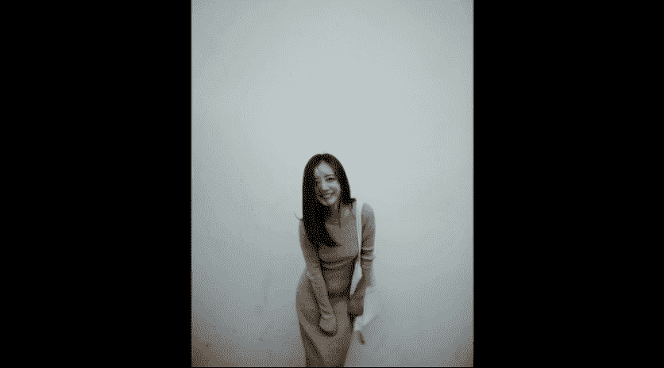
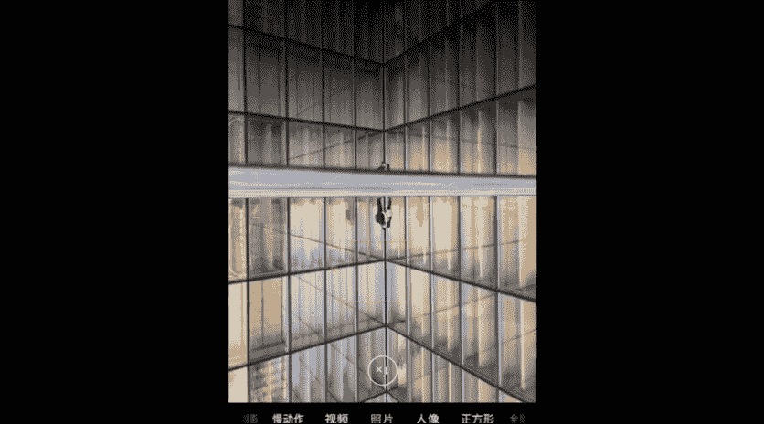

# 韩松-跟全球iPhone摄影大赛冠军学手机摄影，随手惊艳朋友圈（完结）：课时13.人像拍摄要领

🎼，那么今天的第二部分呢会通过几个不同的拍摄的姿势来为大家讲一下，我们在拍摄时应该注意怎样的步骤才容易出效果啊。

🎼那么第一个呢是站姿，请大家看这一个视频。嗯么第一个场景呢是我们的咖啡厅室外的一堵简单的白墙，非常的简单啊。当时的拍摄的时候是阴天，是这样的一种散射光。那么白墙的背景呢还给我们带来了二次反射光。

所以说呢显得人物的肌肤非常的柔嫩。那么小熊呢最开始有一些紧张。所以说呢我和他聊天，让他呢进行一些比较大的运动啊。那么比如说我们的跳跃，还有我们的左右摇摆等等。虽然说这样的表情看上去有一点疯疯癫癫的。哎。

但是呢可以极大的缓和我们的模特的面部表情。那么在呃做完这些运动之后呢，我们就可以看到小熊的表情呢显得更加的自然放得更开了。哎，所以说呢那么这个时候呢我就开始用连拍为小熊记录下。

它更为自然的这样的一些表情。那么我们可以看到小熊的状态转好之后呢，我会尝试拉近我的镜头。🎼呃为他拍摄一些更加特写的这样的一些肖像。那比如说我还会使用二倍的焦距，我们来看一下我么拉近镜头。好。

我们来看一下。那么我们让小熊呢做一些更多的姿势。嗯比如说我们的转头挠头，那么或者呢是低头闭下眼睛。那么这个这些姿势呢都是可以让我们的模特显得更为自然的一些姿势。来看一下。拍摄完成的照片。

我们这两张为大家展示一下。🎼好，我们再来看一下第二组啊，这个这一组呢加上了道具是一个简单的布袋子，呃，它的颜色呢和环境也非常搭配。那这个时候呢，我让小熊开始是背着的拍摄一些背影。

然后呢在转身的那一瞬间去抓捕到那样的一种自然的表情啊，有那样的一种回眸一笑哦，摆媚生的感觉。🎼好，我们再来拍摄一次啊，那么一定要用连拍去抓捕到所有的全部瞬间啊。🎼哎，我们来看一下。

那么这样的一个转头的表情是很容易抓拍到自然的姿势的。那么还有像这样的一种呃侧身拍摄的姿势，也是我经常运用到的，用头发遮住一部分的脸部，那么进行这样的一个稍微的遮挡的拍摄，特别是唉微胖界的妹子啊。

我们可以用长发遮住我们的一部分脸，这样呢是可以显瘦的，可以尝试一下。但要注意啊，不要遮完了，遮完呢就成了贞子了，就会比较奇怪。好，那么像那么现在这样的小熊这样的一个刚才的仰头的表情。

也是我们可以去抓不到的。那么这个时候呢哎我发现有一些暗。所以说呢我优化曝光，稍微的拉高一些曝光，手动调整曝光啊，注意一下，那么让小熊的面部的肌肤更加的柔嫩一些。好，那么我们再来尝试拍摄几张照片。

那么刚才的动作呢可以多多的进行一个尝试。好，我们再来看一下这一组啊，那么又到了正面的人物。那么我们还可以呢啊像刚才为大家讲到的。挠头啊、侧脸啊呃转头啊，还有女头发这样的一些姿势。哎，我们在拍摄的时候呢。

实际上都是可以尝试的。那比如说像现在这样我们的来捋一下头发。啊，那么捋头发的时候呢，很容易我们的表情就会比较自然。我们来看一下低头，哎再来转一下我们的头。那么像这样的一些姿势呢，我们都可以抓捕起来啊。

我们来看一下这样的左右摇晃的部分呢，我也用连拍进行了这样的一个哎持续的抓捕。那么再来看一下，那么这个时候呢，我是进行了一个自动曝光和对焦的锁定。哎，那么锁定之后呢。

我们就可以看到人物的曝光是不会再变化了。那么在拍摄一组照片的时候，用这样的一种方式去控制我们的曝光哎是非常好用的。那么我们继续进行一个连拍的拍摄，让小熊呢继续摆起来啊。

那么用这样的一种最自然的姿势去进行一个呃全过程的抓捕。那么可以抓捕到我们的人物最为自然、最为天真活泼的一面。好，我们再来尝试一下，用二倍焦距，我们来看一下天空。然后呢，我们的手部呢可以有一些小小动作。

比如说遮住我们的呃。额头我们可以去挠一下头发这样的一些小动作呢，很多时候呢可以表现出我们的模特的柔美。说这几张照片。

成才的成果展示。那么相信呢大家看完视频之后呢，都会有这样的一些体会啊。那么第一个拍摄是非常重要的。如何让我们的模特快速进入状态。很多时候呢，模特在开始的时候会比较紧张。

那么不妨让他们做一些幅度比较大的运动吧，可以帮助我们软化表情。那么在拍摄的时候，头部动作非常的关键。比如说我们的转头挠头低头闭眼都是非常容易获得效果的小动作。在拍摄的时候呢，不妨尝试一下。

或者呢是我们在转身回眸的那一瞬间也容易营造出一种特殊的氛围。啊，那么在拍摄的时候呢，建议大家大量使用连拍拍摄。那么如果是背景是白墙的话，我自己建议啊，前期可以稍微的拉高一些曝光，获得更为干净的效果。

还要一定要注意锁定曝光和对焦。好，那么接下来呢我们来看坐姿的拍摄视频。

🎼接下来呢我们移入到咖啡店的室内，我选择的位置呢是窗口。那么窗口这样的一个位置呢，阳光会从室外摄入到室内形成这样的绝佳的场景光。我们可以看到呢，背后还有模糊的阴影，然后背景中呢有一个落地凳背光。

一切呢显得非常的完美。🎼好，那么完成这样的一个光线布置之后呢，我们就开始来进行一个。🎼拍摄了。那么首先呢我开始让小熊呢做出一些动作比较小的这样的一些姿势。比如说双手托腮。

那么这样的一个姿势呢是很容易显出我们女生的柔美对吧？🎼呃，然后呢我们来看一下，可以闭眼闭眼呢，可以让我们的姿势可以让我们的表情更加的软化。因为毕竟呢不用自己亲自去看镜头。哎。

那么这个时候呢我们往往呢会得到更为自然的表情。🎼那么在放松之后呢，我们可以做一些大的动作。比如说我们的侧脸，我们去捋捋一下头发，哎，我们去挠头。哎，这样的一些姿势呢我们都可以去尝试一下。哎。

我觉得那捋头发这样的一个过程，也可以帮助我们软化这样的一种表情，可以让我们的表情更加的自然。哎，那么在这一个过程中也一定要采用连拍的拍摄去抓捕到很多。不同的表情。好了。

我们再来看一下接下来的这样的一个动作啊。哎，我们还可以双手托脸用。头发挡住我们的半张脸，然后用手托住之后呢，可以帮助我们唉看看上去更加的脸小一些啊。

那么这个时候呢我们可以采用这样的微笑表情来让我们抓捕到的场景呢，人物呢更加的甜美一些。哎，那么。状态自然之后呢，我们还可以就直接的看着我们的镜头去和我们的摄影师有一个直接的交流。🎼好，那么在这一组中呢。

我拍下了这几张照片啊，我们来可以看一下比较俏皮的这几张照片。🎼接下来呢我们来通过有日常的道具，我们的水杯就可以进行一个非常完美的抓捕了。用水杯呢可以缓和我们的表情。在拍摄的时候呢。

我让小熊有时候看着镜头，有时候呢将我们的眼神聚焦在画面外的某一点。比如说我们来看一下，哎，像这个时候呢，我让小熊看窗外的一棵树，我们可以看到他的眼神是有眼神光的，非常有神的。

那么这个时候呢对焦在眼睛进行一些连拍，就能够抓捕到当时那样的一种特殊的氛围了。🎼好，我们来再看一下。🎼接下来的这一个场景呢，仍然是喝水啊，我用了二倍焦距，然后加上了一根吸管。

然后抓捕到了小熊的一些甜美的表情。那么还是用非常自然的拍摄手法，让小熊呢呃做出这样的一些呃自然的表情，然后用眼前的这一个简单的道具去衬托出它的美感。好，我们还可以在拍摄的时候呢，用一些小动作。

比如说蒙一只眼睛，那么这个时候呢会造成这样的一种神秘的感觉啊。来看一下啊就像这样的一种拍摄的感觉，我们也可以去尝试一下。那么我们接下来再来看下面的一个小场景。那么这个时候呢，小松已经完全进入状态了。

我开始用二倍来拍摄他的人像。好，那么呢我将焦距离得非常的近，完全是人物的特写。先脱腮看着窗外的一点，也是刚才那一棵树。所以说呢我们可以看到眼神非常的聚焦，非常的有神。那我们呢再多换两个姿势啊。

然后呢在拍摄的时候一定要注意对焦在人脸上非常的重要啊。在拍摄人像特写的时候，一定要想方设法，让我们的人物的眼睛传神。那么很多时候呢，我们只要稍微的移动一下我们的手机，就能将室外的光线引入到眼睛中。

形成这样漂亮的眼神光。好，我们再让小熊的头部呢进行一些稍微的调整。来看一下。稍微的往上抬一点，然后呢持续和小熊聊天，来，让他保持一个持续的放松，有便于我们抓捕到更加多更好的照片。那么在这个时候呢。

比如说还可以做一点小动作，那么还是像刚才那样的旅头的动作，将手呢放在我们的头发上面。那我觉得然后呢将嘴唇微微的张开，可以保持这样的一种良好的状态。我们保持住这样的一个拍摄的眼神。然后呢。

下巴呢这个时候呢在拍摄人像肖像的时候，可以稍微的往回收，这是一个非常好的用法，可以让我们的整体头部看上去更加的协调。哎，那么我们继续呢再做一些小动作托腮等等，唉，将手呢轻松的。

🎼头发上这个时候呢就能够抓捕到这样的一些非常自然的照片呢。那么除了水杯之外呢，我觉得书也是一个比较棒的道具啊。但是呢哎要注意一下，在这里呢我让小熊让书遮住了他的脸。所以说呢脸部会比较暗。

大家可以看到我是手动调高了曝光，让脸部曝光正常。然后呢按住了屏幕锁定，让焦点锁定在小熊的眼睛上面，保证眼睛处呢是最为清楚的这一点呢是非常重要的。🎼好，我们接下来呢再来看一下，哎，由于梳遮脸啊。

我们看不到其他的表情，所以说呢这个时候呢可以让我们的模特更为的放松。哎，而且呢。🎼说遮住了脸部，嗯，可以让我们的脸显得更加的小，唉，脸部较胖或者是微胖肌的女生呢也可以使用这一招啊，非常的好用。

而且呢可以显得我们更加的呃神秘一些。因为这个时候呢我看不到脸脸部的整个表情，我们只能看到眼睛通过眼睛一点传达出来的信息去表现出哎这更多的这样的一种。呃可以引起我们更多的遐想。那么在拍摄的时候呢。

呃我依然使用了手机的连拍拍摄去抓捕到整个小熊的这样的一些眼神过程啊。哎，我们再来看一下这样的一个连拍的拍摄过程。通过连派去抓捕到了更多的这样的一种拍摄可能性。大家看一下这两张照片呢。

就是后期处理的一个结果了。

那么在坐姿的时候呢，我自己觉得眼神是非常重要的。因为坐姿呢大多数是拍摄的这样的一个肖像。那么在拍摄的时候要注意眼神可看镜头也可不看镜头，但是一定要引导模特的眼神聚焦在某一点，这样的眼神才会有神。

那如果是实在看镜头比较紧张，哎，可以转头，呃，轻轻微的转头，然后呢进行一个连拍。好，那么表情呢非专业的模特呢，实际上他的表情是不易把握的。那么还是刚才为大家讲到的。

我们可以做一些幅度大一些的动作去软化我们的僵硬表情。在比较放松之后，我们可以用连拍去捕捉自然的表情。那么在坐姿的时候呢，我自己建议啊，还可以拿一些小道具。比如说用书或者是用头发挡住半张脸，哎。

或者呢是拿些刚才的水杯啊等等，去哎让我们哎更加的放松。好，那么今天的第三个视频，我们来看一下，拍摄一下人物与环境的组合。

🎼那么小熊的最后一个场景呢，哎我是将画面是移大了一些。我们这个时候呢可以看到咖啡厅的环境和人物的关系了。最开始呢我也告诉了大家是这样的一个人物和环境调和的关系。那么小熊呢是伸懒腰。

那么这个时候呢可以显得我们更加的苗条啊，大家呢不妨呢在能够有这样的宽松的环境的时候呢，哎去做出这样的一些动作。我觉得有的时候呢也能去表现出那样的一种轻松愉悦的氛围。哎，我们接下来呢再来看一下。

那么还是采用呢自动曝光，自动对焦锁定这样的一个功能。让我们来看一下。🎼然后在拍摄的时候呢，我让小熊的脚尖是绷直。那么这样的一个简单的操作呢能够显得我们女生的腿比较长。那么我们将脚尖呢放在了画面的下部分。

靠近画面画框的位置。那么用这样的一种方式呢，就更能够显示出我们这样的一种呃人物修长的感觉了。哎，这是一个非常好用的小小的ts，大家也可以把它运用起来。🎼拍摄出来的照片呢，看一下为大家做一个简单的展示。

哎，那我会为大家演示更多的人物比例环境啊。比如说这一张照片是在纽约拍摄的，那么我们可以看到是一个中等比例的人物。所以说呢人物和环境呢就会显得更加的融合一些。比如说我让我的朋友呢继续往后退去拍摄。

它和两边的行道树之间这样的一种具有几何结构的关系。那么呢我在拍摄的时候呢，将焦距是拉的比较大的呃，那么尽量的让这这一个环境和人物进行这样的一个更好的融合。🎼好，我们来看一下呈现。

那么还有一些环境呢是这样的一个人物的小环境。我们可以看到呢，人物在画面中非常的小，这是一个比例人的效果。我们可以看到地面呢是有哎特小很小的一滩水。那么在这里呢我利用倒影去拍摄到哎人物和这样的一个。

🎼建筑还有用倒影去表现这样的一种对称的关系。哎，那么在拍摄的时候呢，我们可以看到人物就非常棒的融合在了这样的一个极具线条美感的建筑当中。那么形成了这样的一个完美的倒影。哎，那么要注意一下。

那么在拍摄的时候呢，我们也可以引导人物去做出一些动作。哎，比如说在这里呢我是让我的朋友呢做出了跳跃这样的一个动作啊，哎我是发出了321，然后开始跳这样的一个指示。哎，那么然后呢在跳跃的过程中。

整体用了这样的一个连拍的拍摄去抓捕到他们这样的一个整个过程。那么最后呢就很容易筛选出一张最满意的照片为大家做一个展示了。

那么。在人物比较大的时候，就相当于是这样的肖像照片的时候，我们要更注重人物的动作与表情。那么人物在环境中的比例是适中的时候，那么就要更注重人物在环境中的结构关系。比如说刚才为大家展示的哎对称等等。

都是非常棒的结构。那么人物比例小的时候，那么这个时候呢就要更注意环境的呈现。人物呢在其中只是一个点缀的效果，形成这样的一种大小比例之间的张力。那所以所以说呢今天的下一组points什么呢？

手机人像摄影与其说在设计模特的姿势，不如说在引导捕捉这样的一个人像的瞬间。那么第二呢，非常重要的化解姿势僵硬的方法是模特呢做一些小动作。那么第三呢对焦在人眼大量用连拍，可以帮助我们提升我们的拍摄成功率。

好，那么今天的第三点呢，我们来看一下，在夕阳西下或者是朝霞升起这样的一个哎光线场景中，我们来怎样拍摄一张好的逆光人像照片。我们来看一下逆光吧，手机呢实际上呢是站在太阳哎。太阳呢是从背后射过来。

那么人物呢实际上呢是在手机和光源之间的。那么这样的一种条件呢，人物可以形成漂亮的哎这样的一种光亮的轮廓。那么经常呢我们用手机的人像模式中的轮廓光去可以去解决这样的一种背光脸黑的问题啊。

🎼那么接下来呢我们来看一下这样的一个日落时分的逆光拍摄啊，光线呢是迎面摄像镜头的。嗯，那在这里呢我是使用了我们苹果手机里面的人像模式啊，呃在我们的华为啊，还有很多国产手机中也有这样的一个类似的功能。

那么。🎼在苹果手机中将这样的一个人像模式里面的光线呢调为轮廓光，去尝试抓捕到这样的一些夕阳西下人物这样的一种镶金边的光线。哎，这个时候呢我们是不是可以看到哎人物的那一个羽绒服。

我们是不是可以看到它的边上有一些金色的光线非常的漂亮啊，那么我们移动手机让阳光处于我们的人物人脸的交界处。那么这个时候呢是最容易抓捕到那样的一种轮廓光线的。那么我们持续进行这样的一个抓捕。

那么一定要注意啊拍摄轮廓光的时候，哎，我们的焦点很容易跑掉，所以说呢我们每拍一张的时候都要注意要重新对焦，那么这个时候呢才能够保证我们的人物最为清晰。好，我们让人物呢完全遮住太阳。哎。

这个呢也是一个非常棒的抓捕我们轮廓光的方法。那么太阳呢就会透过我们的人物，在我们的人物的衣服上形成金光，这个呢就是最后的一张照片。🎼今天的内容呢就是这些，我是原画册的韩硕，谢谢大家参加我的课程。

