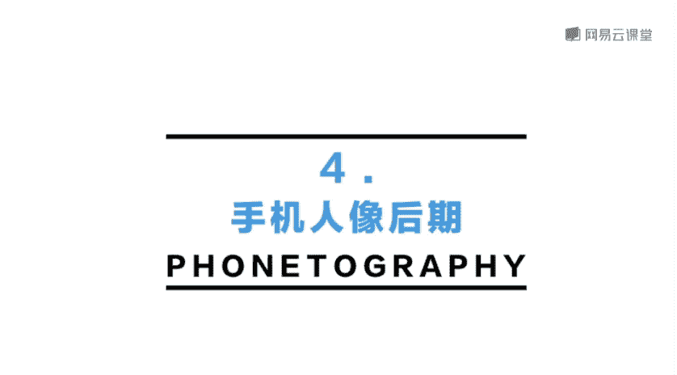
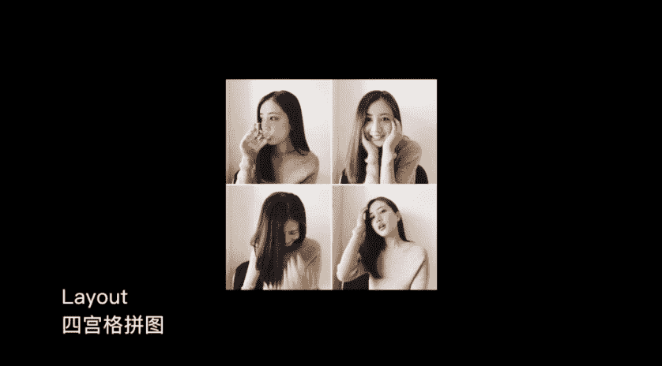

# 韩松-跟全球iPhone摄影大赛冠军学手机摄影，随手惊艳朋友圈（完结）：课时14.手机人像摄影后期处理

🎼，🎼，那么今天的第四部分呢，我来为大家讲一下手机的人像后期处理。

🎼后期处理的是小熊的这一张站姿的照片。我们来看一下原片就会发现一些问题。第一呢，我们看一下背景的墙壁会感觉有一些脏脏的，有一些黄。第二呢，我们来放大一下画面啊可以看到小熊的头发被风吹的很乱。

所以说呢这个是后期需要去除掉的。然后呢小熊的面部也有一些黑，所以说呢这个呢后期会经过一个局部的提亮。然后呢这一张照片我整体的调色思路呢是想要把它调成那样的一种日系广告里面的清新的感觉。

这样的一种清新女神的fe啊，哎，所以说呢我们就按这一个思路去进行。那么今天调色的几款软件呢分别是nap touchuchtouch这一款软件呢之前没有给大家提到过，呃，它是一个非常好用的软件。

平时呢呃比如说我拍的照片中有一些我们想要的元素的时候，我就会用这一款软件去去除掉。🎼比如说我们来看一下，打开ry touch载入这一张照片，我们来看一到下方呢有几个按钮，在这里呢，首先选择的是快速修复。

然后呢，我点击到画面中，我不想要的那一些脏脏的墙壁的东西啊，我们来看一下涂抹一下。那么这些地方呢就被消除掉了。啊，那么这一张照片呢，这样的一些脏脏的东西还是蛮多的。

所以说呢需要一些耐心去把这些东西都把它去除掉。好，墙壁弄完之后呢，我们再来看一下小熊的头发的部分啊。那么头发的部分如果再用这个快速修复的话，我们来看一下。比如说像这样。

那么它就很容易出现一些延展出来的新的头发，就会有一些bug啊。因为头发的部分呢是比较复杂的。那么这个时候呢，我需要使用的呢就是克隆印章这一个功能，我们来看一下。

那么我们先选择一下选择周围的一个白色的墙壁部分。然后呢，再在这四周涂抹。那么这个时候呢，我们就可以看到头发的部分呢，就被墙壁的部分给替代掉了。我们来看一下。

那么我们还可以用两只手把画面放的很大进行这样的一个精细的涂抹啊。🎼这个呢也是考验大家耐心的部分。那么处理人像的时候呢，很多时候哎都会涉及到这样的一个比较复杂的工序。🎼，🎼那我就沿着小熊的头发。

然后把周边的散乱的头发给涂掉。🎼头顶的部分呢也进行一个简单的消除。🎼，🎼好，那么这个呢就是。🎼retouch的一个后期处理部分。那么后期处理完成之后呢，我们选择保存副本。

然后呢将调好的照片再导入到snapse的第二款软件中啊，我们来看一下。🎼好，那么我们导入进去之后呢，那么同样是选择中间的那一个工具菜单。那么在snapsed里面呢，特别是调整人像的时候。

我要为大家推荐第二排那一个局部功能。我们点击那一个局部功能。好，我们来看一下第一。现在小熊的面部处呢按一个点，然后呢滑动两根手指啊，我们来看一下，把那一个调整的参数范围设置到小熊的整个面部。

我们再来看一下这样的一个。它大可以大到整个画面，那么小呢可以小到非常小的地方，选中的部分呢是为红色的。好，那么在这里呢，我们可以看到有4个汉字啊，亮度饱洁分别呢代表画面的亮度对比度饱和度和结构。

那么它调整的区域呢都为刚才我选中的哪一个红色区域。比如说这里呢我想要对小熊的面部进行一个加光。所以说呢我选择了调深。那么我们来看一下提亮亮度，我们就可以看到小熊的面部呢是变亮了很多。那么第二呢。

我们再可以把那个汉字调到结构。我们来看一下，我将结构呢调减。那么小熊的面部呢哎那就变得更加的光滑了。那么出现了这样的一个类似于磨皮的效果啊。好，我们来看一下，那么整体的效果呢和调整前向比。

那么是有一个很大的差别的。好，那么最后呢我还会用突出细节这一个功能，我们可以看到啊，然后呢将结构这一个再整体的拉低一些，然后呢让背景的墙壁更加的平顺，更加的柔滑吧。好，那么最后呢再打勾。

那么这个呢就是用snap seed调整的部分，同样呢选择保存副本，然后呢再把保存完的照片，我们来看一下到到vissco第三个软件中。好，我们来看一下。选择导入。那么第三步呢。

我们就用vissco来调整一下颜色，这一步呢也是最重要的。那么在这里呢我是要想要调成那样的一种日系的，有一些清新。然后呢，年代呢有稍微的有一些复古这样的一种感觉的色调。

那么在这里呢我使用的最多的就是A4这一个色调。因为它会给画面呢带来这样的一种唉稍微的这样的一种黄色，但是只调A4这样的一个按钮呢，我会觉得这样的一种黄有一些过偏了。那么第一呢我是将这样的一个按钮。

它这样的一种黄色的程度呢稍微的拉低一些。好，然后打勾。然后第二步呢我们来看一下，哎，我会稍微的整体拉高一些曝光，那画面不要有死黑的部分。然后第三步呢，我要将对比度再稍微拉低一些。

营造出画面那样的一种稍微朦胧一点的感觉。好，然后呢这张照片呢，我觉得高。高光部分呢有一些过量。所以说呢我选择了画面的色调，然后调整高光。我们来看一下拉低一高光，让背景的墙壁显得不那么的。白。

那么显得画面呢更加的柔顺。那么第四步呢，我来看一下这白平衡。那么这一张照片呢，我自己觉得白平衡呢是有一些哎过于的偏黄了。所以说呢我稍微的往回拉一些，将白平衡呢往蓝调部分拉一些。好。

我在这里呢稍微的拉了-1。2。然后呢，最后呢我将饱和度再稍微的调低一点。好，我们是不是就可以看到。和原片是有了一个天翻地覆的变化。那么整体呢变得非常的淡雅。好，那么最后呢我再选择调节这个菜单一下。

然后呢将小熊呢拉到画面的正中间。好，那么这张照片呢后期就处理完毕了。那么刚才呢是为大家处理了小熊的一张远景照片。那么接下来呢我会为大家演示小熊的这几张近景图片的一个后期啊。

我们来看一下这几张照片呢都是在室内拍摄的，那拍摄的是大概小熊的肖像。然后呢都是在小熊状态非常的放松的时候，抓不到的整体的感觉呢，非常的可爱，非常的俏皮。那么这四张照片呢。

实际上是可以非常棒的组合在一起的。我们来看一下它的后期处理过程。那么就是用vissco这一块最简单的调色软件，那么先载入这4张照片。好，我们来看一下这四张照片，由于有这样的一种lomo风的感觉啊。

哎会给这样的一种复古的感觉，所以说呢我决定都把它调为正方形的构图，有这样的一种呃拍立得相机的感觉。哎，注意调整照片的时候，要将我们的模特放在画面中，最为显眼的位置，不要将最重要的部分裁掉了。

比如说这张照片，小熊的手和眼睛的这样的一个呼应，非常的有动感。所以说呢要完整的保留下来。好。再来看一下第三张照片，那么同样呢有正方形的彩图。那么这一张照片呢要注意啊，将小熊的唉。放在画面的正中间。好。

我们再来看一下第四张照片。第三张照片呢，我们就要注意小熊喝水拿水杯的那一个姿势非常的漂亮。那么我们要注意将眼睛和水杯的位置呢，放在画面的正中间。好，然后呢再打勾，那么这四张照片呢就裁剪完毕了。

那么接下来呢我们简单来看一下调色，哎，这张照片的调色呢其实非常的简单。因为呢我想要让它调成那样的一种哎具有宝利来色调那样的一种感觉。所以说呢我在这里呢是使用呢哎04号这样的一个滤镜。

我们可以看到调整之后呢，整体的对比度是偏高了。然后呢，画面的唉色调呢会给更慵懒这样的一种感觉。好，然后调整完之后呢，我再进行一些其他参数的微调。第一部分呢是调高一些曝光。然后呢。

我们来看一下第二步呢稍微的降低一点饱和度。然后呢稍。微的将我们的画面的色调呢呃我们画面的白平衡哎往。冷色色调稍微的调整一些。🎼好，那么这样呢就大概调整完毕了。

然后选择我们来看一下选择下面从左往右数的第三个按钮，我们来点击一下，那么我们就可以使用当前操作创建一个配方之前为大家讲到过啊。那么这个时候呢，这张照片所调整完的步骤呢，就全部储存在这个配方中。

然后点保存。我们来看一下其他几张照片呢，我们都可以无法炮制选择这一个配方。那么即可。🎼完全调整，一步到位。🎼好，那么这四张照片呢调到这里呢就调完了。然后呢，我们把4张照片都保存到相册，选择实际尺寸。

🎼然后呢，那么我们可以用layout旁边这一款layout的软件来进行这样的一个简单的拼图。我们来看一下，那么在这里呢我是使用的四宫格，那么完全等比例的拼图，然后再将其中的边框稍微拉一下，全爆出。哎。

那么这一张照片呢就会给人这样的一种情节上的连续啦。我们来看一下，那么其实就是用手机拍摄的4个瞬间，那么进行了这样的一个非常棒的拼接。

好的，那么接下来呢我会为大家简单的讲一下啊，照片的拼接。呃，那么我在这里呢使用的是一个layout的软件。那么比如说像这样，我可以将4张照片拼接成像这样的四宫格。

形成一个嗯比较舒服的这样的一种情绪的流动。刚才为大家讲过了，那么我们还可以像这样将哎9张不同的照片拼接在一起。比如说看一下前三张照片是一个场景，中间三张照片是一个场景。那么最后三张照片是一个场景。

前三张是人物的中近景，中间的这三张呢是以稍微远景一些。那么最后三张呢是一个肖像的特写，他们组合在一起，形成了三种不同的氛围，会给我们产生这样的一种感官上的联系。

那么甚至呢我们可以像这样将人物和空场景组合在一起，来看一下这一张小熊的照片眼神中的光线和左边的那一张，哎，当时呢我记得是打在这样的一个墙壁。地上的微微的光线组合在一起，有了这样的一种凝视的美感。

那么再来看一下这一张照片，小熊呢是在看一个哎这样的一个远处的模特，嗯，那么这样那么他们组合在一起，那么也形成了这样的一种。结合的美感吧。那么像这一张照片直接是和天空中的云朵联系在一起。

那么更是产生了一种情绪的流动。哎，所以说呢我们可以将人物和这样的一些我们日常拍摄的空场景把它们组合在一起。那么这样呢可以更助于我们情绪的表现。

好，那么今天的第三组points。第一，人像后期要截制。特别是在皮肤处理方面切记过度的磨皮。那么第二呢是少量拉高一些曝光。对大部分人像后期来说都是一剂好药。比如说刚才为大家示范的几个后期都拉高了曝光。

第三呢是同意景别，同意组连拍。那么同意后期风格的照片，后期呢很容易形成组照，只需要我们将他们嗯有机的组合在一起。🎼这节课就到这里结束了，总结一下技术要点吧。

干净的背景和明快的着装在手机拍摄人像的过程中是一个非常好的条件。如果我们拍摄的对象不是专业的模特的话，让被拍的人保持自然状态，是拍摄人像的一个核心。在拍摄的时候呢，引导我们的模特多多的转头，脱腮。

做一些小动作都是可行的办法。不过这个时候呢一定要注意多用连拍获得满意的图像的可能性呢会大大的增加。然后呢在做后期的时候，一定注意啊不要过度的美颜过度的磨皮。好，那么今天呢还是为大家布置一个小作业。

在这节课后呢，大家试着拍一组。像我给小熊拍的那样的四宫格人像照啊。今天的内容呢就是这些是原画册的函数。谢谢大家参加我的课程。🎼Yeah。

