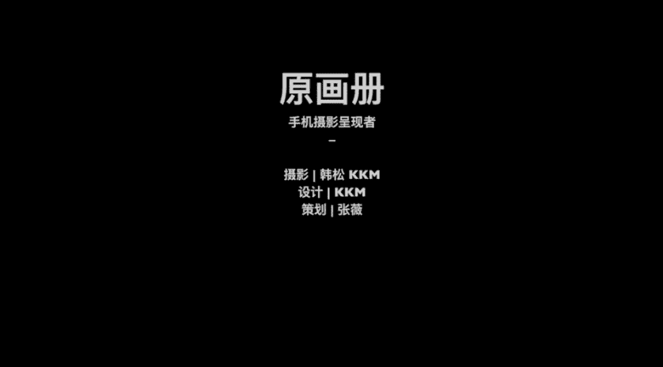

# 韩松-跟全球iPhone摄影大赛冠军学手机摄影，随手惊艳朋友圈（完结）：课时15.城市建筑群的摄影

🎼，🎼今天我们来学习第六课城市建筑风景摄影及后期城市与建筑与风景的拍摄。这一类拍摄题材，几乎在旅行过程中所用手机拍摄的最常见的一种题材。他们的共同点就是大都为中景到远景的拍摄。

这堂课中呢我将带领大家去世界第一的大都市纽约曼哈顿，教大家拍摄城市鸟瞰建筑形体建筑空间的要点。最后呢我还是会照例给大家一些照片的修图案例，让大家体会，从拍摄到成片的一个全过程。

首先呢我们来看一下城市建筑群的拍摄。这个可能是我们大家在平时生活中或者是在旅行中的时候经常会运用到的一个拍摄手法。比如说我们要站在一栋高楼的顶端去俯瞰这一个城市的景色。我们要怎样才能拍的好看呢？

那么第一个需要注意的就是画面的用光问。🎼题我们来看一下第一个光的方向，顺光。这个时候阳光是出现在画面的后方的均匀的照在建筑的表面，给建筑呢打上这样的一个高光。那么随着一天时间的变化。

太阳偏移光线方向呢为侧向的时候，会给画面带来一定的立体质感。那么这个时候呢我们旋转180度角度，我们来看一下阳光到了我们画面的正对面。那么这个时候我们来看一下我们的建筑群呢就是处于阴影中。

特别是在清晨或者是傍晚的时候，阳光比较低，会拍到那样的一种剪影的起特效果。我最喜欢的一个角度啊，我们再来转一下，哎，转到这样的一个侧面侧光照射的画面中，特别呢是在清晨和傍晚的时候。

往往会出现光影的层次效果。🎼那么看完刚才那一个视频呢，相信大家都对用光有了一定的了解。我们来总结一下第一种光线顺光，这是一种正确的拍摄光线很容易出效果。那么第二种呢，逆光逆光的时候呢。

建筑经常是处于阴影中，容易拍摄失败。但是呢有的时候能够拍出那样的一种剪影效果也是非常出彩的。第三种呢是我喜欢的测光，测光呢会增强建筑群的立体感。那么在清晨和傍晚的时候最容易产生那样的一种光影效果。

所以说大家在拍摄城市建筑的时候，大多数可以去抓捕那样的一种清晨和傍晚拍摄。那么最后一点呢，在阴天和雨天的时候，他们也并不是拍摄城市的坏天气。阴天和雨天可以给我们带来和晴天截然不同的情绪氛围和效果。

🎼那么我们接下来呢就会看几张立片。那么第一张照片呢是下午3点拍的，我们可以看到呢是处于一个测光。哎，注意一下那些红房子的阴影部分和光明部分，它们是区分非常明显的，有了一种很强烈的层次之美。

我们再来看一下这一张照片，日落之前，很多时候呢，我们能够抓不到那样的一种绚丽的火烧云。当天呢是这样的一种感觉啊。太阳上托着一个长长的尾巴，有了这样的一种彗星的感觉。那么我在拍摄之后呢。

专门将画面处理为正方形，让那样的一种红色占据了画面的右上方的4分之1，其他部分呢是隐藏在冷蓝色中，有了这样的一种很强烈的撞色之美。那么我们再来看一下，那么这一张照片是表现的一个城市的局部。

那么是在日落前拍摄到的。我们可以看到阳光是金灿灿的撒在了城市的表面上，形成了这样的一种浪漫的氛围。那么日落。之后呢最重要的是抓住那样的一种蓝色氛围。刚才为大家展示的这一张照片呢。

那么蓝调城市和华灯出上的灯光有了这样的一种撞色的美感。那么接下来看一下阴雨天，那么阴雨天这一张照片，我们可以看到能够表现出那样的一种有一些怀旧，有一些颓废的感觉。在画面中。

那么整体的表现是比较这样的一种低调的。那么这个时候呢，如果我们能在画面中抓捕到一些人物，那么和背后的城市形成对比的话，就更好了。🎼那么在拍摄建筑和城市的时候呢，那么有一些摄影语言上的考虑。

比如说我最常使用的有对比啊，重复啊突出前景啊，意向化啊等等。我还是通过几张照片来为大家解释一下。那么这一张照片在柏林拍摄的，就是一个明显的意向化的照片。我们可以看到前景中的人物是一个小小的剪影。

它非常突出在画面中和背景的城市形成了一个巨大的对比。而且呢这一个人物它非常清晰，背景中的城市非常模糊，有的这样的一种人物打怪的感觉，有这样的一种胆大boss的感觉。

我觉得是极具这样的一种有有点这样的一种英雄主义的特色。在其中。好，我们再来看一下这一张照片，那么是在纽约拍摄到的。

我们可以看到背景中的曼哈顿的冷色色调和前景中的那一个暖色的出租车是形成了这样的一个冷暖的色彩对。🎼而且背景中的建筑的这样的一种高大和前景中那个出租车的小也是形成了一个对比。那么像这张照片。

这是一个古老建筑和背景中的现代建筑的对比，是在重庆拍摄的前景中的罗汉寺的那一个寺庙和背景中解放碑的高楼。那么我们可以看到形成的这样的一个古代和现代的对比。那么在拍摄的时候呢。

我们可以经常利用这样的一种重复的感觉去抓捕我们的画面。这张照片呢是在塞尔茨堡拍摄的一个从上往下的俯瞰。我们可以看到将镜头拉的非常的近去抓捕到那些建筑，一个一个排在一起的感觉。

他们重复在一起形成了不同的色块有了这样的一种重复的美感在画面中。而且我们可以看到这一张照片的那一条路是从画面的左上方顺到了画面的右下方，那么是形成了这样的一种线条的冲击力。那么再来看一下这一张照片。

古城和雪山，很多我们的国内城市啊也有啊，比如说我们的大理等等。那么在这样的一些地方呢，我们可以将城市远处本来就有的景致引入到画面中。那么来看一下这张照片，将雪山引入到画面的3分之1的位置。

而城市呢是占卷下面的3分之2的位置，形成的这样的一种自然和人为。之间的对比。那么这一张照片在巴黎拍摄的是一个对比和意象化的结合。那么由于前期是有雾的，我们可以看到埃菲尔铁塔是朦朦胧胧的。

是极具意境之美的。后期呢我还拉高了曝光和对比度，让它更是进一步隐藏在雾中。而且呢我们可以看到埃菲尔铁塔的高，它这样的一个地标的高和下面的城市之间的这样的一种对比是淋漓尽致的表现在了画面当中了。

🎼那么接下来呢我们就来具体看一下如何拍摄好一个城市群。我们来看一下这个视频，来看一下这一个场景。在纽约的洛克菲勒中心往下看当时。

那观光课非常的多。🎼是傍晚时分，多云天边呢我们可以看到有明显的高光，这个时候呢光比非常大，也就是地面很暗，天空呢又非常亮。哎，如果呢我直接找到远处的那一个高耸起来的住宅大厦拍一张照片会是怎样的呢？

我们来看一下，直接拍摄，那么就会是这样光亮处果爆后期非常的难以修复。而且呢前景中我们可以看到下面的那一个玻璃的地方呢非常的抢镜。而且主体在画面中并不是很突出。所以说呢我需要继续寻找角度，继续改善角度。

好，我们来看一下有什么样其他的角度可以拍摄呢，我尝试往对面看过去，那么对面呢是帝国大厦的方向，那个方向呢人就更多了。所有的人都想和帝国大厦一起合影。那么我们尝试呢在人群中找到这样的一个缺口。

可以直接的看到下面的景色。那么继续的往前走动，然后调整位置，避免。前面的人物遮挡，我们可以看到，那么在这个时候呢，帝国大厦就清晰的出现在了画面中。好，我们再来继续的看一下。

将帝国大厦的位置呢放在画面的正中心，然后呢进行一个对焦和测光。首先我如果测在下面的话，我们可以看到非常亮，测在上面的话呢就相对来说比较暗。那么我最后选择的是怎么样呢？是侧在了帝国大厦的上面。

然后再手动的调低曝光，让曝光处于一个比较正常的位置。好，那么接下来呢我们再来尝试一下，调整一下我们的天际线，用二倍焦距拉近主体，让帝国大厦更进一步明显的出现在画面中。那么最后呢得到了这一张照片。

那么通过降低曝光，抑制了高光过亮的前景，规避了多余元素，而且帝国大厦在画面中非常的突出。🎼那么除了刚才那个最官方的拍摄角度之外呢，我们再来看一下其他的拍摄思路。第一个呢是我们华为的夜景模式。

它可以在比较暗的场景中迅速的将照片的曝光调为正常。这个呢是后期处理出来的一张照片。那么我们还可以用5倍的长焦焦距去抓捕到更多的建筑细节。比如说这一个非常高的住宅楼。

我们来看一下像5倍焦距呢就能够抓捕到了它非常同理，在画面面的感觉。那么我们还可以去抓捕一些像城市中的这样的一种夜景璀璨的结构质感。好，那么除了这样的一种感觉之外呢，我们还可以去利用我们的观光课。

把它们引入在我们的画面中，让他们参与构图，那么得到这样的一种更具临场感的效果。那么还有像这张照片那样一种电影感的效果。我们再来看一下其他细节，远处的那一块玻璃上面呢，我们可以看到反射出了对面的夕阳。

那么我们将焦距调近一些，将人避开，将玻璃和背后的天空，让他们同时出现在画面中形成这样的一种模糊的意象之美。那么我们再来看一下，在这里呢我要继续使用了5倍的电焦去拍摄到了建筑的一些在华登初上时分的细节。

我们再来换几个角度进行拍摄，多抓捕。那么最后呢换到了帝国大厦这个最中央的角度。我们来看一下，用5倍焦距拍出的这一个场景呢，我们可以明显的抓到帝国大厦和背后曼哈顿下沉同处一起的场景。

🎼那么说到拍摄城市的夜景，我最喜欢的时间段并不是完全黑之后，而是像这样的一个蓝色的天空。太阳刚下去。那么天空的蓝和地面的花灯出上的灯光的黄形成了这样的一个蓝色和黄色的。🎼五色的对比。

他们出现在画面中给了画面这样的一种强大的生机，而天空的蓝色呢更是烘托出了城市这样的一种摩登的感觉。🎼我再来寻找一些其他的拍摄角度。由于当天呢刚下过雨，所以说呢我们可以看到玻璃上沾有非常多的水珠。

那么这个时候呢我需要对焦在近处的水珠上面，并且呢锁定住曝光，锁定住对焦。那么这个时候呢我们可以看到远处的城市呢就自然的模糊起来了。那么利用这样的一种模糊的天际线。

那么拍到了这样的一种城市的抽象意向的感觉。那么像这张照片就极具那样的一种情绪之感。你接下来这一张呢是直接在刚才那一张上面往上移动一下我们的镜头去拍到了那样的一个水珠和天空之间的关系。

相对于城市呢就更具抽象的美感了。拍摄一张抽象的夜景，还可以像这一张照片那样拍摄远处城市的虚焦。之前为大家讲过这一个方法，还可以像这一张照片那样去拍摄的时候。

手加以抖动拍摄到了城市的夜景那样的一种虚幻的感觉。而且我们可以看到画面中有那样的一个音符，很多音符出现在画面中。那么音符和城市也形成了这样的一种意向的美。🎼那从刚才的那一个视频中呢。

我总结出了今天的第一批points拍摄城市鸟瞰大多数的光照条件呢，他们是各有特点的，拍出来的城市的性格也是会有差距的，情绪也是会有不同的。我们需要根据自己的需求去进行一个选择。

🎼第二呢是太阳角度比较高的时候，拍摄逆光呢是比较困难的。很多时候呢我们就可以看到太阳是很大的挂在我的画面的背后，有了这样的一个强烈的高光，那个高光是非常不舒服的。所以说呢我们要去尽量避免。

第三呢是多用测光拍摄，测光呢很很容易在建筑群众去建立那样的一种光影的层次之感。那第四呢是在建筑群众寻找一个主体，有利于让画面变得更加的响亮。那么最后呢拍摄的时间段，我自己呢是比较偏爱太阳初初升。

还有还有降落前后那一个时间段，嗯，大概是太阳升起来后半小时和降落前半小时那一个时间段，我觉得非常棒。然后呢，天色刚暗的时候深蓝色的天空，那一个也是一个很棒的时间段。

那个时间段呢大概是在日落后呃半个小时之内，那样的一种华灯初上的半夜景。在我。🎼看来也是比较讨巧的拍摄时间点。今天的课程呢就到这里，我是原画册的韩松，欢迎大家参加我的课程，谢谢。🎼Yeah。

