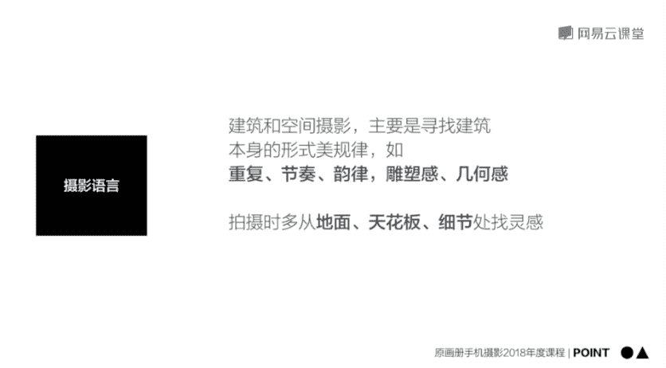

# 韩松-跟全球iPhone摄影大赛冠军学手机摄影，随手惊艳朋友圈（完结）：课时16.建筑与空间

🎼，🎼今天我们来学习第六课城市建筑风景摄影及后期。好，那么接下来呢我们来看今天的第二部分建筑与空间的拍摄。那么提到拍摄建筑就会遇到一个非常棘手的问题。因为很多时候呢我们只能够站在地面去仰视比较高的建筑。

所以说拍出来的建筑呢是会比较歪。那么我们想要拍到的建筑呢是那样的一种两点透视比较直的感觉。那么很多时候我们拍到的建筑却会是那样的一种三点透视，向中间倾斜的效果，那样的一种仰角拍摄。哎。

我们可以要通过后期的修正，才能够达到两点透视的垂直感觉。我们平时在地面上拍到的建筑可能是像现在这样斜的，我们需要在后期的过程中把它逐渐拉成，现在这样是处于一个挺拔垂直的状态中的。那么我们再来看一下。

比如说刚才是这样的一个三点透视建筑呢是向中间倾斜的，我们需要呢将它拉成这样的一种两点透视，处于一种垂直的状态。那么在表现建筑和人的关系的时候，如果我们要表现的主体是建筑，那么人物的比例不宜过大。

最好呢是不要超过5分之1啊。但是呢如果完全没有人的话，建筑也会显得没有生气。所以说加入人加入这样的一种比例尺度是会给建筑带来生机的。那么关于人物在画面中的位置，我为大家推荐的是终点和三分点。

这样的一些关键位置，可以让我们的视觉看上去更加的平衡，更加的舒适。我们。

来看一下林肯中心的。🎼广场上面对面的这一个建筑呢。🎼啊，它的线条纵横交错，而且非常的简单，极具几何美感，吸引了我。那么我开始观察建筑和上面人之间的关系。那么我需要调高焦距，将背景不要的元素去除。

仅仅将人人物出现在画面中，这样呢就很容易形成一张干净的照片。我们再在广场上面闲逛一下，观察一下还有没有什么东西可以拍。我们来看一下这一个广场上面的场景，有行人，还有一些垃圾桶等等设施。

还有建筑的线条也是比较杂乱的，这样的一些东西呢，我是需要规避掉的。所以说呢我想要表现的还是对面的那一个纵横交错的建筑，它的线条非常的漂亮。

那么我们就干脆直接的对准它去拍到它和下方的行人形成这样的一种高大和矮小之间的对比。那么我们还可以像刚才那样用斜构图的方式。那么那么这个时候呢我是打开了手机的九宫格。用九宫格，那么这样的一种焦点去构图。

将人物呢放在九宫格下方右下方的那个焦点处，然后通过这样的一种方法，让画面的构图更为饱满，人物的位置呢更为顺眼。那么最后呢就得到了这一张照片。那么我们可以看到线条从镜像远延伸。

形成了这样的一种几何结构之美。接下来这一个建筑呢是设计大师卡拉特拉瓦的一个作品啊，就在世贸中心的附近。它极具几何的美。这个建筑呢是纽约世贸中心附近的一个商业建筑，它极具几何的美感。

在周围的环境中也非常突出。所以说呢想把它表现出来。我采用的第一个方法呢是将画面的结构简化，去观察建筑那样的一种流线线条，所以说使用的大变焦，然后将流线线条部分表现出来，将其他部分规避。我们可以看到。

那么这个时候呢，我需要稍微的抬高一些镜头，将人行道的部分完全的舍去，将建筑上方的部分表现出来。那么第二个思路呢，我可以往下滑动一下镜头。那么这个时候呢就要表现人物和建筑。

他们在一起互相交融互动这样的一种效果了。因为这一个建筑呢，我们可以看到外立面极具几何之美，那么出现一些人物在画面中也很容易形成那样的一种对比的感觉。🎼那我们就可以得到这样的一些照片。

建筑的单纯几何之美感，建筑处于环境中的感觉。那么还有像这样的一个建筑，在太阳下的光影之感，以及建筑和人物之间的配合。🎼接下来呢我们就进入到这一个建筑的内部，先四周观察一下。

我们可以很明显看到这一个建筑的内部呢是依然充满了线条，充满了几何节奏。而且呢线条的排布非常的整齐，极具这样的一种节奏，还有韵律的美感。首先呢我将焦点对在了画面的正中间。

因为我们可以很明显看到这个建筑呢很和很多其他建筑一样啊，都是左右对称的这样的一种对称的构图呢是在建筑和空间摄影里面一个非常具有仪式感的构图，会给画面带来这样的一种整齐的美感。

之前呢在第二课里面讲那样的一种形式美规律的时候，也首先提到了对称啊。好，那么这张照片呢，那么除了这样的横向构图之外呢，我们还可以将这样的一个纵向的构图去表现出画面更多的在众身上的结构之美。

那么我们再多拍两张，我们再来看一下。那么这个呢就是拍摄完成之后的一个照片。那么除了刚才的那一个对称之外呢，我们还可以呀将我们的焦距呢调为二倍，我们去抓捕到边上的那一些线条，从近向远的这样的一种分布。

会给画面带来更强的这样的一种韵律，还有节奏的美感。那么我们还可以呢稍微的往上去拉动一下我们的画面，然后呢去表现建筑的天花板。我们来看一下，那么从下往上进行这样的一个仰拍。

有的时候呢也能够拍到一些不错的照片。

🎼你在拍摄建筑的时候呢，有这样的一些摄影语言，比如说寻找建筑本身的形式美、重复节奏、韵律、雕塑感、几何感等等。在拍摄的角度上面呢，多从地板啊，天花板细节处找灵感，往往会得到不错的照现。

接下来我们来观察一下这一个建筑，我们可以看到它的室内的配色呢都是比较浅色调的。在这样的一种浅色调的配色中呢，一般在拍摄的时候，我都会往上拉动一些曝光。哎，我们来看一下，先点击画面。

然后呢从下往上滑动手指拉高一些曝光。哎，这样的一种操作呢容易让这样的一种浅色的建筑显得更加的通透。我们来看一下刚才黄黄的颜色拉高曝光之后，显得更加的白皙。

接下来呢我会在建筑中游走，去观察一下建筑的线条和处在其中的行人，他们之间有怎样的关系。哎，我们在这个时候呢就发现了对面的露台上，有一位女士她所在的位置呢比较干净。

背景比较干净和见背景的建筑呢是融为了一体。我所做的呢就是拉近对焦，让它和背景显得更加的干净。我们来看一下，那么随时观察它的动作，有利于拍到一张完美的照先，我还会拉高一些曝光啊，让背景更加的通透。

我们来看一下，在继续的调整一下角度。那么最后呢就很容易拍到一张满意的照片。我们可以看到这一张就是后期处理完成过后的一张照片。首先我们来看一下拍摄天津滨海图书馆的室外。我们来看一下拍摄的最好时间段。

就是像这样的一个天空处于蓝色天空的时候。那么傍晚的时候，那么开下了开出了灯。那么这样的一个灯的黄色和蓝色是形成了这样的一个黄蓝对比。刚才呢也为大家讲到过，那么在拍摄的时候呢，我觉得一个非常好的角度呢。

就是正对建筑拍摄。我们来看一下，一定要正对建筑，把这样的一个对称的建筑才能够表现的更有气势。那么这个呢就是拍出来的一张照片。🎼我们来看一下这个建筑的内部是极具几何美感的。首先观察一下地面。

它是大理石的地面，所以说是反光的。这个时候呢我们就可以将手机倒置在地面镜头朝下。那们可以看到现在呢画面翻转呢是出现了一个倒影的效果，让前面的几何美感翻倍。那么这个时候呢我抓捕到了经过的人。

然后呢用连拍的方式抓捕到了一系列的瞬间，最后呢会筛选出几张照片，最满意的几张照片为大家做一个展示。我们可以看到调整完之后呢，就会像这样人物明显的凸显在画面中，而且有了倒影的衬托，形成了两倍的美感。

我们再来观察一下对面的书架，可以发现它非常整齐，但是呢现在离我们太远，所以说呢仍然要使用比较大的变焦，让背后的书架整齐的出现在画面中，然后让人物点缀在画面的3分之1处，形成这样的一个视觉上的美感。

我们可以看一下，可以多拍几张照片来表现这样的一种空间和人的大反差比例。那这两张照片呢就是最后选出来的两张，他们是利用了人和空间的比例来制造画面的美感的。那么拍摄建筑室内的时候。

除了刚才给大家讲到的注意地面之外，我们很多时候呢还会望到一个地方，那就是天空，我们可以抬头望一下我们建筑的天景，建筑的天花板，很多时候呢那个时候是有建筑里面的最漂亮的结构线的。

而且呢天花板可以避开建筑下方的比较杂的人。哎，所以说呢我们往上拍一下，很多时候能够拍到那样的一种几何的结构美感。那么这个建筑呢就非常的明显。天花板上的线条极具流线的美感。我们可以多拍几张。

后期进行一个筛选。那么这两张呢就是从原片中筛选出的两张结构非常棒的，非常美的天花板的照片。🎼那么通过刚才那一个视频呢，为大家总结出今天的第二RP points手机拍摄高大的建筑的时候。

要尽量制造两点透视，形成那样的一种垂直的效果。人物建筑中的人物不是妨碍拍摄建筑的元素。他们很多时候运用的好，可以给拍摄大大的加分。人物的比例呢要比较小有序的方式分布，能够成为建筑的良好配角啊。

在拍摄的时候，我们多去寻找一下建筑的重复节奏、韵律等等形式美的规律。那么还要找到建筑和冲空间里面的主要结构，这也是拍摄建筑一个非常重要的点。🎼今天的课程呢就到这里，我是袁滑册的韩松。

欢迎大家参加我的课程，谢谢。

