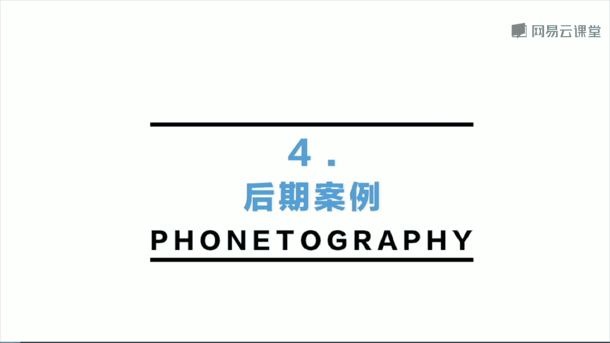

# 韩松-跟全球iPhone摄影大赛冠军学手机摄影，随手惊艳朋友圈（完结）：课时18.后期案例

🎼The。🎼今天我们来学习第六课城市建筑风景摄影及后期。那么今天的第四部分呢，我会为大家分析一些后期的案例。我们还是会通过几个视频来为大家讲解这样的一些后期，我们要如何把它们做出来。

那我为大家示范一下怎样用后期处理的方法，将一个比较歪斜的建筑这样的一种三点透视改为比较垂直挺拔的两点透视。有两款软件可以做到这一个步骤。第一个呢是snapse。

第二个呢是sew screw这一个软件呢也就是画面中右边的这一个软件是苹果手机独享的。那么我首先使用s来进行这样的一个后期调整，点击开，然后载入这一张照片，我们可以看到就是一张典型的。

由于我在地面拍摄到的，所以说呢镜头不得不向上拍全，所以说呢建筑是一个三点透视的歪斜状态。那么我们打开cr可以看到下面有6个按钮，最重要的就是从左往右数的第四个呃有那个正方形的框，边上有4个空格那个按钮。

那么我们把它点开，那么点开呢，点开之后呢，我们就可以看到有4个这样的四个点，我们可以触碰任何一个点，它选中之后呢，就会显示。为蓝色。那么我们首先来选中左上角那一个点，然后呢将画面从右往左拉一下。

我们来看一下拉动呢我们就一直拉动到建筑的最左边的那一条线是垂直为止。然后我们再选中右边的那一条线呢，6那一个点，然后呢朝反方向拉，一直拉到最右边的那一条线为垂直为止。那么这样的一个动作呢。

我们来看一下反复进行几次，我们就可以看到建筑呢是基本上处于完全垂直的了。那么我们接下来再进行下一步，选中两个点的中间那一个。方框我们就可以看到，同时选中了两个点，然后将建筑。往上拉。

那么这个时候呢我们就可以看到刚才感觉被压扁的建筑，它的这样的一个结构回到了原始的尺寸。哎，所以说呢这个就是crew进行一个建筑后期拉直的步骤。首先左右拉，将建筑完全调直，然后在中间点往上拉。

将建筑的比例调为原始尺寸，非常的容易。好，那么接下来呢我们再来看一下，用snap seat的这一款软件进行同样的一个操作步骤。那么我还是先导入这一张照片，然后选择下方的中间工具。然后打开之后。

我们可以看到第二排第二个按钮透视点击进去。然后首先呢选择最右边的那一个自由。然后同样是出现了4个点。那么我们首先呢还是像刚才那一个步骤那样，先往左拉拉到最左边的那条线垂直为止。

那么再往右拉拉到最右边的那一条建筑线垂直为止。那么在这样的一个反复进行。这样的一个拉动。好，我们来看一下，那么拉过几次之后呢，整体呢是处于一个垂直状态。那么接下来的第三步呢，我要回到刚才的下方。

从左往右数的第二个按钮选择。那么缩放这一个按钮。我们来看一下，从上往下拉一下，我们就可以看到整个建筑呢也是回到了一个完全和原来相同的比例。所以说呢我们可以看到。

不管是用scrcr还是用snap seeed，呃，在建筑后期拉直的调整过程中，它们调整的步骤都是相类似的。首先呢将建筑左拉右拉调整值。然后呢。呃，调整建筑的结构回到原来的比例。🎼哎。

那我们就来看一下天津滨海图书馆这一组照片的一个后期处理。🎼我们来看一下这一组照片啊，它的建筑室内呢实际上是比较白的颜色，但是用手机拍出来呢，往往这样的白墙呢会发黄。所以说呢我们需要修正这样的一种黄色。

把它矫正为比较白的颜色。那么在室内呢纠正这样的一种黄色，我一般首先会用A6号的滤镜，我们来看一下，那么调整完A6之后呢，我们就可以看到那样的一种脏脏的黄色，就受到了一个极大的抑制。

白色呢就开始显现出来了。那么调完这一个滤镜之后呢，我们接下来再来微调一下其他的参数。🎼首先是曝光，那么一般要将室内调的比较明亮，那么曝光呢是需要进行一个比较大幅度的增加的。这里呢我是增加了四的曝光。

那么一般呢调整完曝光之后，接下来呢我还会调整一下色调里面的高光。那么高光呢稍微的往前拉一些。我们来看一看一下，那么往前拉一些呢，那么它的那样那样的一些过曝的地方就不会显得那么明显。

画面呢就会显得更加的柔和一些。🎼那么接下来呢第三步我会调整一下画面的白平衡。因为现在呢我看到这一张照片可以看到背景还是有一些泛黄的，所以说呢将白平衡往左边拉一些，就是往蓝调的方面拉一些。

那么这个时候我们就可以看到整个画面呢，它那样的一种黄色就完全得到了抑制，整体的白色就出来了。画面显得非常的干净清爽，这样的一个后期处理呢在处理，特别是建筑室内白墙的时候非常的好用。

基本上都可以将画面调整为这样的非常干净清爽的色调。那么调整完之后呢，就打勾。选择保存。那么我们来看一下，那么还有其他三张照片需要我调整，这三张照片呢也是在同样的一个环境拍摄的。我们可以看到光环境。

还有那个建筑的环境都差不多。那么所以说呢我可以将前面的那一张，然后点中选择下方最右边的那一个按钮，然后选择其中的复制编辑。然后再选中其他的三张，那么再选择下方右边的那一个按钮，那么选择粘贴编辑。

这也是一个非常好用的办法，可以在调整一组照片的时候，快速将其他几张调整好。那么之前呢为大家讲到那一个配方的方法，那么也可以进行这样的一个快速的调整。今天为大家讲到第二个方法呃，复制编辑粘贴编辑。好。

那么我们看到其他三张照片呢也非常迅速的调整好了，我们还可以对其中的一些进行一个呃微调整。比如说我们来看一下刚才调到的第一张照片它是偏白的。但是。上面的这一张照片用同样的方法调出来呢，还是有一些偏黄。

所以说呢每一张调出来的照片要进行一个微调整。那么我还是调整这一张照片的一个白平衡，那么将白平衡呢继续朝蓝色那边拉，我们可以看到拉到这个时候呢，白色呃黄色呢就完全被抑制住了。

整个建筑呢显示出了清爽的白色色调，显是保存。然后呢，最后再将这几张照片全都保存到相册，嗯一般呢我会保存呃，实际尺寸就OK了。🎼好那我们来看一下这一张照片是在冰岛黑沙滩拍摄到的。当时呢是一个阴天。

我们来看一下原片啊，没能表现出当时那样的一种呃有一些忧郁的色彩在画面中。所以说呢我要使用snap see的滤镜，将这一张照片染上一种微带蓝调的这样的一种忧郁的感觉。🎼好。

那么在这里呢我要为大家推荐几个滤镜，呃，它们分别是A系列的A7号和A8号和A9号，这三款滤镜呢都会给画面带上非常自然的蓝调，而且呢会稍带这样的一点点的暗角啊，会给画面渲染出那样的一种特定的氛围。

那么这里呢我选择的是A8号滤镜。🎼我们来看一下，那么调整完之后呢，我们可以看到整个画面由原来的偏黄变成了完全的偏蓝。那么画面的氛围就得到了一个极大的变化。那么调整完之后呢，我们再来进行一些微调。微调呢。

我觉得第一是要降低一些曝光，让海面的分界线左边的海和右边的黑沙滩显得更加的明显。来看一下这个过程啊，那么调整完之后呢，我们可以看到海面和沙滩之间的呃这样的一种分界更为明显的。好，那么在这张照片中呢。

我觉得可以增加一些对比度。那么将样这样的一种明显程度再体现出来。但是呢注意不要增加的过多啊，那么增加一左右，我觉得就差不多了。然后呢哎第三步我觉得呢还可以稍微的调整一下白平衡将色温呢再调蓝一点。

整体的氛围呢会更强一些。那么这一张照片呢，像现在我们来看一下和原片的对比，那么这样的一种情绪。这样的一种忧郁的氛围就出现了。好，那么这张照片呢我还可以裁图啊，那么通过裁图。将画面中上方去除。

我们来看一下，那么只留下下方的海面和沙滩部分。我们可以看一下，那么像现在这样，那么这一张照片就会出现一种更多的忧郁的美感呢。那么我们可以看到，那么原图呢没有裁剪之前，它是表现的。整个风景。

那么裁剪之后呢，那么那样的一种感觉。尺度的不确定性带来的那样的一种模糊的美感就出现了。所以说呢有两种这样的一种。调节方式可以保存原图，也可以选择这样的裁剪的照片，将画面那样的一种嗯朦胧的美感吧表现出来。

🎼那么今天的第四批points呢为大家分享一下后期的points。第一个呢建筑摄影后期矫正非常重要。s basically里面都有很方便的矫正功能，或者是呢school也有这样的一种嗯矫正功能。

我们可以把它实现。那么后期呢利用软件中的参考线进行对称和横竖对齐非常的重要。建筑和空间的形式感较强。多余的元素呢可以可能会影响画面的效果。很多时候呢我们画繁为简，去表现，专注表现建筑为佳。

那么黑白摄影呢也是建筑和空间摄影的一个较好的解决方案，可以帮我们去除掉画面的颜色影响，让我们专注画面的内容。🎼好的，那相信大家通过今天的学习，对拍摄建筑的城市还有风景都有了更多的认识。那么我们总结一下。

对于拍摄这样的一种中演中原景类的照片，将会遇到比较大的场景。那么这个时候呢在我们的场景中找到画面的主要结构主体的东西非常的重要。在拍摄建筑的时候，多用一下对称，节奏的韵律，重复等美学规律。然后呢。

在拍摄建筑的时候，永远不要把人当成是一个负面的元素，不要把它当成是一个遮挡建筑的讨厌的东西，多去寻找一下建筑和人的关系，会让我们的作品变得更加的有生气。那么最后呢还是给大家留个作业。呃，做一次爬楼档吧。

用手机拍下你所在城市的一个最壮观的鸟瞰图。🎼今天的课程呢就到这里，我是原画册的韩松，欢迎大家参加我的课程，谢谢。

