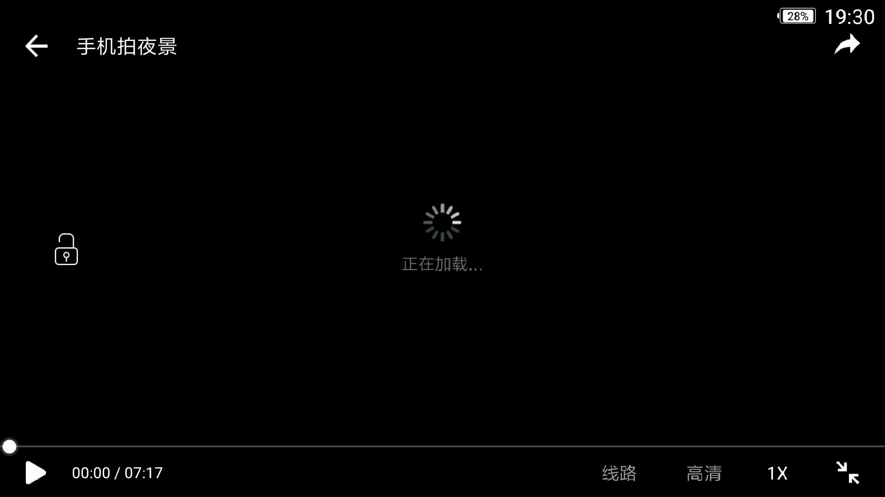
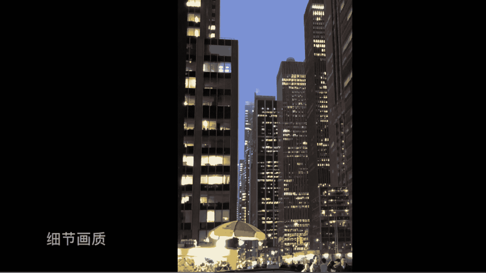

# 韩松-跟全球iPhone摄影大赛冠军学手机摄影，随手惊艳朋友圈（完结）：课时19.手机拍夜景

Yeah。🎼と。🎼这节课呢我们来玩归一下光线，我们都知造一句非常有名的话，摄影是用光的艺术。这对手机摄影也是成立的这堂课中呢我们将引入几种光和绿灯相关的拍摄方法。

帮助大家利用日常的光照条件拍出有味道的照片。这几种方法呢主要包括剪影、慢门、夜景和暗光条件拍摄、光影构弧、倒影拍摄、流光快门等等。🎼首先呢为大家介绍的第一部分呢是大家都非常感兴趣的内容啊。

用手机去拍摄夜景。首先我们来看一下华为P20pro的夜景模式。

🎼们来看一下，在曼哈顿第七大道的街头，人来人往远处的大楼灯光璀璨，这是一个拍摄夜景的非常棒的场景。我将我的手机架在八爪鱼的三脚架上，然后呢用夜景模式拍摄到了一些照片。

🎼我们来看一下P20pro的一个操作界面，这是最普通的拍照模式。当然用拍照模式也可以用来拍摄夜景。但是呢画面的画质和暗部细节会得到一定的损伤。所以说呢这个时候呢我们可以往左移动两格来到夜景模式。

你尝试呢将画面切换为夜景模式，然后按快门进行拍摄。在拍摄夜景模式的时候呢，系统会自动的拍摄几秒钟的时间，然后最终合成一张照片，这一个拍摄的时间呢是根据我们当时夜景的光照程度来定的。一般像这张照片。

它的光照比较亮。所以说呢拍摄了三四秒钟的时间。这种方法呢也是可以手持的这是一个比较神奇的。我们用手持拍摄三四秒系统呢，也可以帮我们合成一张清晰的照片。然后呢，我们来对比一下这一个画面的细节。

可以看到亮部和暗部的细节都非常的多，保存的非常的完好。啊，我们可以看到。整体也非常的锐利画面。最终呢来为大家展示一下成篇。🎼那么其他智能手机呢就用非夜景模式直接拍摄就好了。以iphone10为例。

那么拍摄的场景仍然是曼哈顿的第七大道街头。我们可以看到背景的大厦，灯光非常璀璨。🎼那么我们来看一下苹果操作界面。那么这个时候呢，我就直接对焦，直接测光，直接拍摄，就跟白天拍摄是完全相同的操作非常的容易。

然后拍摄完成的照片呢，我们可以看到进入了我们的系统相册，然后我们点开来看一下这一张照片的细节。我们把它放大一下，仍然看到细节是很棒的，画质是非常锐利，非常清楚的。就是暗部细节呢可能有一些损失。

🎼我们再来把画面放大一下，看一下整体的操作细节，可以看到，即使放到这么大才涂到这么大，都能够清晰的看到画面的一些细节。

🎼所以说呢我们可以看到现在的智能手机拍摄夜景呢是完全可以胜任的。像华为这样的手机，有夜景模式，可以保存更多的细节，没有夜景模式呢。也能够拍到满意的照片。

相信大家呢通过那一则视频呢都可以看到这两个关键词啊，夜景模式和非夜景模式。我们的华为拍摄夜景呢是可以采用夜景模式的。经过数秒钟的计算，可以获得画质较好的夜景，可以看到在上面的例图中，用华为拍摄的夜景。

它的暗部细节是保存的比较多的。所以而且呢可以用手持拍摄。但是呢用华为拍摄呢经常呢可以感觉到那样的一种夜景拍摄的过量，呃，没有了那样的一种情绪氛围感，往往会丢失掉啊。那么用iphone等手机拍摄夜景呢。

它没有夜景模式，我们只能用我们手机的原始模式拍摄。那么这样的拍出来的夜景呢，可能不如华为手机锐利，没有那样的非常多的细节，但是呢它的夜景表现会更加的真实，容易拍出画面的那样的一种暗调的氛围感。

特别是在拍欧美街头的时候，我觉得这样的一种暗调出现在画面中是非常迷人的，极具场景感的。

接下来呢我们再来看一下P24pro的一个专业模式啊，将画面调到专业。那么在这一个场景中呢，将曝光设置到0。5秒钟左右，也就是每一张照片会有0。5秒的曝光。

我们可以看到我将手机放的非常的滴滴在了那个斑马线附近，然后呢来捕捉从对面经过的行人，那么我连续拍摄，每一张照片都是0秒0。5秒的曝光。那么这个时候呢，由于行人在走动，就会形成一定程度的脱影。

这样的一种脱影呢会给画面带来极强的模糊抽象，还有动感。那么最后呢我选择了这一张，当画面中刚好有5个对称的人物经过的时候，为大家做一个展示。下面呢我们再来对比一下普通拍摄模式和夜景拍摄模式之间的区别。

我们可以看到普通拍摄模式拍摄出来的车呢是没有脱影的。那我们来看一下夜景拍摄模式，拍摄这样的一个城市的灯车轨啊。我们可以看到它拍摄出来的感觉呢，车是有一定的脱影的，是有这样的一些不同的区别。好。

那么看完视频之后呢，再为大家展示两张照片。那么第一张呢还是纽约街头。那么运用了一个相对来说比较长的曝光，去抓捕到了虚化的行人这样的一种红色的衣服和背景中的一个冷调夜景的一种颜色对比，还有动静的对比。

我们再来看一下这一张照片，纽约的曼哈顿的街头，我们可以看到，那么也是一个入夜的场景。前景中的建筑和背景中的一个非常。暗的光线是形成了一种对比。好，那么今天的第一组points分享给大家。🎼第一。

智能手机呢在拍摄夜景的时候，会将我们的曝光时间压缩的比较低，让我们能够进行手持。但是呢这样的一种条件呢也会让黑暗处产生非常多的噪点。呃，像华为这样的一些型号的手机呢，它有夜景模式。

利用算法呢合成抑制了噪点，但是呢也会造成夜景过量，丢失掉一定的氛围这样的一些问题。那么第三点，最最重要的是夜景拍摄的时候呢，要注意焦点不要点在画面的暗的地方，这样呢手机的系统会自动强行提亮整个曝光。

让夜景的氛围失控。好，我们今天的课程呢就到这里结束，使用画册寒松。欢迎大家参加我的课程。

