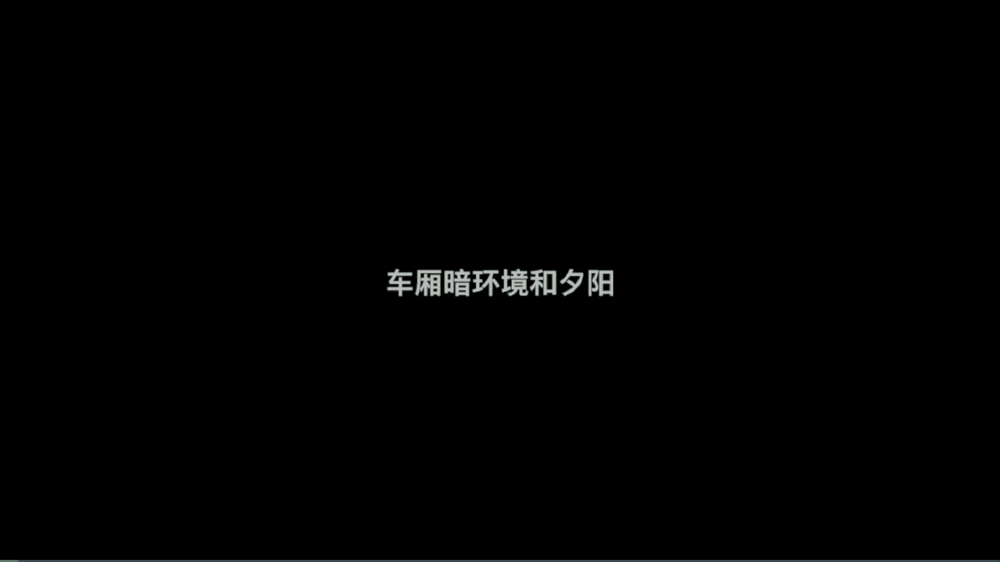
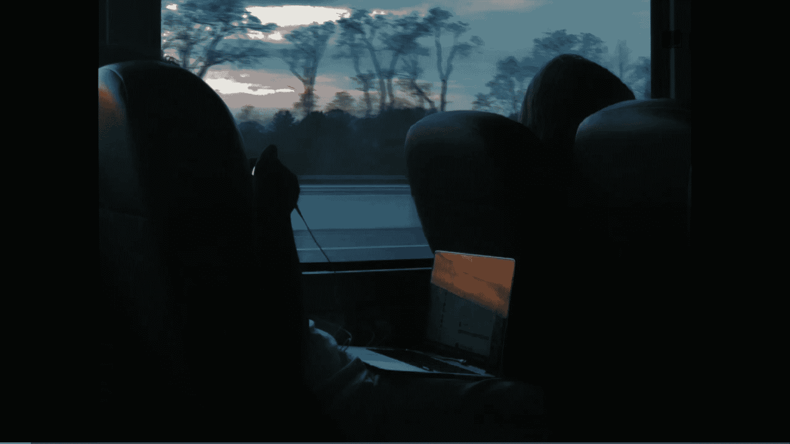
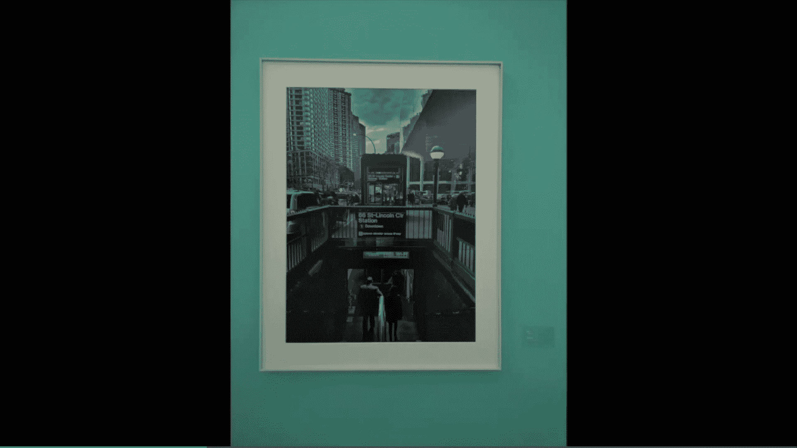
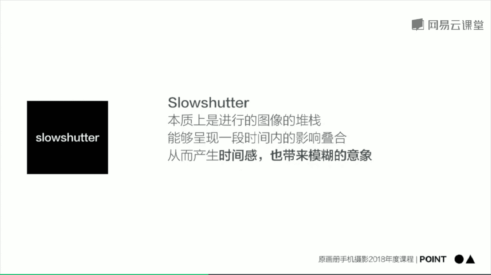
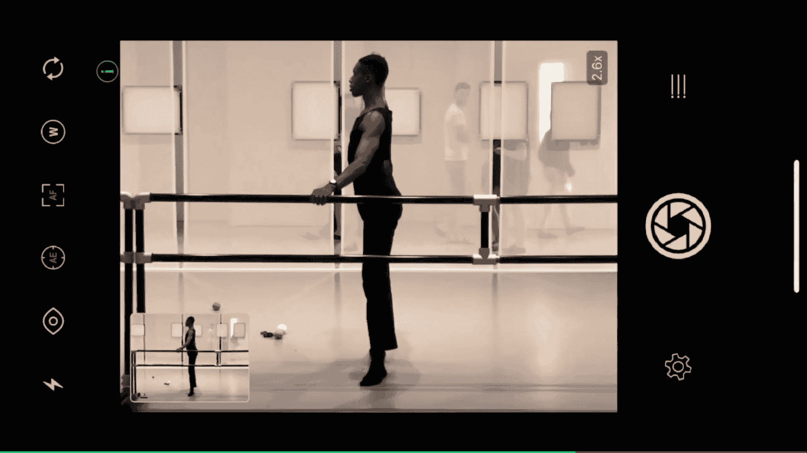
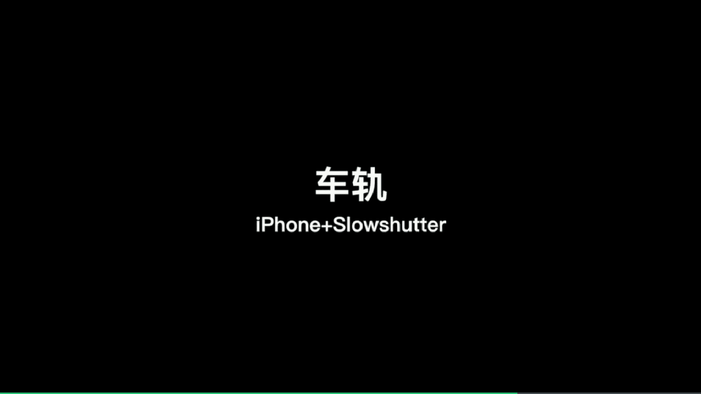
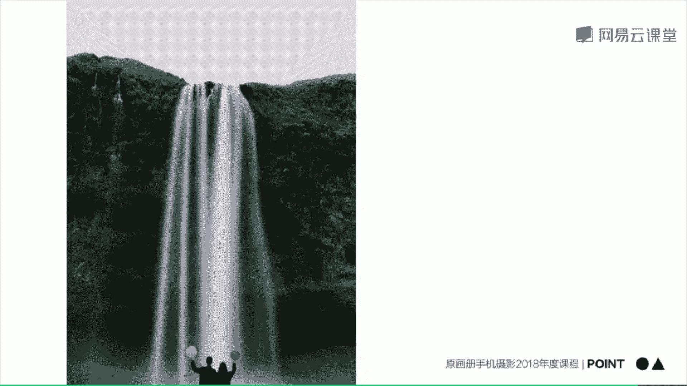

# 韩松-跟全球iPhone摄影大赛冠军学手机摄影，随手惊艳朋友圈（完结）：课时20.暗光环境下与长曝光的创作

接下来我们来看一下今天的第二部分，在暗光环境下去进行一个创作。

🎼我们来看一下在夕阳下的车厢内这样的一个暗光环境中要如何去拍摄。我看到前面这一个人呢拿着一台笔记本，他的笔记本中反射出了夕阳。于是呢我将焦点对在笔记本上面，用二倍焦距。

并且拉低曝光去表现出笔记本中的太阳和天空中的夕阳他们之间的一种模糊美妙的关系。那么通过这样的一个操作呢，我可以得到这样的一张照片。

🎼那么我们还可以将这张照片中的笔记本放大，去表现出笔记本中的夕阳和背景中的蓝色，他们之间这样的一种模糊的颜色对比关系。

🎼那么接下来呢我们来看一下人物拍摄，我们可以将焦点对在人物上面，也可以将焦点对在窗外。对在人物上面的时候呢，就一定要拉低曝光，保证窗外的曝光正常，保证细节。那么对在窗外的时候呢，就可以直接用原始曝光。

那么这个时候呢我们可以看到窗外的细节是很完整的。那么其实呢这两种操作呢，最后的结果都是比较类似的。那么重点呢就是保证窗外的细节一定要完整。那么最后得到这一张照片，我们可以看到窗外的彩虹非常的漂亮。

人物呢是处于剪影状态，很迷人。那么我们接下来呢，那么时间更晚呢，在一个更暗的场景中。那么我们这个时候呢可以利用室内的场景光。比如说人物的电脑照在人物脸上的光线，那么这个时候呢就会更具氛围感。

来看一下处理过后的照片啊。人物的面部呢被电脑照亮，是显示出了这样的一种嗯极具场景氛围光的感觉。

我们来看一下在霓虹灯映照下的街景。霓虹灯呢在我夜景拍摄的里面呢是一个非常喜欢使用的道具。因为呢它可以将我们的场景渲染成这样的一种单色的色块，极具氛围感。🎼在纽约的曼哈顿radio city的正前方。

我们可以看到霓虹灯将街道造成了这样的一种呃音略带粉红的色块非常的漂亮。那么在这样的一个色块中呢，我就直接正对radio city的招牌，然后进行一个拍摄，用对称场景平拍的方式去捕捉画面。

那么我一直在等待车辆或者是人物的经过。然后呢用连拍的拍摄去抓捕到这样的一整个场景。最后呢，才能够筛选出一张照片为大家做展示。🎼来看一下展示的这一张照片，极大的表现了对称之美。

🎼那么有的时候如果我们更靠近霓虹灯招牌的话，那么这个时候呢我们可以利用霓虹灯比较亮的光线这样的一种人造光线去抓捕住前方行人的剪影也是非常有意思的。🎼来看一下这个场景。

成都的太古里街头背景中的霓虹灯非常的有意思。我拉近焦距，把它放大，然后呢自动曝光锁定对焦在霓虹灯上面。那么这个时候呢，我们就可以看到前景中的人物呢是自然的虚化成自然的变成了剪影。

那么接下来呢我就会继续等待一个合适的人经过。啊，在有人群经过的时候呢，我就会按住快门连拍，抓捕到一系列的照片。那么我们再耐心的多等待一会儿。那么这个时候呢我们就会等待到有一个人经过的时候为家啊。

那个时候呢我们可以去。呃，专注的表现这样的一个人在霓虹灯下面的剪影他的这样的一种姿势。那么现在手机的画质呢是进步非常的大，我们已经可以用手机去抓捕一张完全黑暗的天空下的街景了。我们来看一下。

在美国新泽西州的街头，我们可以看到天空已经完全黑暗下来了。但是街对面的那1个24小时的小店信引呢我我觉得它的招牌呢非常的有意思，也很当代，也很美国有那样的一种西部牛仔的感觉吧，非常的粗犷。

那么这个时候呢，我对准它进行一个拍摄。那么在这里呢我是用普通拍照模式，然后对焦拉低一些曝光去保证天空的完全黑暗保证这样的一种嗯比较朴素的背景。然后呢呃注意手不要抖，这个时候呢就能够拍到一张清晰的画面呢。

我们可以看到我用的是三倍的长焦焦距也完全是OK的，可以拍到一张清晰的画面。好，我们可以看到拍出来的照片呢，画质也是非常棒的。那么这一张照片呢还出现在了今年的深圳国际影展next image手机专区中。

呃，那么我们来看一下这一张照片，其实呢也是一个嗯夜景的街头，也出现在了今年的国际影展中。

好，我们来看一下，在暗光环境中呢有非常多可以拍摄的元素啊。比如说这一张照片在纽约的新泽西街头是一个阴雨天，我们可以看到整个背景呢是处于一个比较呃绿色的这样的一种灰绿色的色调中。那么前景中呢有一个人家。

他们的窗户是亮着的。那么这样的一种亮着的东西和背景中的蓝色色调，是形成了一种冷暖交接的对比。那我们再来看一下，在我的好朋友陈红宇的家。我们可以看到它是前景中呢是有一个。

椅子那椅子呢作为画面中一个明显的主体出现在画面中，背景呢是这个椅子打上的影。我们可以看到真实物体和影之间似乎产生了某种对话，而且呢他们是处于一个非常昏暗的场景中。

那么这样的一种场景渲染出了当时的场景和氛围之感。我再来看一下这一个纽约的街头，那么背景中的灯光呢是作为画面中唯一的人造光源，是完全处于一个四周暗光的环境中。那么这一张照片运用了完全对称的构图。

那么加上人物的点缀，形成的这样的一种强烈的街头氛围之感。那么这一张照片啊，我觉得是一个很棒的欧美街头的摄影作品呢强烈的表现出了美国的郊区，那样的一种萧瑟的夜景之感。

我们可以看到前景中车打出的前光是如此的寂寞，然后和背景中的一个暗光是形成了一个相辅相成的效果，有了这样的一种强烈的氛围之感。

好，那今天的第二批points分享给大家。那么在暗光条件下拍摄啊，本质上是找到那样的一些人造光源。比如说灯光，他们和我们的人物的影子或者是和我们人物本身是进行了一个调和的关系。在黑暗的环境下拍摄啊。

要时刻注意检查我们手机的测光情况。因为在暗光情况下拍摄，我们的手机是很容易自动调亮我们的曝光调亮曝光之后，噪点就出来了，而且氛围就会完全没有了。所以说呢我们要时刻检查手机的测光，手动控制曝光。

不要让画面过曝。然后呢，第三点，在缝隙窗口街角这一些不经意的地方，我们要去多多观察，往往在这些地方，他们的光线会更加的精彩。时刻保证我们手机的镜头是干净的，否则拍摄灯光的时候很容易出现脏脏的光晕之感。

那么第四五呢拍摄霓虹灯题材的时候呢，很多时候呢会有一些刺眼的撞色。比如说我们的灯光是红色的，我们的地面呢又会被照成紫色的，然后呢，有一些蓝色的车经过。那么这样的一些撞色或者是色块的对比出现在画面中。

往往呢会非常的出彩。接下来我们来看一下今天的第三部分，利用长曝光进行拍摄。那首先呢给大家介绍一款长曝光的软件，flow shuttter这一款软件呢本质上是进行了一个图像的堆栈。

能够形成一段时间内的影像的叠合，从而能给我们产省时间感带来这样的一种模糊的意象。

接下来呢我们用iphone加slow shutter这一款软件这样的一种组合来进行一个长曝光的拍摄。首先呢给大家介绍的是水面长曝光的拍摄。🎼我们来看一下这一个场景，我觉得前景中木栈道的斑驳和背景中。

曼哈顿的摩登是一个强烈的对比。我想要用长曝光的方式去抓捕住这样的一种对比，拿出八爪及三脚架。然后呢将我的手机固定在三脚架上面。这样的一种方法呢可以帮我提供一个稳定的拍摄场景，保证在长曝光拍摄的过程中。

不会出现抖动，让画质更加清楚。🎼可以看一下，安装好之后呢，我就打开slow shut这一款软件，用这个长曝光软件去拍出平静的水面。那么第一步呢是调整构图。哎，我们来看一下。

将故栈道和曼哈顿的城市天际线究竟要买下画面中的哪一个位置是更好的。那么现在呢是调整好了。那么接下来呢我点击设置。然后呢。🎼将画面中的模式呢调为激光模式，快门速度呢调至B门。

B门呢实际上呢就是一个手动控制快门，你可以任意曝光时间。好，然后呢再点击快门进行曝光。那么这个时候呢，我们可以看到水面呢就逐渐变得平顺了。那么在曝光一定时间之后呢，再点击快门就可以停止了。

注意呢一定要点保存。这个时候呢我们的画面才会保存到我们的相册中。接下来就可以拍摄另一张了，可以看到这张照片拍摄出来的效果是非常棒的。我们再来看一下下一个例子，是一个海景照片。在葡萄牙的波尔图拍摄到的。

那么这一个场景呢是更为自然的场景，同样也适合长曝光去表现。首先呢我们还是打开slow shuttter，调整构图。那么在这张照片中呢，我将远处的灯塔放在了画面上方的3分之1处。这样的一种三分法的构图呢。

可以让景色更加的养眼，更加的呃符合我们的视觉观察美学吧。啊，我们可以看一下，那么调整到这个时候呢，我们就差不多将我们的远处的灯塔调在了画面的3分之1处。然后呢点击快门进行曝光和堆栈。那么我们可以看到。

那么点击之后呢，那么海水呢就好像瞬间凝固了起来一样。那么出现了这样的一种柔柔和的丝化的效果。好，那么除了这一个构图之外呢，我们接下来再来看一下第二个构图方式。那么第二个构图方式中呢。

我是将远处的灯塔调在了画面的中间，有了这样的一种天空和地面完全对称的感觉。啊，我们可以看一下，那么同时呢也点击了快门进行曝光和堆栈。那么在拍摄到了一段时间之后，我们就可以得到一张呃完美的照片呢。

那么接下来呢我们再来进行一下第三次构图啊。那么这个时候呢，第三次构图的时候，我是将焦距放的非常的大，去表现出远处灯塔的一些细节和近处礁石的一种对比之感。那么这个时候呢在调整好之后，我同样进行了快门。

点击快门进行曝光和对账。在一段时间之后呢，也同样呃再次点击快门进行这样的一个后期处理。接下来呢我们就来欣赏两张处理完成的照片。我们可以看到哎，海浪呢被柔和的虚化了起来，雾化了起来。

形成了这样的一种有一些模糊的美感。那么除了刚才的河流、瀑布等等流动的自然城市景观之外呢，在拍摄一些小场景的时候，我们也可以用长曝光去捕捉到一些奇特的内容。

🎼我们来看一下，在这一个场景中是纽约的惠特尼美术馆。嗯，在这一个展厅中呢，有几个人在跳芭蕾舞，我觉得他们的舞姿呢非常的动感啊，极具这样的一种曲线之美。

所以说呢我想要通过长曝光去记录他们这样的一个跳舞的过程。🎼哎，我们来看一下，那么现在呢就是我打开了slow shutter，然后对准其中的一名舞者进行拍摄的一个场景。

我们可以看到舞者呢通过长曝光在我的手机中有了一个虚化，有了这样的一种动感的感觉，也有了一种抽象和模糊的美感。我觉得比直接拍摄更能体现当时那样的一种场景之美。我们来看一下，在slow shutter中呢。

我还是设置为闭门曝光，自己控制快门。🎼然后呢，还是设置为低光模式。我自己觉得呢低光模式是我在长曝光里面最常使用的一种模式，然后呢就开始点击快门进行曝光。那么在拍摄这样的一种运动物人物的时候呢。

一般就一两秒钟的这样的一种拍摄时间就OK了。好，我们来看一下，我再将焦距调大一些，将其他的人呢去除，只表现中间一个舞者。呃，然后呢我们来看一下这个时候呢，人物在画面的正中间得到了一个极大的突出。

那我们再来尝试去表现它的多种动作，比如说像这样的一个弯腰的动作。那么再比如说像这样的一个下腰的动作。呃，还比如说像这样的一些呃比较姿势比较优美的动作，我们都可以通过长曝光，把它嗯。

拉长让动作呢更加的平顺，能够呢体现出这样的一种模糊的动感。

看一下拍摄完成的几张照片，呃，相比直接去拍摄它的这样的一个瞬间。我觉得长曝光呢更能够体现出哎时间的这样的一种流动感，让人感觉到嗯画面的这样的一种动感吧。

那么长曝光里面呢也包括了我们经常拍摄的夜晚城市景色中的车轨。我们来看一下具体怎么拍摄。现在看一下成都的春熙路街头车辆川流不息。我找到了一个天桥的中间，这是拍摄车轨城市非常好的一个地方。

它能够拍到城市中哎，车辆来来往往这样的一种场景。那么还是打开slow shuttter这一个软件，然后就不是选择低光模式了，是选择中间这一个灯光轨迹模式进行拍摄。那么同样使用B门曝光。

我们看可以看到点击快门之后呢，这个时候就开始观察车灯的轨迹，等这个车灯的轨迹呢，差不多往来的车灯铺满整个画面的时候就可以按停止了。

哎，我们来看一下，那么这个时候呢，我自己觉得车轨呢是铺在画面中比较饱满的。那么最后呢再进行一个后期的处理，就可以成片了。🎼第二个场景呢是在东京的新宿街头，我们可以看到这一个街道呢它是弯曲的。

所以说拍出来的车轨呢，我自己觉得啊相对直的车轨来说会更有魅力一些。🎼那么我们来看一下，还是打开slow shutter这一款软件，然后呢仍然是将模式设为拍摄车轨的灯光轨迹模式，然后呢。

快门速度仍然调为B门，跟刚才那一个拍摄成都车轨的这样的一种设置呢是完全相同的。🎼那么设置完成之后呢，我就开始曝光。🎼好，我们来看一下，我们开始曝光了，那们车轨呢也逐渐形成了。哎，需要大家注意一下。

除了刚才为大家讲到的那一个拍摄人物是手持拍摄之外，那其他拍摄这样的一种长曝光的模式呢，都必须要使用我们的三脚架进行拍摄，这样呢才能够保证我们的背景稳定。好，我们可以看到刚才拍摄完成了一张照片。

然后呢后期处理的成片就像这样为大家做一个展示。你再来看一下同一个场景，用iphone原生相机拍摄。首先呢对准前景进行对焦，按住屏幕锁定曝光，锁定对焦。然后呢我们来看一下远景。将我们的画面扩大。

将前景呢去除掉表现远处景色那样的一种闪烁的场景。然后呢，我们拉低曝光，将背景呢那样的一种黑拉的更加的纯粹。那么这样的一种城市虚焦呢就出现在眼前呢，我们来看一下拍摄完成的照片，呃。

这样的一种城市虚焦呢也是之前为大家布置过的作业，大家再可以去尝试一下。那么除了拍摄车轨呢，这样的一种城市虚焦。在我看来也是非常迷人的。

好，那么看完视频呢为大家总结一下几种不同的长曝光要怎么样去操作。第一种呢水面长曝光用slow shuttter将低光模式闭门曝光，手动控制曝光时间。呃，一般水面拍摄呢大概在10秒钟左右的曝光时间。

我自己觉得是比较合适的，能够拍出水那样的一种丝滑般的感觉。那么第二个呢是车灯轨迹，那么也是用slow shuttter里面的灯光轨迹模式，加上闭门曝光去拍摄。那么拍摄车灯轨迹的时候呢。

曝光时间一般也在10秒钟，甚至呢更多一些是最好的。好，那么接下来呢为大家分享几张长曝光的作品，来看一下第一张照片。那么在冰岛拍摄到的我让我的朋友呢马上一红一黄，两个气球背对着我站在前面。然后呢。

大概拍摄了3秒钟的时间。我们可以看到瀑布这样的一种丝滑的感觉，是非常明显的。那么第二张照片呢是一个海滩上面也是曝光了10秒钟，抓捕到了这样的一种梦幻的感觉。那么第三张照片呢是拍摄的一个湖泊。

我们可以看到湖水呢是奶蓝色的。那么依然利用长曝光去抓捕到了这样的一种呃抽象模糊的意想之感。

好，那今天的第三批point分享给大家。长曝光的本质呢是在于在一段时间内的图像堆栈形成的这样的一种模糊的效果。那么部分的模糊呢需要借助我们的三脚架，比如说水面长曝光等等。哎。

那么有的时候呢让我们的全局模糊。比如说刚才那样的一个惠特尼美术馆里面的人物那一组照片，我们可以使用手持。但是呢还是要尽量让画面有张可循。那么iphone呢可以用slow的灯光轨迹实现车轨低光模式等等。

呃，flow shuttter的灯光轨迹这样的一种模式，实现车轨，用低光模式呢可以去实现我们的水面长曝光。那么安卓的大部分机型，比如说之前讲到的华为的手机，他们可以用流光模式，也可以拍摄车轨长曝光等等。

🎼好，我们今天的课程呢就到这里结束。使用画册韩松，欢迎大家参加我的课程。

