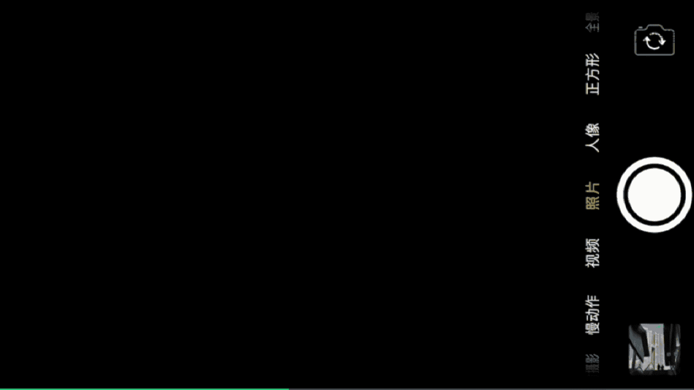
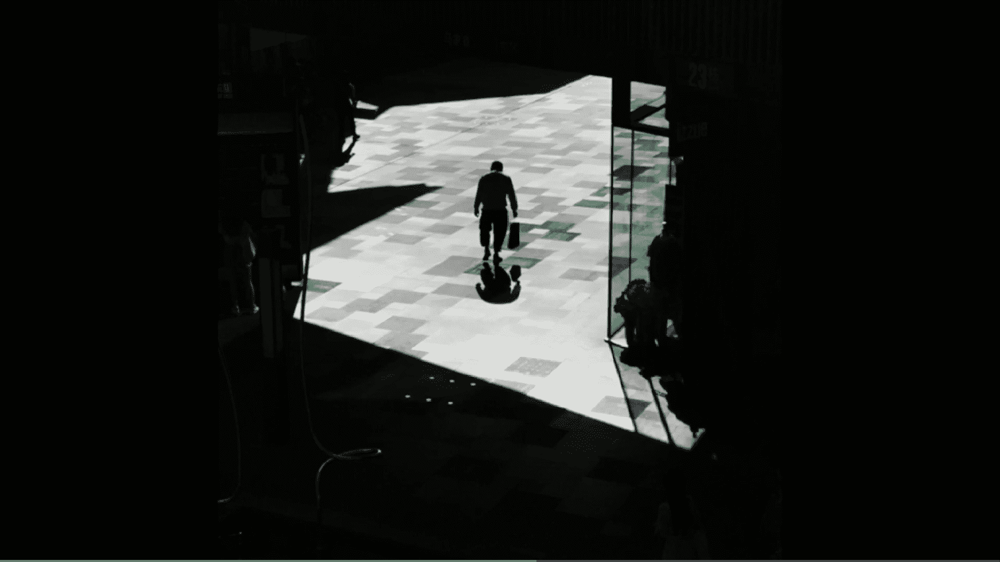
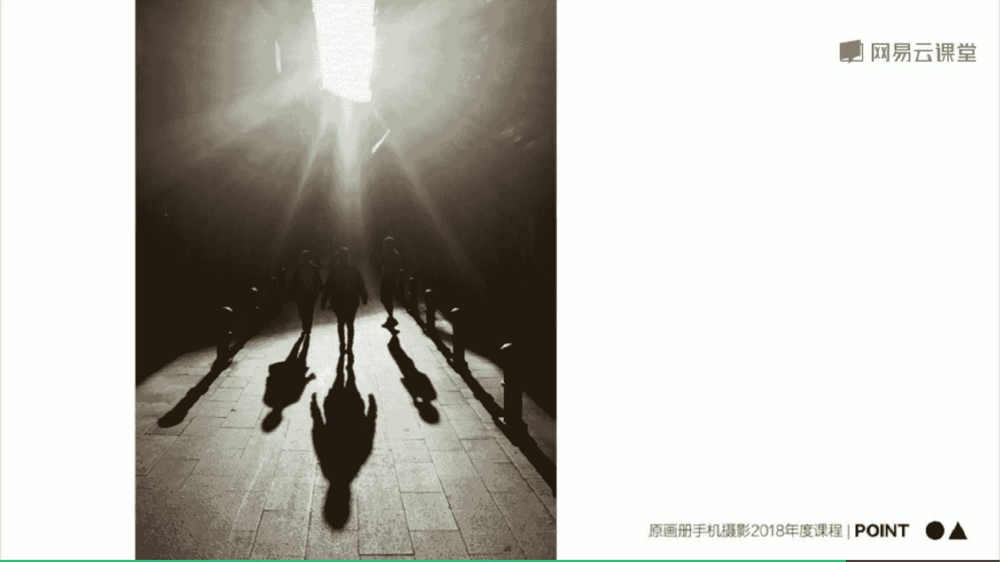
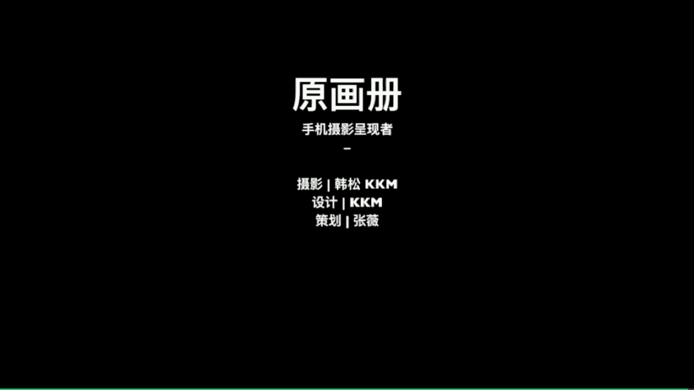

# 韩松-跟全球iPhone摄影大赛冠军学手机摄影，随手惊艳朋友圈（完结）：课时21.倒影、剪影的拍摄

🎼。🎼，今天的第四部分为大家讲到倒影的拍摄。

这个呢也是我一直在收集的一个项目，就是在全球各地拍摄当地的倒影，然后呢它们呈现出来，集合成一组照片。你看一下在纽约的街头，我们可以看到很多高楼，只刚下过雨，然后呢，我们的人行道的边缘呢是有一些积水。

所以说呢这个时候呢我们可以看到可以用这个积水来开出完美的倒影。最重要的一点啊就是一定要将手机镜头紧贴水面。手机镜头呢一定要是倒置的。然后呢，我们将焦点对在远处的建筑上，就能够拍摄到完美的倒影呢。好。

我们来看一下第二个场景，那么也是在纽约的曼哈顿街头，我们可以看到远处的高楼大厦呢，非常的具有几何的节奏感。那么也是这样的一个小小的水洼。我们可以看一下。

那么用手机倒置在这个水洼上面就能够拍摄到一组倒影的照片呢。那么由于这个地方呢是人来人往的，我们可以呢进行一个等待。然后呢注意将手机调整与地面保持垂直。

才能够拍到我们的这样的一个倒影界面是完全垂直这样的一种状态。那么我们等待行人经过。然后呢，在等待的时候呢，我们可以用连拍的方式进行抓捕，抓不到这样的一组照片，后期呢才能够筛选处我们最满意的那一张。

我们来看一下来继续的等待一下，特别是有车经过的时候，这样的动感呢会更强烈一些。好，我们来看一下。那么这个呢就是我最后筛选处的一张照片，一个人骑着自行车经过给画面呢增添了很大的乐趣。

🎼那么接下来呢我们再来看第三个场景，是在纽约的中央公园内的一条小道上面。我们可以看到两边长满了茂密的树木，而且呢这个树木呢它们都是朝中间收拢的。

所以说呢有这样的一种将人强烈的包裹在戏中这样的一种共麻烦的效果非常的有意思啊。所以说呢在这个时候呢，我让我的朋友打着伞，经过这一个画面。然后呢，当他经过画面的时候。

我全程都运用了手机的连拍去抓捕到它的整个过程。那这样呢非常有利于后期筛选出一张最满意的照片。我们来看一下最后拍到了这一张照片，像这样的。

接下来呢再为大家分享几张照片。那么第一张呢在葡萄牙的里斯本街头拍摄到的也是呃一个非常小的水洼，加上等待这样的一种方式去拍摄。来看一下在法国图书馆的前面。

让我的朋友也拍摄到了这样的一张和背景中的线条组合形成的倒影照片。再来看一下这一张纽约的街头，那么同样是使用手机镜头朝下贴景水面，再加上等待拍摄人物的这样的一种方式拍摄到的倒影及剧动感。那么用倒影呢。

我们还可以去拍摄这样的一种夜景的场景。那么和剪影结合起来，让他们这两种方法都达到一个最大的利用。好，那么今天的第四批point分享给大家，实现倒影拍摄的媒介啊，比如说有我们的水面，还有我们街头的玻璃面。

还有我们街头的那一些我们的建筑的那一些玻璃幕墙等等，都是非常好的倒影中介。那么拍摄成功的倒影啊，最重要的，让我们的手机镜头一定要紧贴反射面，很小的积水都可以拍摄到很大的倒影。

只要让我们的镜头紧贴反射面就好了。那么越纯净的水面，倒影呢会越清晰。倒影呢可以有效的整理杂乱的场景，让画面出现这样的一种对称的结构，有更强烈的美感。接下来我们来看一下今天的第五部分剪影的拍摄。

接下来呢这个题材也是运用光线的一个非常棒的拍摄素材拍摄剪影。剪影呢是指画面中的一些小的东西。比如说我们的人物等等，他们是完全没有细节的，只能看到一个黑影，而背景的场景呢往往比较大。

他们出现在画面中和人进行了这样的一个对比，让人物这样的一个小点更加的突出，而且呢会给画面带来这样的一种神秘的叙事之感。我来看一下拍摄剪影的一些秘诀吧。那么首先呢一定要背景亮度大于我们的剪影主体。

比如说人物等等。那么在拍摄的时候呢，要注意适当降低曝光，可以去强化人物的剪影属性。我们可以看到在这里我降低曝光之后，人物呢就黑得更彻底了。

那我们继续来看一下这一个场景，成都的太古里的街头。那么阳光呢照射在地面上形成了中间那一小块光斑，我们可以利用那一小块光斑去抓捕到剪影的效果。我们可以看到走在光斑中的人呢是完全黑暗的。

是非常有利于营造那样的一种剪影的氛围的。所以说呢我们首先调整好我们的手机，将光斑呢放在画面的正中。然后呢注意对焦在光亮处，让周围更加黑暗。对焦之后呢，还必须适当的拉低曝光。

拉低曝光呢可以让周围的光线进一步的变暗，让周围的一些杂乱的场景得到适当的消除，让中间人物的剪影更加突出。那么第三部分呢，我们需要锁定曝光和对焦，因为在拍摄剪影的时候呢，很多时候都需要多次抓捕。

锁定曝光和对焦呢有利于我们的拍摄更加的方便。那么再接下来呢就等待一个适当的人经过画面就OK了。拍摄到的成片就是这样为大家做一个展示。

那么接下来呢再为大家分享几张剪影的照片。这一张照片在北京拍摄到的，我们可以看到呢，远处太阳从背后射过来，近处的数木是处于完全的剪影状态。那这一张照片呢我非常喜欢也是参加任何一个手机比赛都会得奖。

是在笔斯本拍摄到的，那么也是利用了太阳从背后射过来，前面的人物是出现了一个极具动态的剪影。那么再来看一下这一张照片，阳光呢从室外射入室内，我们可以看到在另一个门处可以拍摄到明显的剪影。好。

那么今天的第五组 points分享给大家。拍摄剪影的条件呢，刚才为大家讲到啊，主体的光线要比背景暗很多。拍摄剪影的时候呢，如果对焦在主体上面，画面呢很容易过亮，这个时候呢请拉低一些曝光。

让剪影呢保持一个完美的状态。那么对焦在背景光亮处更容易获得明显的剪影。好，那么今天的第六部分光线参与构图，我们来看一下。🎼那么像这一个场景中，大概下午三四点的样子，阳光斜射穿过建筑。

那么打在地面上形成这样的一种光线是我经常运用到的一种手法。我们来看一下这一个场景中，这一道细长的光线就是一个极具戏剧性的拍摄背景。那么还是对焦在光亮处拉低曝光，锁定曝光和对焦，非常有利于连拍。好。

那么在这个时候呢就耐心的等待车和人走进这一道有戏剧性的光线就OK了。我们可以看到那么拍摄完成的照片呢，就像这样极具动感和戏剧性。🎼再来看一下第二个场景，在葡萄牙里斯本清城的一个街头，我从上往下观察。

可以看到有两个人经过我的画面。那么在这个时候呢，我仍然通过他们和阳光之间的关系去捉捕到了他们这样的一个长长的影子利用影子，在画面中进行一个构图，这样呢也是一种非常有利于让画面更加生动的办法。

那么我们可以看到拍摄完成的照片，就是这样。那么第三个场景呢是在纽约的林肯中心前，那也是夕阳西下，我们可以看到阳光呢从背后射过来，将人物的影子拉的非常的细长。那么实际上呢这也是一个有些类似于剪影的状态。

那么我们首先呢是对焦在人物上面拉低曝光，而人物的影子呢更加的黑。然后呢等待到一个。最当他们出现在画面的正中，他们的影子最尾有戏剧性的时候，按下快门。那么在整整个过程中呢。

我也是使用了锁定焦点这样的一个功能。那么锁定完焦点之后呢，就可以进行一个良好的连拍了。最后呢还是为大家展示一下拍摄完成的照片。🎼接下来呢还是为为大家分享几张有光线参与构图的场景。那么第一张照片呢。

我们可以看到人物的影子，还有他们的这样的一种剪影的状态，出现在画面中，形成了画面的一个强大的亮点。那么再看一看这张照片，下午的4点，人物的影子拉的非常的长。我们看到这一张照片。

人物的影子呢其实几乎填满了画面的下方3分之1的位置。那么这个时候呢，影子是画面中一个非常强大的表现情绪的工具。

🎼好，那么今天的最后一批point分享给大家。第一，光线和影子是软材料容易造成画面的故事感。影子稍长些的时候，更容易开始出这样的一种戏剧性，特别是清晨和傍晚的时候。

利用细长的影子给画面构图是一种非常棒的组织手法。在门窗柱廊接巷等等这样的一些间隙处，利用光线透射，从室外摄入室内，或者呢是在街道中，那么拍摄到这样的一种地面的光线。

我们也可以去把这样的一种光线组合在画面中。呃，不要对焦和测光在阴影处，用在那个时候呢，呃画面呢会变亮，对焦在光亮处效果往往会更好，让画面处于一种黑暗的状态中。🎼那么建筑密集或街道狭窄的城区。

在我看来是利用光影摄影的一个非常棒的地方，大家不妨进行一个尝试。🎼上面呢就是今天这一节课的全部内容。关于光线的内容呢，其实很少有人专门把用一节课来讲。那么这里呢为什么要一节课来讲授这个内容呢？

是因为它确实是会照片增色的一个好利器啊。呃，我们的剪影慢门播重曝光都是非常酷的拍摄玩法。在课程中的教授的方法，也请大家多多的去尝试多多的去练习。那么这堂课的课后呢，还是为大家布置一个小作业啊。

大家找一找身边的河流。用我刚才为大家讲到的slow shut的一个软件，或者呢使用iphone自带的实况拍摄去记录一下身边的一个流水慢门曝光吧。🎼好，我们今天的课程呢就到这里结束，主于画册韩聪。

欢迎大家参加我的课程。

