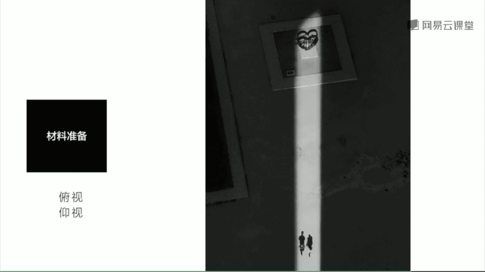
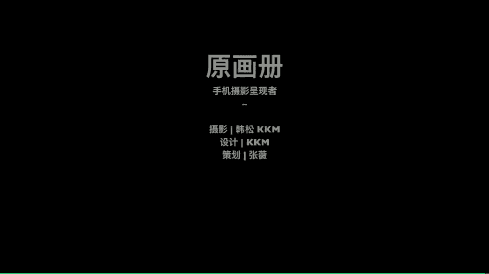

# 韩松-跟全球iPhone摄影大赛冠军学手机摄影，随手惊艳朋友圈（完结）：课时22.街头摄影的技术准备

🎼Yeah。🎼The，🎼街头与人物摄影，实际上呢就是我们日常所说的人文摄影或者是街头摄影，本质上呢都是用我们的强大的观察力去记录下社会的一种真实状态。街头摄影呢有着一种非常明显的不可控性。

那么这个呢也正是街头摄影非常有趣的地方啊？这节课呢我们就围绕着街头摄影的核心抓拍去展开。那么这其中呢包含了非常多的议题。比如说在混乱的场景中如何拍到好看的东西。

哪些东西值得我们去发现和拍摄街头有哪些道具可供我们使用。当我们需要与陌生人拍摄的时候，我们一定要和他们交流呢？街头场景的表现有哪些有意思的方式。那么这一堂课中呢，我会为大家一一解答这些问题。

🎼首先呢为大家解释一下什么是街头摄影。街头摄影呢实际上是一种有关城市公共生活的摄影类型，是摄影师对于特定城市生活观察和个人体验的一种表现。那么刚才呢我也为大家提到了人物摄影这样的一个名词。

它和我之前课程中讲到的人像摄影是截然不同的。人像摄影呢主要表现的是人物本身。而我们的街头人物摄影呢主要是表现的人物的活动与空间的融合与空间的关系。那么它往往呢会带来更强的故事感和叙事性。

那么在街头摄影中，我觉得比较重要的有几下几个点。第一个是形式感，特别呢在传统的街头摄影中有这样的一种审美取向。那么在一个真实杂乱的场景中去提炼出某种有意思的形象。那么这些照片呢往往有一个视觉中心。

或者呢有影像这个视觉中心的力量，往往这些照片呢它的画面比较简洁，有说服力。那么以上呢为大家提到的就是这样的一种形式感，或者呢就可以说成是看上去好看有可读性。当然呢我们现在的当代摄影呢是另当别论的。

关于当代摄影的部分呢，我会在最后一堂课为大家做一个简单的介绍。那么接下来呢就会为大家分享几。张极具形式美感的街头摄影照片。首先呢是这一张在纽约的moma拍摄到的。我们可以看到那一个图书馆里面的看管员呢。

他是穿着黑色的西装与背景的墙壁是形成了这样的一个黑白截然不同的对比。所以说呢制造了画面中唯一的视觉中心。那么这个呢这一点呢有我第二堂课中为大家讲到的那一个单一纯粹的美学规律是一致的。

🎼那么接下来这一张照片，我们可以看到中间的那一盏灯在夜空中是非常的显眼，那么带来了这样的一种幽绿色的色彩。那么我们用色彩去表现我们的街头，很多时候呢可以知道一个极大的亮点。

那么再来看一下这一张照片运用了对比的法则。我们可以看到左边的那一个站岗的士兵，他的严肃和右边的那一个游客之间的放松式形成的这样的一种情绪的对比的。我么再来看一下这一张照片，首先就能够感受到色彩的对比。

左边的红墙和右边的黄色墙壁是一个色彩对比，左边的这一个人呢穿着黑色的衣服和右边的人那个人穿着白色的衣服又是一个黑白的对比。那么我们再来看一下这一张照片呢是非常写实的出现在街头，那么有这样的一种临场感。

我们再来看一下这一张照片，同样也是对比的应用。那么墙内和墙外墙内的人和墙外的车是形成的这样的一种大小不同的对比。那么通过这样的一种对比呢是渲染出了画面的情绪感。好。

我们再来看一下下面的这一个点表现画面的情绪爆点。我觉得在街头摄影中也是一个一大利器吧。那么情绪爆点呢就是在于给画面制造故事。🎼的感觉去抓捕到画面中人物行为不稳定的那一瞬间。

让人感觉到画面是停不下来的往下发展的。来看一下这个场景。在纽约街头啊非常的有意思。抓捕到了一个穿红衣女子，她们她的这个刚好被拍的那一瞬间，我们可以看到她是非常高兴，非常兴奋的，两手是张开的。

那这个两手张开的动作呢和下方鸽子飞舞的动作呢，实际上是哎有某种联系的。而且呢我们可以看到鸽子非常的动感，而且女孩的表情呢也是极具张力。那么她们组合在一起表现出了这样的一种动态之美。

那么再来看一下下一张照片，我在二楼拍摄到的。我们似乎都可以看到那一个女孩的头发在下一秒钟，但是肯定会回到她的肩膀上。但是呢此刻是处于这样的一种呃散开的状态，那是处于这样的一种不稳定的瞬间里面。

那么再来看一下这一张照片，我们可以看到两个人大步流星的向前跑去。那么这也是一个不平衡的瞬间，我们可以看到下一秒钟，他们的姿势就会立刻发生变化。那么这样的一种不平衡的瞬间抓捕下来。

是很容易造成画面的情绪高潮的。🎼好，我们还可以在街头摄影中呢去抓捕到一些有情节的东西。比如说一些冲突，一些巧合一些故事感。来看一下这一张照片，我们可以看到画面中前景中的狗狗欢快的奔过。

那么背景中呢有这样的一排英文上面写着穿着夹子拖鞋，你的生活呢就会更加的美好。我们可以通过这样的一种文字去呃散发开来去表现画面中那样的一种呃俏皮又有一些温馨的感觉，那么是通过文字。

那么去体现出画面这样的一种表意的感觉的。我们再来看一下这一张照片，则为我们讲到了符号的传达，我们可以看到远处的那几个打牌的人和近处那个穿着拖鞋经过的人都产生了一种年代感，这样的一种年代感呢。

很多时候在我们的一些传统老区，或者是呃生活样式保存的比较好的区域，都可以去找到这样的一些场景。我们再来看一下这一张照片则是用冲突来表现的画面。我们可以看到两边的花朵呢是大片大片的出现在画面中。

而中间的那一个玩游戏的小男孩好像是强行插在了中间是形成的这样的一种和花朵之间的冲突之感。那么我们再来看一下这一张照片，则是体现了画面的故事感。我们可以看到那一个倒着的牌子，上面写的轻轨3号线。

但它指向的那一个方向呢，却是一个小广告。那么这样的一种文字表现出来的故事性呢，也传达在整个画面中形成了一种趣味的街头拍摄。🎼好，那么为大家总结一下今天的第一批point。

那么手机呢是十分符合街头摄影的一种拍摄方式，它非常轻便焦距适中实际上呢实际上呢有很多街头摄影大师都在用手机相似的焦段进行拍摄，也就是那一个30毫米左右的焦段。

那么接下来呢是形式感情绪化和情节感都是拍好街头摄影的关键，只要我们去把这样的一些东西抓捕起来。我们的街头摄影呢往往都会有比较好的效果。那么第三呢街头摄影呢不一定要在街头拍摄。

那呢都是用独到的眼光观察和记录人与人之间的关系，人与环境之间互动的关系。这个呢是街头摄影一个非常重要的表现议题。好，那接下来呢我们来看一下今天的第二部分，要拍好一张街头照片，我们需要进行怎样的技术准备。

那么首先非常重要的是器材的准备，手机呢是当然必要的。耳机线呢也非常重要，在闲时可以听音乐。那么之前也为大家讲到了，在街头拍摄的时候呢，我有时候也用耳机线呢当快门可以更加隐蔽。那么用硅胶套呢，很多时候呢。

呃，可以保护我们的手机，不要滑落充电宝。因为手机拍摄呢是非常费电的，准备1块1万毫安以上的充电宝呢是非常有必要的，这样可以保证一天的拍摄。那么充电宝的线也非常重要啊，除了充电呢。

它还可以充当稳定手机的作用。啊，那么还有背包和水，这些呢也是非常重要的一些装备。好，那么说完了器材准备呢，我们再来说一下街头拍摄的操作准备，那么最重要的一个呢就是快速进入我们的拍摄。

那么这个呢之前也为大家讲到的，在这里呢再为大家简单的提一下，因为呢在街头摄影中出现的元素呢都是突然出现的，大家都可能是突然出现的，所以说呢我们在最短时间内进入拍照这样的一个操作呢非常的重要。

那么我在这里呢以苹果手机为例。国产手机呢也大多类似。那么首先呢是在锁屏界面下，从屏幕呢先点亮我们的屏点亮我们的屏幕，然后呢拇指从屏幕边缘迅速向左滑动，这个时候呢就可以直接进入我们的操作界面。

无需按密码是最快的一种方法。好，那么在街头摄影中呢，我们很多时候呢还会单手操作。因为我们的双手呢可能来不。及那么单手操作的时候呢，首先还是根据刚才那样的一种操作，快速进入我们的拍摄界面。

然后呢用食指按下音量键。哎，如果时间允许的话，我们拇指呢可以去对一下胶，这样呢可以呃更嗯高效率的去完成我们的一张拍摄。好，那么接下来呢会为大家分享几个街头摄影中非常棒的呃抓捕材料。那第一个呢是抓捕光线。

嗯，比如说右边的这一张照片是用了一个逆光的拍摄。事实上呢顺光逆光测光，我们都可以把它运用起来。那么除了光线呢就有影子，比如说在右边的这张照片中，夕阳西下人物的影子被拉的非常的细长。

用影子去参与我们的构图，那么再比如说这一张照片啊也是影子，这张照片呢是人物的剪影。由于由于背景中的光线是比较亮的。所以说呢人物是出现的这样的一种剪影的状态。而且我们可以看到这一张照片，由于是室内。

所以说呢曝光时间是相对比较长的。所以说呢人物是有了这样的一些脱影这样的一种脱影的去表现动感，也是一个非常棒的方法。那我们还在街头呢可以看到很多反射的题材，例如这张照片拍摄到一个路人。

他的眼睛里面眼镜里面反射出的美国国旗，那么还有这样的一些仰视俯视各种视角，我们也可以去把它利用起来。因为我们平时成年人最常见的一个视角呢，就是大概1米5到3米范围内这样的一个平视拍摄。那么如果我们。

突然把这样的一种视角改成了仰视，或者俯视呢，就会给我们带来更加新鲜，更加新颖的拍摄效果了。因为这一张照片从上往下拍摄的我的一对情侣朋友牵手的这样的一种剪影的效果就非常有意思。那我们街头呢还有很多材料。

可能跟我们去拍摄。比如说像这样的一种窥视视角，大家可以看到右边的这一张照片，其中的圆圈呢实际上是卷帘门上面的圆孔。如果我离那个圆孔很近的话，圆孔呢就放的很大。通过圆孔呢去观察对面的视界。

对面的街道形成的这样的一种窥视视角，这样的一种方式呢，在电影中也经常会运用到。

那么还有这样的一种将我们的被摄提拉的极近去拍摄，往往呢会造成比较夸张的效果。比如说上面的这一个人，我们近得都可以看到他的衣服的材质，还有他的包上面的花纹呢，那么通过这样的一些细节的观察。

去抓不到更有意思的材料。那么除了更近之外呢，那么还有更远的拍摄去抓不到人物在整个城市中这样的一种与成挚完全融合的感觉。好，那么接下来的第二批points分享给大家。街头摄影的身心准备。

让尽量保证自己用最习惯的方式拍照，这一点非常重要，只有用自己最习惯的方式拍照，才会提升我们的拍摄效率，最大可能性的抓不到满意的街头照片。那么用光影反射，这些呢都是渲染照片情绪的绝佳材料。

大家可以去多多观察，多多使用。那么要获得独特的照片形式感以极高极低的视角极远极近的拍摄距离，我自己觉得呢都是不错的拍摄手法，可以给我们的画面呢造成这样的一种呃独特的陌生感。

那么还有有独到的眼光快速的反应和拍摄速度是提高成品率的保障。这几点呢请大家注意。🎼好的，今天的课程呢就到这里结束，我是韩松，欢迎大家参加我们的这一套points课程，谢谢。😊。

