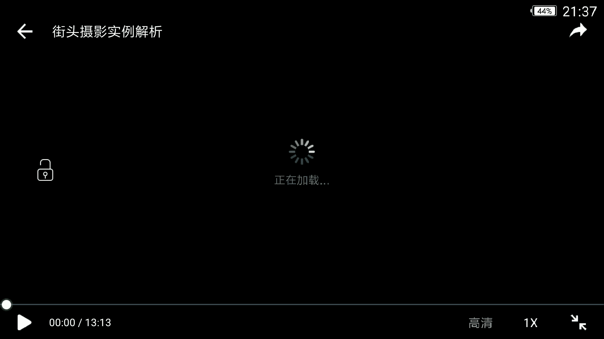
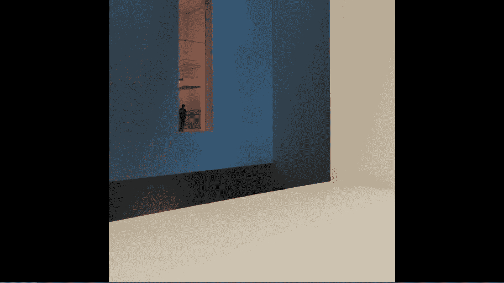
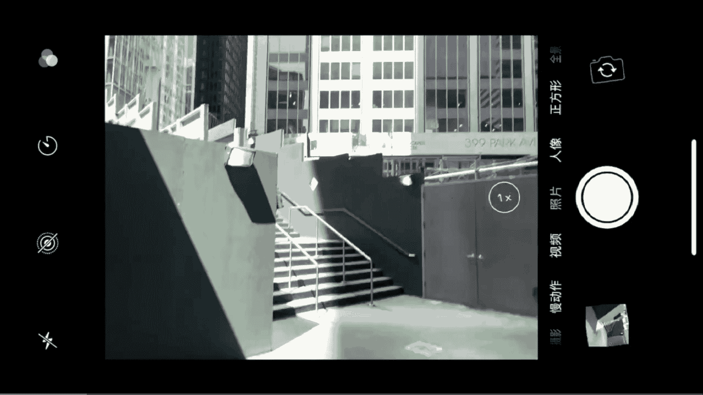
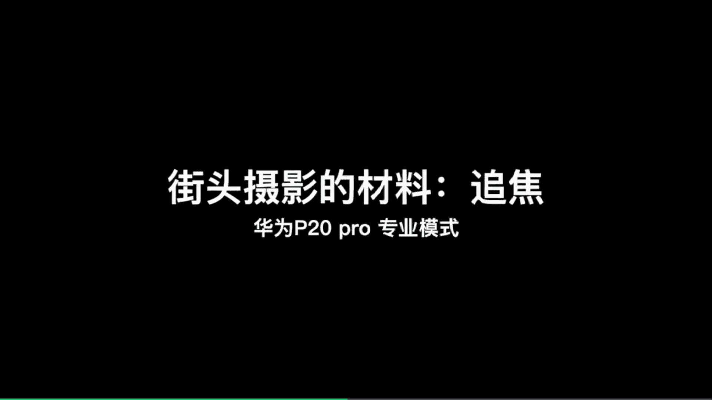
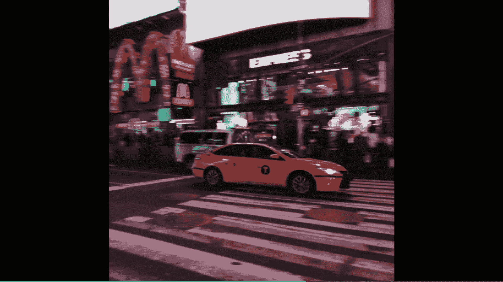

# 韩松-跟全球iPhone摄影大赛冠军学手机摄影，随手惊艳朋友圈（完结）：课时23.街头摄影实例解析

。🎼。好，那么今天的第三点呢是我们的实拍这样的一种案例。我会为大家分享几个实拍案例。大家可以看到这些案例呢就就会想到我们在遇到这样的类似的场景中要如何拍摄。来看一下在真实杂乱的场景中。

如何提炼出画面的形式之感。

🎼我们来看一下moma美术馆的免费开放日，室内人非常的多，无论朝哪个方向拍，都能拍到很多杂乱的元素，显得毫无章法。那么这个时候呢，我就将手机对准室外的窗户。

来观察一下近处窗户的黄色和远处的蓝色是形成了这样的一种颜色的对比。而且呢他们也有一种几何的结构关系在其中。那么等待其中有一个人经过就能够拍到一张很美的照片呢。

拍摄成片呢为大家做一个分享。

那么下面这一个场景呢，我们来看一下街头摄影的材料，运动的场景要如何去抓捕。

🎼这是在纽约的地铁站，我们可以看到远处呢即将有列车驶入站台，近处有一个站着的人，我想要去抓捕人的静止和车的运动之间一种动静结合的关系。那么当车速度还没完全减下来之前，我就一直对准人对焦。

然后呢用连拍的方式去抓捕到人物的静止和车运动这样的一种结合的关系。🎼接下来我们来看一下关于街头摄影的光线抓捕。🎼我来看一下这一个场景是在纽约的一个地铁站的出口。

阳光呢是透过建筑的缝隙撒在地面上形成了这样的一种光影分解清楚的界面。这样的一个场景呢，极具临场感和氛围感，非常适合用来构建这样的一个空场景。那么在构建的时候呢，我用了二倍焦距。对焦在亮处。

然后将曝光拉低，增强画面的轮廓感，锁定曝光和对焦，在后期连拍的时候呢，非常方便。那么这个时候呢，搭建好模型之后呢，等待人物出现就行了。那么实际上呢这样的一种前期搭建好我们拍摄的这样的一个光线的场景。

然后等待人物走进我们的舞台这样的一种方法。在街头摄影中呢是一种最常见最简单非常易操作的公式。我们可以用它去抓不到很多这样的一种光影。

🎼呃，这样的一种交织的场景，然后呢把它表现出来。那么在这个时候呢，我们只需要等待有人经过我们的场景就可以了。哎，我们来看一下，在耐心的等待一两分钟。🎼我们可以看到，那么有人经过场景的时候呢。

最重要的就是需要用连拍的方式去抓捕到他运动的整个瞬间。🎼好，我们来看一下。🎼那么稍微的移动一下我们的画面啊，那么有人经过了，一旦有人物出现呢，那么就立刻用连拍去抓捕到整个瞬间。

那么这个时候呢才有利于我们后期筛选出我们满意的那一张照片。我们可以将人物和他们的影子，也同时纳入到画面中，形成这样的一种生机活勃活勃勃勃的感觉。🎼接下来呢我们来看第三个材料，烟雾表现场景感。

我的我觉得烟雾是街头拍摄的一个非常棒的道具，它可以给我们的画面带来这样的一种模糊柔软、飘忽不定的意象。如果用的好的话是非常加分的，就在纽约街头呢我是发现井盖冒出了烟雾。

那么首先呢我们将烟雾作为画面的主体，用大焦距去抓不到烟雾的一些细节和背景之间的关系。🎼我呢还可以怎么拍呢？我可以先过街，然后呢靠近烟雾，利用烟雾作为画面的前景。那么这个时候呢。

我们注意一下背景呢是一个夜晚的街头。那这个时候呢所有的车都会打出这样的一种暖色的灯光。来看一下，那么灯光在烟雾中是发现了一个折射效果给了画面这样的一种强烈的电影之感呢。🎼好。

那么这个时候呢我们来再来看一下，那么调整一下构图，我将角度呢调低。那么这个时候呢，车的灯光在画面中就会更加的明显。好。我们再来看一下还可以怎么拍。我将我的手机呢是放在画面的。🎼人行道上面我们来看一下。

可以说是离烟雾非常近了。那么通过车灯直射过来的光线去表现出画面那样的一种电影般的质感和电影般的场景。🎼那么我们再等待多一些车经过。那么在这一个等待的过程中呢，我们可以。

🎼开的方式去抓捕到车灯和烟雾之间那样的一种距离感。🎼も不质感。🎼好，我们再来看一下。🎼么对一面的行人是不是也可以纳入我们的拍摄界面呢？们来看一下，将我们的拍摄的镜头稍微的转一下，我就可以看到。

那么在烟雾中光和人物，那么形成了这样的一种剪影的关系，那么表现人物的剪影也是在。🎼么前景加上烟雾，我觉得也是一种非常棒的街头表现方法。🎼那么这一个场景的拍摄成现呢还是分享给大家。

🎼我们来看一下倒影的拍摄，它的拍摄本质呢实际上还是场景加等待，将手机倒置在水洼的表面，等待有人经过按下快门就能够拍到满意的照片了。接下来呢我们来看一下另一种有趣的街头拍摄材料啊追焦。

那么这里呢我使用了华为的专业模式，让我们的拍摄快门速度是定在比较低的30分之1秒，这样呢容易提高我们的成功率。

🎼我们来看一下在纽约的曼哈顿街头夜晚灯光璀璨，这一个场景呢非常适合拍摄我们的追焦啊。在这里呢我想要追焦的元素是那一个黄色的出租车。我们来看一下，在出租车经过的时候呢，我在按快门的同时。

手呢要随着车的运动方向移动。就是拍摄追焦的一个非常重要的前提啊，我们来看一下，在这里呢我将我们的快门设为30分之1秒，这是一个非常棒的追焦成功的拍摄时间。为什么呢？是因为在这一个时间下。

我们在拍摄的那一瞬间呢，我们的背景会产生一个移动。那么这个时候呢我们的前景元素就可以凸现在画面中呢。好我们来看一下，那么再试几张照片，说实话呢用手机拍摄追焦的成功率呢不是很高。

初拍呢大概成功率只有10%左右。所以说呢在拍摄的时候呢，一定要耐心。呃，不要着急，那么多试几次。那么保证。🎼我们的拍摄方向和车辆的运行方向是同样，而且速度是一样，这样呢就有可能拍摄到一张成功的照片呢。

那么在这里呢我还是会哎多试几次照片。因为当时呢我们那个黄色的出租车也非常的多，所以说呢有非常多的拍摄机会，我们来看一下，那么在多试几次之后呢，我们就拍到了一张满意的照片。

那么在这里呢我还是将拍摄完的照片呢为大家做一个展示，我们可以看到的背景是模糊的前景类似的场景，还有这一张照片在东京的新宿街头。那我们再来看一下这一个材料，用长曝光来表现我们的街头来看一下这个场景。

在纽约的中央车站人非常的多，非常的密集，非常的杂乱，来来往往的。如果直接拍摄呢效果不会很好。所以说呢在这里呢我是架好了三脚架，然后用iphone加slow shuttter这一款长曝光软件来来为大家。

🎼拍摄这样的一张照片。我们来看到好，首先呢我是打开slow shutter这一款软件。然后呢还是先选择一下调整的模式。在这里呢是选择了低光模式我们可以看到加上曝光时间嗯为B门这样的一种组合。

之前也为大家讲到了这一个组合啊，低光模式加上B门曝光。那么去拍摄这样的一个场景。我们可以看到，那么在我拍始拍摄之后呢，我们可以看到人物就开始变模糊了。哎，整个画面中呢就有充满了这样的一种模糊的动感。

那么还有一些人呢他是站在那静止的，美有了这样的一种对比的感觉在其中，那么通过这样的一种方式呢去抓捕到街头呃，这样的混乱的街头这样的一种秩序感。觉得是很棒的一种拍摄方法。哎。

大家以后呢在接拍的时候也不妨带上八爪鱼三脚架和这样的slow shutter这样的一款软件。那么通过这样的一种方法呢，就很容易拍摄到一张满意的照片呢。🎼记得拍后一定要选择保存。

这样呢才能够拍摄下一张照片。好了，那么接下来呢我们就来看一下拍摄过后的成品。🎼首先是这一张。🎼然后呢，我们再来看一下第二张照片，我们可以看到整个画面中既有模糊的人物，又有清晰的人物。

那么出现的这样的两种对比效果呢就非常的棒。我们再来看一下下一个拍摄材料，人物和环境。那么在这里呢，我是首先设定了一个场景，然后等待人物的经过。哎，我们来看一下这一个场景啊，它是极具光影感的。

那么在这个时候呢，我们可以看到有一个人，他牵着狗经过，我们可以看到在他牵着狗经过的那一整个瞬间呢，我都是用连拍的方式去抓捕到整个画面的。那么在拍摄完成之后呢，我们就很容易能够筛选出一张照片。

当他出现在画面比较合适的瞬间那一个照片来为大家做这一个展示。就如图所示。

🎼接下来这一张呢同样是设定一个场景等待人物。那么等待的呢是那么在窗户前面探出头的一个老太太整理衣服这样的一个场景也非常的有意思啊。那最后呢同样也是凝聚成了一张照片，为大家做一个展示。

🎼那么我们再来看第三个场景啊，是在成都的街头，夕阳西下，我们可以看到呢阳光是透过建筑洒在地面上有这样的一小撮的光影。我们可以看到呢有往来来往往的路人去经过那个光影，去走到那个光影中，拖上了长长的影子。

哎，这一个。🎼场景呢非常的有意思啊，因为我们可以看到，那么走到中间的人物呢，就好像走到镁光灯下面有这样的一种聚焦的效果啊，它的影子很明显的出现在画面中，形成了一种强烈的剪影。

我们可以看到当人经过的时候呢，我是用连拍的方式去抓捕到了这一个人经过的全部瞬间，那么最后呢是筛选出了一张照片，我们可以看到由于这一张照片呢，拍摄的背景呢是比较复杂的人来人往比较杂乱的。

所以说呢我后期呢是把它导入到vissco这一款软件中，然后呢用的黑白的调色方法，在这里呢选择了B系列的滤镜。我们可以看到，那么选择了这一款滤镜。那么人物呢出现在画面中就更加的明显更加的突出。

然后呢稍微的运用了一些剪裁的效果，那么将后面的人物呢去除掉一些把前景中这一个人呢突出出来，然后呢在稍微的旋转了一下我们的画面让人物的影子处于正。正对我们的这样的一种场景里面。🎼好，大家看过视频之后呢。

再为大家总结一下今天的第三批points。第一个呢是在街头摄影中做减法这一个操作呢非常的重要。在我们的真实杂乱的场景中大胆截取，截取我们想要表现照片中需要的部分，这是一个非常重要的拍摄手法。好。

那么第二个呢是烟雾动态光影，这些呢都是造成街头情绪的良好材料。我们去可以我们可以去把他们良好的组合起来。那么培养对空间色彩事件的敏感。我觉得非常的重要。这一部分呢我们可以通过阅读达人和大师的作品达到。

🎼好的，今天的课程呢就到这里结束，我是韩松，欢迎大家参加我们的这一套points课程，谢谢。

