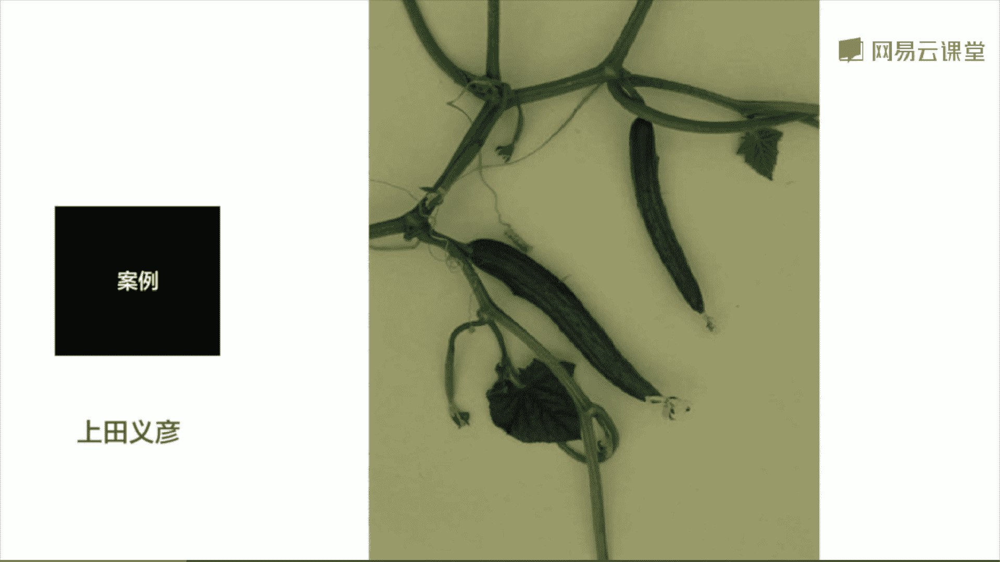
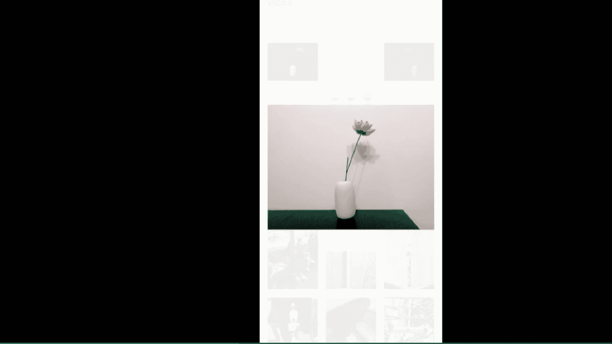
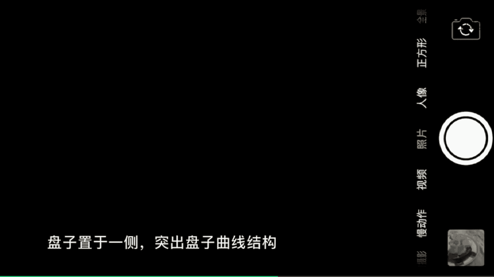
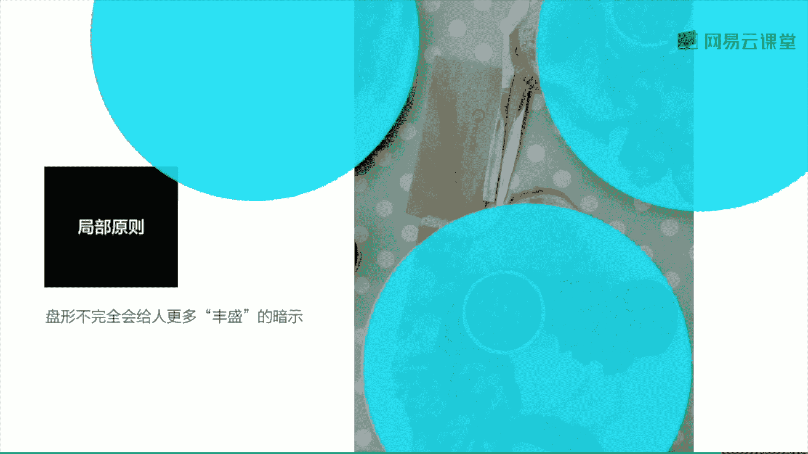

# 韩松-跟全球iPhone摄影大赛冠军学手机摄影，随手惊艳朋友圈（完结）：课时26.静物摄影及拍摄美食

🎼，🎼Yeah。好，今天的第二部分呢是为大家讲到静物的拍摄。首先呢我们来看一下如何拍出具有高级的静物摄影。在这里呢为大家举到两个例子。第一个例子呢是我们平时都很常见的无印良品的广告摄影。

为什么我们来看它的静物拍摄非常的专业，非常的高级呢？首先来看这一张照片。那么背景是一个简单的白墙，那么前景中的水壶极具流线感也是白色的。那么它们的色调呢是非常明亮，非常简单的。我们来再看一下这一张照片。

背景中的那一个地板是浅米色的，而且非常的有质感。那么浅景中的那一个晾衣框，重亮的衣服也是这样的一个浅色的色调，那么整体效果也是比较明亮的。我们再来看一下第三张照片，那么前景中的电饭煲非常的简洁。

也是一个白色的。那么背景呢是一个生活场景，我们可以看到整体的色调也是浅色的温暖的点这样的一种感觉。那么看到这三张照片就可以把握住一个明显的要点呢？整体效果是比较明亮。的整体线条是比较简洁的。好。

那么接下接下来呢我们再来看第二个案例是日本的著名广告摄影大师上田意宴拍摄的一组静物。那第一张拍摄的是荷叶，我们可以看到整体是比较暗调的绿色呢是比较深沉的。那么再来看一下这一张照片是拍摄的一些植物。

我们可以看到画面的右下角有非常多的黑暗处，我们可以看到植物在这样的一个黑暗的背景下，显示出一种奇特的微光效果，给人感觉极具质感。那么再来看一下第三张照片。那么丝瓜，我们可以看到整体的绿色。

也是用的比较暗比较深沉的绿色。那么来看一下上田意宴的这三张照片呢，我们就可以总结出来。那么它们是比较暗调的，是比较灰暗的。那么营造出一种另外的效果。我们可以看到无印良品那三张照片。

如果是一个亮的极致的话，那么上田意宴这三张照片，那么就是一个光线的暗的极致。

好，我们下面呢就来拍一下家里面都很常见的这样的一种白色的花瓶和上面的一朵钢花。呃，我们来看一下。第一呢我是将它摆在我的钢琴上面。因为背景呢是一堵比较深色的墙。我们来看一下。

我首先呢将焦点对在白色的花瓶上面，然后锁定好曝光和对焦，然后呢往下拉，制造出这样的一种暗调背景的感觉。我们来看一下，那么首先这样拍一张。好，那么接下来呢我们再来换一个背景啊，我们来看一下。

将这个花瓶呢放到了我客厅的饭桌上面我们来看一下，那么这个时候的背景的色调就变了，变成了这样的一种白色的墙壁，那么是浅色的色调。好，那么我们再来拍一张，我么还是对准花瓶，然后呢往上稍微的拉一下曝光。

让背景的白色的墙壁的白更加的凸显出来。好，那么再按快门。好，我们来看一下两张照片，那么那们拍出来的效果呢就是截然不同的。那么第一张照片呢有这样的一种暗调，欧美暗调的感觉。

第二张照片呢是呈现出这样的一种呃日本色调的明亮的感觉。好，那么我们再分别对这两张照片进行一个简单的后期。我们来看一下将这两张照片分别导入vissco这一个软件中。我们来看一下首先第一张照片。

欧美暗调的照片。那么我将这一张照片呢，首先是调整一下。它的那一个滤镜，我在这里呢使用了A6号滤镜啊，然后呢稍微的增加一点曝光。然后将饱和度稍微的减少一些。那么这一张照片呢就呈现出这样的一种简单的风格了。

好，那我们再来看一下那一张。比较明亮的照片。那么我们首先呢调节一下那一个桌面，让它保持保持这样的一种保持这样的一种垂直的感觉。好，然后呢我们再来调整一下滤镜。那么在这里呢我使用一款比较偏蓝色调的滤镜。

那么是AL1号滤镜，我们可以看一下，它可以让背景的墙壁变得更加的白。然后呢，我增加一些曝光，让整体的效果呢更加的通透。好，然后再稍微的增加一点对比度，那么最后呢减少一些饱和度。好。

那么这张照片呢就调整完毕了。我们来对比一下这两张照片的区别，可以看到它们易黑一白表现出来的整体情绪也是完全不一样的。

我们来看一下后期玩的两张照片。那么第一张呢非常的暗调，第二张呢非常的明亮，是两种不同的效果。这样的练习呢，我们大家平时在家里也可以非常简单的运用起来。

好，那么在拍摄静物中呢，我也为大家总结出三条points，大家看一下。🎼那么第一个呢拍摄好静物，我觉得最重要的是把握好土地关系，去研究好我们拍摄的静物本身与背景之间这样的一个关系。那么第二呢。

拍摄静物的时候，除了背景虚化，我们还要多多考虑色彩和光线的摄影语言。那么第三呢拍出具有高级的进高级感的静物摄影呢，我们应该多考虑明暗两个极端的光线。那么这一点呢，在刚才的视频中也体现的非常的明显。好。

那我们接下来呢看今天的第三部分拍摄美食。🎼那么首先呢还是为大家展示一个美食拍摄的视频。这是在曼谷的一个咖啡厅，我们来观察一下光线。我们可以看到上方呢是有一个天窗。

太阳光呢通过天窗柔和的摄入室内是用这样的一种柔和的慢反射光线，这样的一种光线呢不会给我们的实物带上非常生硬的光影，所以说呢很容易拍到一张满意的照片。我们来看一下有哪些拍摄角度呢。

第一个拍摄角度就是从上往下俯拍。这样的一种拍摄角度呢能让我们的实物更加的突出。那么特别是摆在正中的时候，它就是画面中最为突出的那一个主体了。那么在拍摄的时候呢，要注意调整好曝光。

一般呢都是在自动曝光对焦锁定之后，再手动的调整我们的曝光，拿到我们满意的美一瞬间样的。

🎼看一下这个呢就是一个拍摄完成的照片，给大家展示一下。好，那么像这样的一个甜品呢，我们可以看到它是极具立体感的。所以说呢这样的一种食物我们可以进行一个侧排，那么将盘子呢放于一侧。

突出盘子这样的一个曲线结构和食物之间的关系。很多时候呢也能够抓捕到一张满意的照片。

🎼就像这一张照片那样。🎼接下来呢我将我的手机继续靠近眼前的这一盘甜品，进到只能看到它的细节了。那么这个时候呢，实物是充斥满了整个画面。那么我们可以清晰的看到实物表面的那些白色的粉末、糖霜，哎。

以及它表面的光泽。那么通过这样的一些细节，能够充分的反映出食物的那样的一种可口的程度，以及这样的一种结构的美感。🎼接下来啊我们看一下，将刚才喝过的水这样的一些杯子都放在了甜品的周围。那么在这里呢。

我考虑到了之前为大家讲到的那么一个左右平衡的视觉原则。那么所以说呢我将一些杯子放在了画面的左下方，哎，这那一个咖啡的瓶子放在了画面的右上方，这样一左一右才能够更好的平衡起来。

🎼接下来呢我们还可以利用这样的一种对角线的原则，将食物呢放在画面的左下方，将咖杯呢放在右上方，形成这样的一种对峙的感觉。那么我们来再来观察一下这一个甜品呢，我们可以看到它的侧面非常的漂亮。于是呢我靠近。

让它重斥满整个画面形成这样的一种抽象和质感的美感。我们来看一下是不是本像一座山非常的有意思啊。好，我们再来看一下那么这一个实物，我们还可以用这样的一种。🎼距离的拍摄去表现出那样的一种层层叠叠的感觉。

那么我们的人像模式呢不只可以用来拍人，我们也可以用来拍实物。特别是背景比较复杂的时候。那么比如说这个场景背景的枕头非常的复杂。如果直接用普通拍摄的话，我们就可以看到背景没有进行一个很好的虚化。

所以说呢在这里呢我使用人像模式进行拍摄。那么如果用自然光模式的话，就会显得比较昏暗。那么在这里呢我使用了摄影室灯光模式就会自动的提亮我们的画面，那么注意拍摄人像模式的时候呢，要稍微移远一点。

才能够激活我们的人像模式，那么最后呢为大家展示一下这一张后期果的照片。再为大家展示两张照片。第一个呢是一个咖啡瓶子的重叠，第二张照片呢是几个玻璃杯的重叠，都是非常棒的景物拍摄。那在看完那个视频之后呢。

接下来我为大家总结一下拍摄美食有哪些值得拍摄的角度。那第一个呢也是刚才为大家一再强调的俯视拍摄，它非常强调摆盘与桌布之间的关系。那么比较适合呢拼盘讲究的食物。那么第二呢是45度角的拍摄。

这一个角度的拍摄呢更加的强调实物和环境之间的关系。因为一旦我们的手机往斜处移之后呢，我们的实物背景的环境就被展示出来了。那么第三个呢是平视拍摄，这样的一种拍摄呢更加的能够凸显出实物的质感。

那么所以说呢这一个拍摄呢，我们比较讲究实物的侧面它的质感来。往往呢是实物堆的比较高，层次比较丰富的时候，用这样的一种拍摄会更加的显眼，更加的出彩。好，那么第四个呢是自然光的原则，大多数情况下呢。

在自然光下面拍摄食物都是最漂亮的。那么第五个呢是10分钟原则，也就是上菜之后，10分钟之内，我们要把这个食物拍摄下来。那么之后呢，食物的光泽度，还有美味可口的程度呢都会极度的下降，大大为打折啊。好。

那么接下来一个呢是局部原则，这样的一种盘形的不完全，会给人更多的丰盛的暗示。比如说我们来看一下，那么这一张照片，我们来看一下我的那几盘菜都没有表现完整。

那么正是由于这样的一种不完整才给这样的一种哎更为可口的感觉。

好，嗯，拍选实物呢我也为大家总结了几个points。でがなし。拍摄。后我们再去把这个食物享用掉，我觉得这是非常重要的。所以说呢饭钱是一个在朋友圈的一个最佳的时机。这个呢也是刚才为大家讲到的1分钟原则。

第二个呢嗯我们的手机拍摄食物，往往是非专业的不光非精致的摆盘。在这样的一种情况下去拍摄食物的局部，往往呢会给人一种比较丰盛的意象传达。第三个呢，自然的散射光是手机拍摄美食，最容易掌握的光线。

来避免在实物上生硬的阴影，我觉得非常的重要。很多时候呢，我们可能可能会发现我们从上往下拍摄食物的时候，我们的手机或者是手的影子就印在实物上了。那个时候呢，我们用稍微大一点的焦距。

或者稍微的往斜处调整一下我们的拍摄，就能够避免这样的一种生硬的阴影呢。🎼好，那么今天的课程呢就到这里，是韩松。🎼加下新课程，谢谢。

