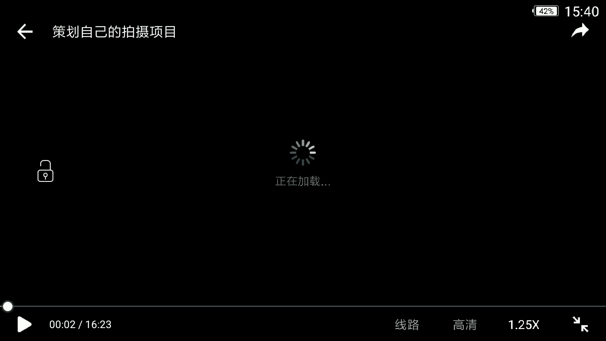
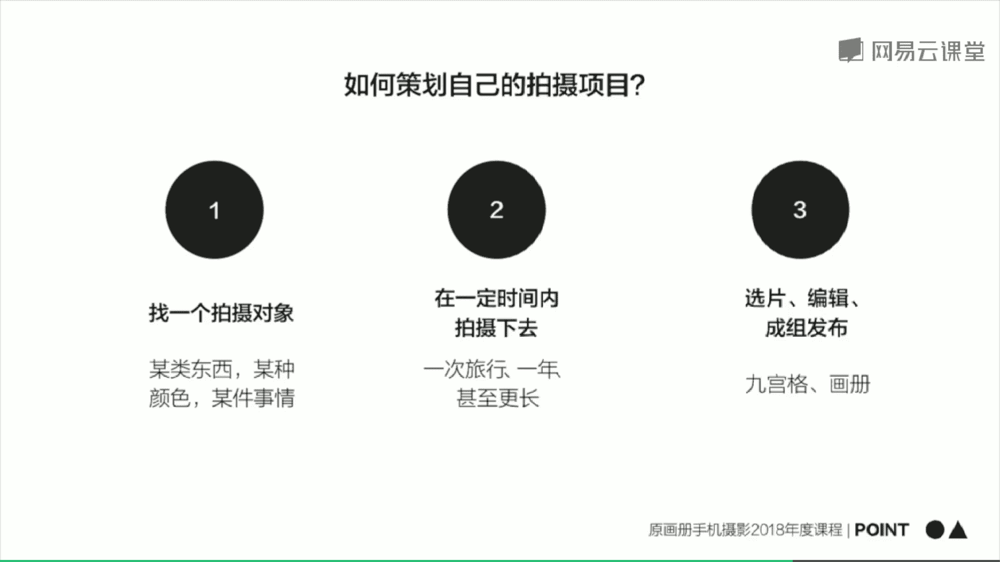
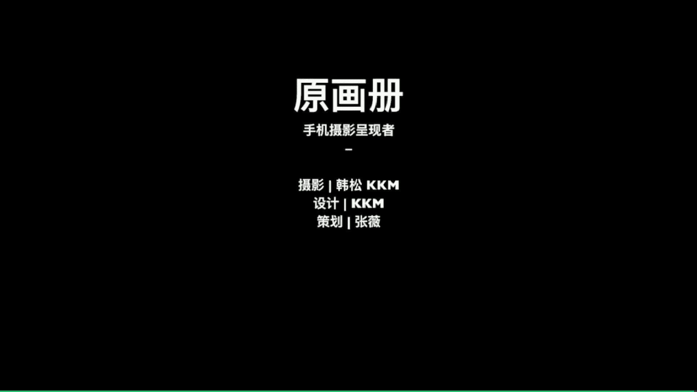

# 韩松-跟全球iPhone摄影大赛冠军学手机摄影，随手惊艳朋友圈（完结）：课时28.策划自己的拍摄项目

🎼Oh。🎼今天是我们的本套课程的最后一课，很多朋友呢学习手机摄影，其实呢都源于自己想在朋友圈或者是微博上多获得一些赞。其实手机摄影的魅力呢就在于随时随地收集生活的素材，生活呢从来不缺少美。

而是缺少发现美的眼睛。我们越学习手机摄影啊，就会越发现拍照这件事呢其实本身只是一个展示生活的媒介。那么在本次课中呢会展示自己用手机记录生活的其他的方式。比如说拍摄延时摄影，拍摄剪辑一些小视频等等。

同时呢会教大家如何设计一个手机拍摄项目，以及如何参加国际手机摄影比赛。最后呢会针对大家平时经常问到的一些问题做出解答。🎼首先我们来看一下第一部分手机摄影常见的疑难杂症。

我会把很多朋友提给我的最常见的问题总结起来，为大家进行一个分享。那么首先第一个问题是关于我们的明星滤镜软件vissco的vissco呢特别是加入那个X会员之后呢，有大概100多个滤镜。

很多朋友呢面对这么庞大的一个滤镜群都会产生疑惑，我要怎么样去选择这些滤镜分类这些滤镜呢？啊，这实际上是一个非常庞大复杂的问题啊。单就这一个问题呢，就可以开好几堂课了，我会在后面呢开设一整套课程。

为大家专门分享我们图片的后期调色问题。那么在这里呢就为大家做一个简单的回答。呃，在我看来呢，在vissco里面啊，对图像的敏锐眼光非常的重要啊。我们看到一张好照片。

有很多朋友呢呃看到一张好照片就会去猜哎，老师这一张照片用的怎么样的滤镜呢，我会告诉他哎，那么直接去猜是没有什么意义的。因为你拍摄的那一张照片，可能和我调整的这一张照片拍摄的时候的光线啊，色彩啊。

以及画面中的元素是并不相同的。所以说呢不能升斑的硬套啊，我自己觉得呢在理解某款滤镜所带来的影调这样的基础上去尝试究竟使用哪一款滤镜是一个比较好的做法。那么滤镜呢和拍摄的类型，它并不是一一对应的关系。

所以说去声斑印套并并没有什么作用。而呢我们要与具体的氛围哈，具体的场景。那么在这样的一个场景中，我们要去实际的应用，这样呢才会呃更好的使用我们这一款软件里面的滤镜。

那么在这里呢为大家简单的推荐几款我最常使用的滤镜啊。那么第一个呢是A系列的滤镜是模拟胶片的滤镜，其中的A4号和A6号是我使用的最多的。第二个呢是vissco非常出名的B系列。

B呢是black的缩写是黑白系列的滤镜。这一个系列中呢B3和B4是我使用的非常多的那么第三个呢是C系列的滤镜。C系列的滤镜呢是整个C1到C9是整个的一个活泼鲜艳的彩色滤镜。那么其中C1到C3。

那么还有C6到C8是我使用的最常见的。那么第四个呢是sco最经典的01到010号的滤镜。那它其中包括了黑白到彩色呃，一共10款这10款滤镜呢都还蛮好用的。大家可以去试一下。

第四个为大家推荐的是H系列的呃，H系列呢是一个多彩系列的滤镜。那调整一些比较简单的场景比较呃有很有比较丰富的色块的场景的时候，我经常会使用到那么第五个呢是HB系列的滤镜。

这个滤镜呢是visco和海比斯的这个公司合作的一。两款滤镜是免费的滤镜，我们也可以去尝试使用一下。在调整城市呃比较蓝调，比较忧郁这样的一种氛围的时候，我们经常会用到这两款滤镜。

那么最后一个呢是M系列的滤镜，M系列的，包括6款滤镜，它主要是台摄那样的一些呃低饱和度场景的时候会用到特别是那样的一种呃欧美系列这样的一种感觉，有些性冷的冷淡风的时候，经常会遇到用到M系列的滤镜啊。

这个呢是对A口这一款软件滤镜的一个简单的介绍。好，那么第二个问题呢，有朋友提出啊，在街头摄影被发现之后，我可能会觉得有些尴尬那样的一种尴尬的情绪要如何去处理。那么在这里呢直接为大家推荐一篇很好的文章。

也在我们的原画册公众号和知乎专栏中发表过，呃，在街头拍照如何能不被人打。大家可以去看一下这篇文章就可以得到很多信息了。好，我么接下来呢为大家推荐一个安卓系统，类似于slow shutter软件。

因为有很多朋友告诉我，哎，老师我不是使用的苹果手机。那么如果我要拍摄慢曝光的慢门曝光的话，我们要拍摄长曝光的话，要如何去实现呢？啊，为大家推荐一下。

那么第一个呢是我们的华为和它旗下的荣耀这些大多数机型啊，我们可以使用呃机内本身嵌入的那个软件那一个好用的软件丝砖流水呃，流光快门呃，这样的两种东西去实现我们的慢曝光呃，那么其他的安卓机型呢。

我们可以使用第三个为大家举到的那个camera fVfi这样的一个好用的软件去实现那么接下来这两个呢就是刚才为大家讲到的那个camera f vfi它的一个操作界面呃。

我们可以点击上方的那一个S点击进去之后呢，选择。控制曝光，然后就可以打开快门选择我们的具体曝光值了。啊，那么最左边的那个三个按那个三个点呢，我们点开之后呢，就可以调整任意曝光数值。呃。

通过这样的一个方法呢，就可以实现我们安卓呃，所有机型的慢门曝光。慢门曝光可以拍摄什么题材呢？之前为大家提到的啊，比如说拍摄流水，拍摄天空的云朵呃，还有拍摄瀑布等等，通过这样的一种慢门。

将这一些场运动的场景把它们凝结起来，形成一种特殊的效果。大家可以去尝试一下。好，那么第三个问题为大家讲到的除了摄影技巧，我们要如何去培养我们拍摄的摄影颜。好。

那么在这里呢也为大家提到几个小小的 tipsip。第一个呢是扩展审美的外延。那么比如说这一张照片中的那一个杯子，我们平时呢可能看上去它并不是那么漂亮，觉得并不值得拍，其实呢我们通过一个具体的角度。

然后凑近之后呢，我们可以发现杯子，他们连成了一体，然后形成了这样的一种呃一条一条的竖线的排列，形成的这样的一种几何抽象的美感。哎，那么这一个花瓶也是呢三个花瓶结合在一起形成的这样的一种曲线的美感。

那么第二个呢是学会阅读抽象。比如说这张照片实际上呢就是一个电梯下方的场景。那么电梯上面的1。1点的圆形连在一起，形成的这样的一种几何的延续这样的一种视觉的延续，这样的一种抽象的感觉。

其实呢在我们平时的场景中有非常多的元素，值得我们去抓捕，这是其其中的非常小的一部分。好，那么接下来一个呢就是阅读真正优质的作品。就是呃在我看来这样的一个方式呢去了解我们的摄影作品。

去了解我们对提升我们的摄影也是非常有帮助的。那么首先呢为大家推荐一些摄影大师的作品。呃，第一个呢就是非常出名的呃提出了决定性瞬间理论的亨利卡地亚布列松啊，他拍摄了非常多的街头摄影。

他非常善于去抓捕街头的一些呃情绪爆点的瞬间，大家可以通过他的照片呢，找到如何去观察我们街头的人物和元素的关系，如何去抓捕人物，他们那样的一个呃高潮瞬间。通过这样的一种方式呢去凝固一个非常精彩的瞬间。

这个可能是布列松带给我们的。第二个呢是何帆呃何帆呢相对于布列松的作品呢，他画面中的人物往往呢会更小，往往去关注了人物和环境人物和建筑之间的关系。人物和光影之间的关系，是更有这样的一种形式的美感在其中的。

第三个呢是史蒂夫麦凯瑞呃，很多朋友呢可能知道他拍摄的非常有名。那一张阿富汗少女的呃那张非常有名的照片。那么他的照片呢是非常国家地理的颜色呢非常。的好看，形式也非常的漂亮，经常抓捕的氛围也非常的迷人。

那么第四个呢是我们的马格南摄影大师alexweb的照片。哎，他的照片呢嗯大家都是那样的一个多重主体。大家在网上可以去输入他的名字，就可以看到他的画面中哎有非常多的主体，有非常多的层次。

给人这样的一种眼花缭乱的感觉。但是呢我们看到他的照片又能够体会出他表现出的画面中那样的一种精彩的氛围，非常的有意思啊啊，那么除了呃alexweb之外呢，我们还有非常多的马格南图片设的摄影师的作品。

这一个图片设的摄影师作品呢，都非常的棒也推荐给大家。好，那么接下来的一个问题呢是大家为我提到的啊，手机拍起来的照片往往看上去画质不好，是不是我用的更高档的手机啊，实际上不是这样的呃。

我用的手机呢也就是我们现在非常普通型号的手机，我主要用苹果手机和华为的手机以及一些其他我们国产的安卓手机，实际上呢这一些手机的拍摄的画质都是非常棒的，只要是近两三年出的手机啊，画质都是非常棒的。

我曾经呢将一张用手机拍摄的照片洗出了大概50厘米乘以50厘米这样的一个尺度都是没有问题的啊，那么手机拍摄起来，为什么看起来画质会不好呢？第一是大家拍摄的时候，可能手没有端的非常的平稳。

第二呢是拍摄的时候，可能光线不太好啊，一般在大白天正午阳光比较好的时候，那个时候拍摄是完全没有问题的。即使对面走过来，一个人他走的非常的快，我们去把它抓不下来这样的一个场景都是没有问题的。哎。

那么如果是晚间时分或者是傍晚或者是阴天，天气不是很好的时候，那么这个时候呢我们手就一定要端的更稳啊。那只要手有一点摇晃，这个时候只要手有一点摇晃，可能拍出来的人物就会有这样的一种晃动。其实呢。

这也是单反呃，或者是我们其他的传统设备也面面临着的问题，并不是手机呃，它本身的问题呀。呃所以说呢邀请大家注意。好，那么这一部分呢为大家总结一下points。那么第一，手机摄影学习的一大误区呢。

就在于后期最重要的就是简单的套路滤镜。其实不是这样的，我们一定要注意去分析我们原片的各种影调和们原片的各种色彩的问题。只有找到这样的一些问题呢，我们才能决定后期调色的一个走向。

并不是简单的套一个滤镜就完了。那么第二呢是手机摄影最重要的还是眼光，好的眼光呢能带来好的构图，好的元素构成，好的眼光呢也能够在我们后期处理，特别是颜色处理的时候，给予我们更优质的判断。

那么第三呢是培养摄影眼最有效的方式，就是找到真正优质的资源多看，甚至是洗脑。好，那么今天的第二部分呢，为大家简单的讲一下如何策划我们自己的拍摄项目。那么用手机拍照也能够有一个拍摄项目吗。

那那答案呢肯定是肯定的。我们来看一下我们如何策划自己的一个拍摄项目。那么第一个呢就是找一个拍摄对象，比如说我们某种东西某种颜色某件事情，通过这样的一个小小的点去发散出一组照片。

第二个呢是在一定的时间内拍摄下去，在一次旅行一年甚至更长的时间内去找到一个更大的拍摄项目。比如说我记录的我的一对情侣朋友的那一个二人世界的项目，相信有很多朋友在很多平台上都看到了。

那么是记录的我的朋友他们呃每周年呃周结婚周年庆的时候去国外旅行拍摄的一些呃二人与环境之间的关系。那么这个项目呢也是长期进行的。所以说呢有这样的一个充分的时间积累，借出了非常多的作品。

第三个呢在拍摄完成照片之后呢，那么选片编辑和成组发布也是非常重要的。那么主要有我们朋友。圈的九宫格或者是微博的九宫格。那么更深一步的呢，我们还可以把这些照片设计成画册整理层册之后呢。

往往这样的一个拍摄的逻辑就会更加清晰的展现在我们的面前。

🎼首先来看一下我们的那个壁上光影的项目啊，阳光是下午四五点钟射到对面的一个建筑的表面，那么形成这样的一个非常狭窄的呃光明面。那么我将我的镜头的焦距呢对在亮处，然后往下拉，那么周围呢就变得非常黑暗的。

那么有这样的一种有束光打到我们建筑上面的感觉啊，非常的有意思，让我们的建筑呢是形成了这样的一个高光的光影。好，我们再来看一下这一个小店的嗯视频。我们来看一下，那么就发现了地铁的一个角落里面有一个小店。

那么呢通过这样的直接拍摄，把它记录下来，那么也可以形成一组照片。好，那么在这里呢把这几组照片展示给大家。第一个呢就是高楼光影。刚才也为大家讲到了，那就是在纽约街头的下午四五点钟。

阳光照射到建筑物之间形成这样的一个窄窄的光影，通过这一个小小的点形成的一组照片。那么这一组小店的照片。那么它是源于我儿时的一个梦我儿时呢就很想成为这样的一个小店店主。

这样的一个小店店主呢好像是有这样的一个自己的城堡一般，我们可以看到店主坐在其中。

感觉呃就像坐证一个城堡非常的有意思。那么通过这样的一个儿时的愿望完成的一组照片。那么第三个呢就非常的容易啊。只要我们随时观看我们所在地的天空，就能够拍到一组照片呢，天空是一个非常棒的拍摄题材。

那往往是瞬息万变的不断的变化的。而且呢这样的一些天空的照片，我们还可以把它和其他的一些场景搭配起来。比如说我要拍摄一组天地人的照片，那么我们就可以选择一些天空，再加上一些地面，再加上一些人物的照片。

那么他也可以参与其他组照的这样的一个进行。好，那么接下来一个呢是我拍摄的一个街头人物的组照睡吧，所以吧这个呢也是在全世界各地收集的。那么街头呢其实有很多这样打瞌睡的人。

我觉得他们处于这样的一种瞌睡的呃状态里面，然后和街头其他的场景，好像是格格不入的，是处于自己的一个小世界中的。我觉得这样的一个小世界非常的妙啊。所以说呢我把他们这样的一些睡姿也记录了下来。

那么接下来一个呢是通过我们的颜色呃，就是拍摄的街头傍晚阳光西尘，那么出现这样的一种冷蓝色的。氛围之后，那么抓捕到了一张照片啊一组照片。

好，那么在这里呢为大家总结第二组points。第一个呢是拍摄组照，可以避免将好看作为拍照的唯一目的呃策划并执行这一组组照呢能够培养我们的观察力，以及用照片叙述的能力。

那么通过这样的组照呢可以真正发挥用手机记录生活的能力。因为组照呢是往往有一定的叙事性的。那么这一套课程呢，就为大家讲到这里。今天是我们的最后一堂课。欢迎大家参加我原画册的2018年的手机摄影年度课程。

我是韩总，谢谢大家。

