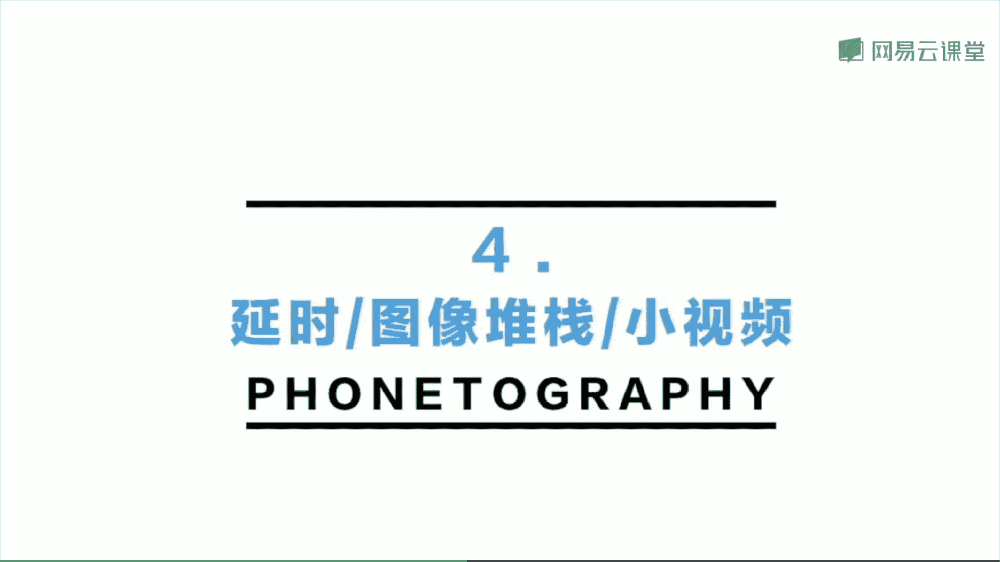
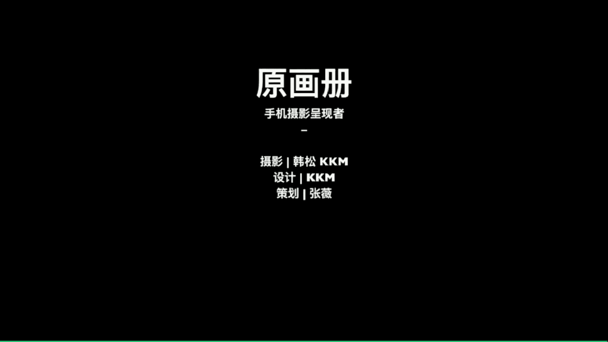

# 韩松-跟全球iPhone摄影大赛冠军学手机摄影，随手惊艳朋友圈（完结）：课时29.艺术家们的摄影

第三部分，我们来看一下艺术家们的摄影啊。那么在这里呢会给大家讲到一些当代摄影的内容。那么第一个呢是我非常喜欢的日本的摄影艺术家川内轮子。那么这一组照片呢是它那一部非常有名的那呃啊，也用中文说呢。

就是嗯假妹，他拍摄的呢都是嗯感觉是在消逝中的事物。我们来看一下它是如何组织的。比如说那么在这两张照片，那么相对的照片中，我们可以看到，虽然说哎那么分开看，他们都是生活中非常普通的场景。

但是呢我们把它连起来看就会产生不一样的化学变化了。左边的那一些从水中伸出头的鱼。那么右边的这一些被砸成嗯正在煎的鸡蛋。那么他们呢在形式上是有一定的联系的，都是这样的1。1。1点的构成。

那我们来看一下表现意义上，那么鱼渴望氧气。那么所以说呢从水中生出来。那么鸡蛋是被已经处于这样的一个被砸的过程中，所以说呢它是处于一个死亡的瞬间。那么整体这两个场景呢。都是有这样的一种消逝的意义。

在其中的。我们再来看一下这两张照片。左边那一张，我们可以看到网状的神是好像要破了。那么右边的这一张呢人吹出了一个泡泡，它也是处于感觉下一秒钟就会破的那一瞬间。那么他们也是走向消逝的那一瞬间。

作者呢把生活中这两个非常小的场景抓捕了下来。那我们再来看一下第三个场景。左边的一个从水中跃起的海豚，那么和右边的这一个从窗户内吹这样外面的这样的一个风。哎。

我们是不是可以感觉到这两张照片都是非常有动感的。而且这两种动感好像是有某种隐喻的联系的。那么我们再来看表现的主题，那么海豚从空中跃到海里面是处于这样的一个下降的瞬间的，有那样的一种消逝的变化之感。

而那种风呢从呃室内吹到室外，那么也是这样的一种好像呃有那样的一种正在消逝的感觉。那么这两张照片呢，他们就可以合成一组组照。那我们再来看一下这两张照片非常的有意思啊。

那么第一左边的那张我们可以看到洗衣机去卷。写的那样的一种漩涡。那么右边的那一张移到室外，那么天空中也是出现了这样的一个漩涡。那么第一张照片，左边的那一张我们可以感觉到水好像要被吸到下水道里面呢。

那么右边的那一张我们好像要感觉到阳光快要哎，从乌云的那边射过来呢，那一个呃那一个孔好像快要消失了。那么整体呢都是处于那样的一个消逝的过程中。哎，那么这两张照片那么就更为明显啊这样的一种比喻啊。

好像累的快要死去的苍蝇和右边的那一些呃都市里面感觉移动的人群的好像有这样的一种蝼蚁的感觉出现在画面中。那么其实呢这一整套嗯照片作者呢都是很明显的去表现的那一个死亡消逝的主题。但是呢表现这一个主题。

它的具体的照片的表现却是非常多元化，哎，非常有那样的一种呃呃那样的一种。清新又自然的感觉在其中的。那么通过这样的一种感觉，好像清新和死亡这样的一个凝这样的一个凝重的主题。

好像通过这样的一些照片把他们联系了起来。啊，所以说呢我自己觉得这一本书对我的拍摄是非常有影响的。大家也可以去看一下。那么第二个要为大家介绍的呢是史蒂芬肖尔这一名当代摄影师。

他是美国非常著名的一个新地形主义的摄影师啊，那么他很出名的就是这一张照片，在洛杉矶拍摄到的呃一张加油站的照片，实际上呢他还拍摄了很多这样的一些风景的照片那么这几年呢肖尔也开始用手机拍摄照片。

那现在呢开了一个instagram的账号呃，基本上每天都会发好几张他用手机拍摄的照片，很多朋友呢会发现会给我说，老师我看不懂他的照片。呃，其实呢我觉得对于当代摄影啊，你不要去急着看懂啊。

而是呢去仔细的去揣摩一下他照片中所表现的某种情绪或者是表现的哎某种元素之间的联系，我觉得是非常有意思的啊。哎，比如说这一张照片中，我们可以看到右边摄过来的光线呃让那一个床上面非常的明。

明亮而左边的那一个马桶部分呢却非常的黑暗。哎，那么这个明亮的床和那一个黑暗的马桶之间，他们是不是有某种联系呢？我们可以去多多的思考一下。那么大家可以看一下史蒂芬肖尔的instagram的主页啊。

很多都是这样，其实呢都是拍摄了我们生活中的一些非常不起眼，非常小的场景。那么我们把这样的一些场景给集合起来，往往呢也可以形成很棒的一种power，一种能量。那么这也是史蒂芬肖尔拍摄的一组呃风景照片。

那么在他的stagram上呢有很多这样的一些组照，我都可以去看一下去学习一下。好，那么接下来呢就会为大家分享几个我自己还觉得蛮值得推荐的摄影师，他们呢都是搞纯粹艺术的。

大家可以去看一下如何用我们的摄影去记录我们的生活的同时也去记录一下我们对周边事物的对我们的这个世界的看法吧。

那么首先为大家推荐的是日本的几位摄影师山本博斯田正治上田意宴川内轮子还有圣苍角那么第二个呢是欧美的摄影师夫史蒂芬肖尔古斯基还有ex那么最后呢是国内的三个摄影师张克淳他的那一本北流火现在应该已经绝版了。

但是非常的推荐啊，是用一条河流为线索去记录我们的黄河的那么第二个呢是成都的摄影师冯他的作品呢非常的有意思，他记录的那样的一种街头，他都是用。强制闪光拍摄到的，而且他的照片呢大多是在白天拍摄到的。

所以说他的这一本非常出名的摄影机叫做白夜，那就是用闪光灯制造出那样的一种类似于夜晚的效果。第三个呢是刘涛呃，刘涛应该是比较有名的一位街头摄影师啊，他的作品中充满了对街头的那样的一种呃，有一些讽刺。

有一些黑色幽默的感觉，非常的有意思。大家去可以去看一下他的画集呃，走来走去，也是一本很棒呃，大开脑洞的话集吧。呃，那么这一些纯艺系的摄影师呢，一般有他们的官方网站。

我觉得在官方网站上面去阅读他们的照片是一个最棒的选择。好，那么今天的第四部分呢，我给大家讲一下，那么拍摄延时，还有图像堆栈以及各种小视频。我们要如何去处理？

🎼接下来我们来看一下如何用slow shutter进行堆栈的创作。那么首先呢在我们的手机架在三脚架上，为我们的拍摄提供一个稳定的背景，然后打开slow shutter这一款软件。

然后呢将我们的参数调到低光模式和闭门快门这样的一个组合，然后呢就可以按下我们的快门呢，按下快门之后呢，我们可以看到画面已经变模糊了。然后在拍摄的过程中呢，不断的拉近我们的焦距啊。

我们可以看到那么背景中的场景呢是在依次变模糊。好像有这样的一种像我们逐渐靠近的动感啊，这是一种非常呃有新意的拍摄手法，我们可以用它来拍摄很多场景，来看一下这一个场景呢，我们拍摄完成之后呢。

在我们的画面我们的相机的那一个相册中就可以找到这一张照片。我们可以看到和我们平时看到的场景是截然不同的。那么经过简单的后期处理就可以拍成这样的一种魔幻的感觉了。那么再来看一下那么这几张照片呢。

实际上也是用这样的一个简单的方法拍出来的，可以看到和我们看到的实际场景是完全不一样。接下来呢我们来看一下延时摄影。🎼用我们的手机呢就可以进行一个很简单的延时摄影拍摄。

比如说苹果手机中就自动有那个延时摄影的按钮。我们点击之后呢，我们就发现系统在不断的读秒。那么延时摄影呢实际上就是把我们比如说一分钟之内发生的事情压缩到一两秒钟时间内发生。

这样的就会出现这样的一种时间高速流转场景快速变化的感觉，会给我们的这样的一个小视频带来一个极强的动力之感啊。那们来看一下这一个视频实际上呢是拍了两分钟，那么最后压缩成了只有五六秒钟。

那么通过这样的场景就能够体现到这样的一种快速的流转变化。延时摄影就非常适合这样的一种场景中既有静态又有动态的元素，同时出现的一个场景。那么延时摄影呢实际上也可以像这张这一个小视频那样用那样的手持拍摄。

实际上呢也是比较呃流畅的会出现大幅度的波动。因为系统呢会帮我们自动进行这样的一个优化。那么还有像这样的一个场景啊，那么天空中有云朵的时候，们也可以用延时摄影拍出那样的一种动。

那么接下来呢为大家分享一下这一组我们的场景小视频。那实际上呢就是一些非常小非常。每个场景的话拍摄起来，然后用我们苹果手机自带的那个IMovie的软件把它们剪辑，再来一起形成了一个集合。这か。都记录。

🎼好，那么今天的第三个po总结，我们来看一下。第一呢是拍摄延时摄影师，注意找到静止场体中的动态原。🎼第二个呢是延时审影中，建议使用三脚架，时刻保证我们的手机处于一个稳定的状态。

第三个呢是视频的拍摄和照片的拍摄呢，我们所需要的观察力是相同的。那么这一套课程呢就为大家讲到这里，今天是我们的最后一堂课，欢迎大家参加我们原画册的2018年的手机摄影年度课程，我是韩总，谢谢大家。

