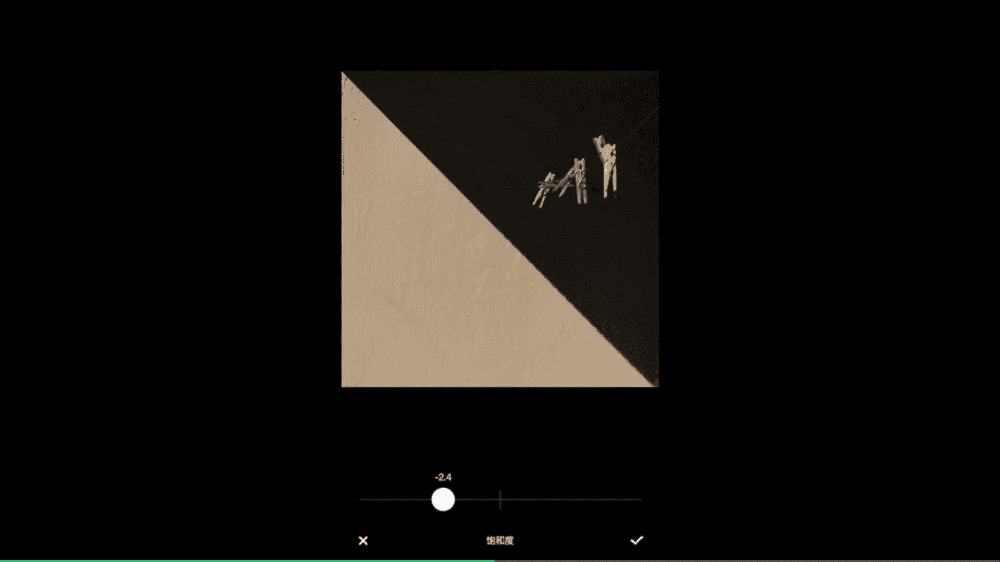
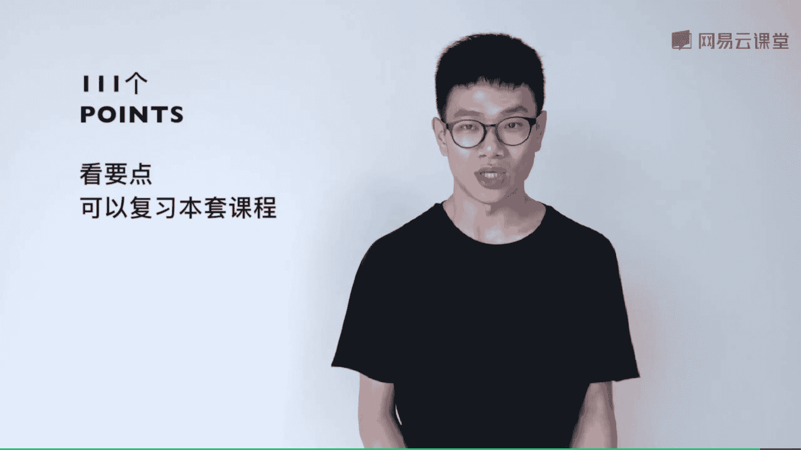
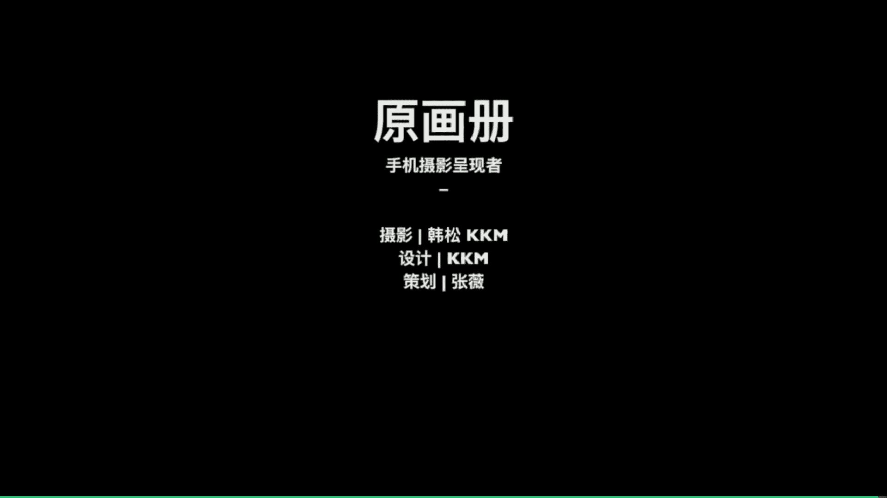

# 韩松-跟全球iPhone摄影大赛冠军学手机摄影，随手惊艳朋友圈（完结）：课时30.参加国际手机摄影大赛攻略

🎼。🎼好，那我们再来看一下今天的第五部分，如何去开加一个国际手机摄影。

为大家分享这一张照片，拍自冰岛的北部小城阿克雷里。我们来看这张照片，就会发现极为强烈的几何美和光影感。阳光从画面的左上部一直延伸到画面的右下部，为画面形成了明暗交接的两部分。而暗处的那一部分中呢。

刚好有被阳光照的非常闪亮的晾衣家，他们就好像在黑暗中的闪亮着的星星一样，我觉得有这样的一种比喻的美感。好，我们来看一下这一张照片是怎么拍出来的。首先来看一下原始场景，下午7点钟左右。

阳光从室外斜射进入阳台，在阳台上形成的这一个三角形的光影。我们可以看到窗外的雪山，还有被阳光照亮的居民楼也非常的漂亮。但这个时候呢我的重点是在前面的那一个光影上面。所以说呢一定要把多余的元素给去掉。

形成这样的一种抽象的美感。因此呢我就将焦距进一步的放大。然后呢进一步的靠近我的被摄体，也就是墙壁的一个光影和前面的晾衣夹。嗯，但是呢这一个场景我们就会发现那一个晾衣夹子过大的出现在画面中。

那一种抽象的平衡感就被破坏掉了。🎼因此呢我又再离远了一点，我可以看到在这一个啊拍摄的距离就是比较合适的晾衣架出现在那一个黑暗的画面中间，不大不小，有这样的一种闪烁的效果。

那么所以说呢就以这一张照片为延篇来为大家进行一个后期的处理。后期的软件呢还是最常见的那一个vissco的软件。我们来看一下。🎼我打开vissco，将刚才那一张照片呢导入到软件里面啊。

那么在这里呢首先需要进行的就是一个裁图。因为我们可以看到这张原片呢，它是一个竖构图。那么我整体想要的呢是一种方构图的形式。那么这样呢才能把那样的一种正方形的光影表现的淋漓尽致。那么裁图的时候要注意啊。

左上角要对准那个光影的对上端，那么右下角呢要对准光影的最下端，那么这样呢才能给画面带来这样的一种阴影对半分的效果。好，那么裁剪好了打勾，那么裁剪好之后，我们再来看一下第二步啊，第二步呢要注意一下。

我需要将曝光调低一些，这样的一个阴影的部分呢压暗。那么这样呢我们可以看到阴影和光明它们的分界线就会更加明显的。那么第三步呢再增加一些对比度增加对比度的原因呢同样是阴影部黑的更为彻底。

才和那个光明处呢有这样的一个明显的交界。好，那么第四步呢我来选择一下滤镜。那么这张照片呢，我是选择了我们的C系列的。🎼C8号滤镜唉，它可以给画面带来这样的一种更暖的橙色的光线。

我觉得在这一张照片中是非常合适的。我调整一下它的滤镜强度调到百调到9左右。好，那么最后一步呢，我再减低一些画面的饱和度啊，那么整体呢让画面看上去颜色更加的朴素。那么这一张照片呢从前期到后期就是这样的。

🎼好，那么在这1个IPA全球iphone摄影大赛中呢，我们可以透露出一些首摄作品优秀首作作品的一个特质。第一个呢是他们都是通俗而有一定陌生感的照片。第二个呢他们的调色都是健康不过度的。

很多朋友呢发给我的照片我都会说你的照片后期调色太重口味了健康一点朴素一点，往往会更好。第三呢是这些照片往往都是主题鲜明的。来看许多的照片呢其实呢都是第一眼，我们就看上去就知道主体是什么。

包括我刚才为大家分享到的那一张照片啊那第四个呢是这些照片往往是非炫集式的。因为手机摄影呢往往它不需要加多种器材附加和高技术，就可以达到一个比较棒的效果。

主要呢通过观察和提取这样在手机摄影中占有更大的比例。那这些照片呢往往是单张或者是三张呈现的去呢PA多了一个3张照片这样一个组照的选项这样一个参加比赛的项目那么所以说呢通过这样的一个单张或者是三张它往往不是大长片的照片组。

所以说要我这几张照片或者是单张照片非常吸引人。因。嗯，经常这些照片呢要求形式感比较强。那么这样的一些形式感呢，可以通过我们第二课讲到的那一些形式美的规律去逐渐的习得。好，那么IPA参赛的一些要点呢。

给大家简单的讲一下，它是报名每年的3月31号截止在那之前呢都可以传图啊。那么上传的图片呢是要求前期用iphone拍摄后期呢用iphone处理不能使用任何的电脑软件。

那么上传的时候呢要注意一下最短边不小于100像素那么一个照片的类别大概有20多种大家可以在网上去看一下选择自己最为拿手的那些类别参加往往获奖的概率要更高一些，上传的网址呢是Www大家可以去上传。好。

那么今天的最后一部分分享给大家那么手机摄影呢实际上是不止在朋友圈的，它能够带给我更多的东西能够带给我在拍摄里面更多的思考能够带给我更多更美的享受，能够解放我的双手让我观察到更多更好的东西。

那么在整套课的最后为大家做一个整的总结。从我们这套课程的第一节课开始，我们入门的手机摄影基本操作构图取景则。🎼后期的基本步骤。那么后面的课程呢。

我们就人物人像、风景、建筑、城市、静物、街头扫街等等常见的题材进行了从拍摄到后期的全程演示，也教授了延时长曝光、剪影、多重曝光等各种好玩有序的拍摄方法。其实中间每一个问题展开来说都有太多要说的东西。

但时间有限。所以说呢我也只能带大家入门。更多的功夫呢还在于体会原理，自己上手多练习。🎼不知大家还记不记得在课程开始之前为大家提出的这套课程的特色呢，就是抓住要点points去了。

大家仅仅看这些points，就能够进行一个非常棒的复习。我是韩松，原画册工作室的创始人，感谢大家学习这套课程。那么这一套课程呢，就为大家讲到这里。今天是我们的最后一堂课。

欢迎大家参加语原画册的2018年的手机摄影年度课程，我是韩松，谢谢大家。

